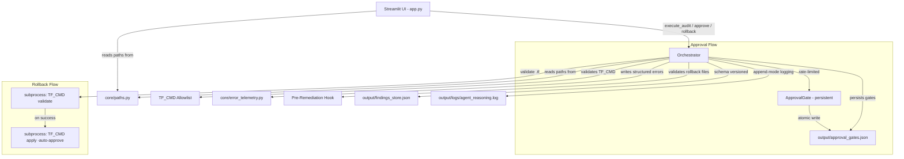

# Design Document: Audit Remediation

## Overview

Req 14 (session isolation) is deferred — see requirements doc. No session-scoped code is included in this design.

This design addresses 14 audit findings spanning the Cloud Janitor orchestrator, Streamlit UI, and supporting modules. The remediation is organized into five functional areas:

1. **Approval & Rollback Hardening** (Req 1, 6) — Persistent, rate-limited approval gates with actual Terraform execution on rollback
2. **Security Validation** (Req 2, 9) — TF_CMD binary allowlist and resource ID extraction allowlist
3. **UI–Orchestrator Contract** (Req 3, 10, 13) — Streamlit delegates exclusively through public Orchestrator API; explicit static imports for Phase B/C agents
4. **Data Integrity** (Req 4, 5, 7, 11) — Unified path config, pre-remediation hook validation, schema versioning, log preservation
5. **Operational Robustness** (Req 8, 12) — Broad exception handling in savings tracker, structured error telemetry

All changes are confined to existing modules (`orchestrator.py`, `app.py`, `agents/approval_gate.py`, `agents/savings_tracker.py`, `agents/reasoning_logger.py`) plus new supporting modules (`core/paths.py`, `core/error_telemetry.py`). No new external dependencies are introduced.

## Architecture

### Component Interaction After Remediation



### Key Architectural Decisions

| Decision | Rationale |
|----------|-----------|
| Single `core/paths.py` for all artifact paths | Eliminates divergence between UI and Orchestrator path construction (Req 4) |
| Atomic write-then-rename for gate persistence | Crash-safe writes; prevents gate file corruption mid-write (Req 6) |
| JSONL format for error telemetry | Append-friendly, parseable per-line, same pattern as reasoning log (Req 12) |
| TF_CMD validated at Orchestrator `__init__` | Fail-fast before any pipeline work begins (Req 2) |
| Reasoning log in append mode with separator | Preserves historical entries while enabling per-run navigation (Req 11) |

## Components and Interfaces

### 1. Path Configuration (`core/paths.py`)

A single source of truth for all artifact paths. Both `orchestrator.py` and `app.py` import from here.

```python
"""Centralized path configuration for Cloud Janitor runtime artifacts.

All artifact paths are constructed here. No module should build
artifact paths via string literals outside this module.
"""

from pathlib import Path

PROJECT_ROOT = Path(__file__).resolve().parent.parent

# Base output directory
OUTPUT_DIR = PROJECT_ROOT / "output"

# Subdirectories
ROLLBACKS_DIR = OUTPUT_DIR / "rollbacks"
LOGS_DIR = OUTPUT_DIR / "logs"
POLICIES_DIR = OUTPUT_DIR / "policies"

# Specific files
FINDINGS_STORE_PATH = OUTPUT_DIR / "findings_store.json"
AUDIT_LOG_PATH = LOGS_DIR / "audit.log"
REASONING_LOG_PATH = LOGS_DIR / "agent_reasoning.log"
APPROVAL_GATES_PATH = OUTPUT_DIR / "approval_gates.json"
SAVINGS_LEDGER_PATH = OUTPUT_DIR / "savings_ledger.json"

# Hooks directory
HOOKS_DIR = PROJECT_ROOT / "hooks"

# Required directories (created at Orchestrator init)
REQUIRED_DIRS = [OUTPUT_DIR, ROLLBACKS_DIR, LOGS_DIR, POLICIES_DIR]
```

### 2. TF_CMD Validation (Orchestrator `__init__`)

```python
import os
import shutil
import re

TF_CMD_ALLOWLIST = {"terraform", "tflocal"}

def _validate_tf_cmd() -> str:
    """Validate and resolve TF_CMD from environment.

    Returns:
        Absolute path to the validated binary.

    Raises:
        RuntimeError: If TF_CMD fails any validation check.
    """
    raw = os.environ.get("TF_CMD", "tflocal")

    # Reject path separators
    if "/" in raw or "\\" in raw:
        raise RuntimeError(
            f"TF_CMD contains path separators: '{raw}'. "
            f"Only bare binary names are permitted: {sorted(TF_CMD_ALLOWLIST)}"
        )

    # Extract basename (redundant given separator check, but defense-in-depth)
    basename = os.path.basename(raw)

    # Validate against allowlist
    if basename not in TF_CMD_ALLOWLIST:
        raise RuntimeError(
            f"TF_CMD '{basename}' is not in the allowlist. "
            f"Permitted values: {sorted(TF_CMD_ALLOWLIST)}"
        )

    # Resolve to absolute path via PATH lookup
    resolved = shutil.which(basename)
    if resolved is None:
        raise RuntimeError(
            f"TF_CMD '{basename}' could not be found on PATH."
        )

    return resolved
```

### 3. Persistent Approval Gates

The `ApprovalGate` class gains persistence via an `ApprovalGateStore` that handles atomic JSON writes.

```python
"""Persistent approval gate store with atomic writes."""

import json
import os
import tempfile
from pathlib import Path
from typing import Any


class ApprovalGateStore:
    """Persists approval gate state with atomic write-then-rename.

    Gate state schema per resource:
    {
        "resource_id": str,
        "attempts": int,
        "locked": bool,
        "max_attempts": int
    }
    """

    def __init__(self, store_path: Path) -> None:
        self._path = store_path
        self._gates: dict[str, dict[str, Any]] = {}

    def load(self) -> None:
        """Load gates from disk. On parse failure, lock all gates."""
        if not self._path.exists():
            self._gates = {}
            return

        try:
            content = self._path.read_text(encoding="utf-8")
            data = json.loads(content)
            if not isinstance(data, dict) or "gates" not in data:
                raise ValueError("Missing 'gates' key")
            self._gates = {
                g["resource_id"]: g for g in data["gates"]
                if isinstance(g, dict) and "resource_id" in g
            }
        except (json.JSONDecodeError, ValueError, OSError, KeyError) as exc:
            import logging
            logging.getLogger(__name__).warning(
                "Failed to parse approval gate store at %s: %s. "
                "All gates initialized as locked.",
                self._path, exc,
            )
            self._gates = {"__corrupted__": {"locked": True}}

    def save(self) -> None:
        """Atomically persist all gate states (write-then-rename)."""
        data = {"gates": list(self._gates.values())}
        content = json.dumps(data, indent=2)

        # Write to temp file in same directory, then rename
        dir_path = self._path.parent
        dir_path.mkdir(parents=True, exist_ok=True)
        fd, tmp_path = tempfile.mkstemp(dir=str(dir_path), suffix=".tmp")
        closed = False
        try:
            os.write(fd, content.encode("utf-8"))
            os.close(fd)
            closed = True
            os.replace(tmp_path, str(self._path))
        except Exception:
            if not closed:
                os.close(fd)
            if os.path.exists(tmp_path):
                os.unlink(tmp_path)
            raise

    def get_gate(self, resource_id: str) -> dict[str, Any] | None:
        return self._gates.get(resource_id)

    def set_gate(self, resource_id: str, attempts: int, locked: bool, max_attempts: int) -> None:
        self._gates[resource_id] = {
            "resource_id": resource_id,
            "attempts": attempts,
            "locked": locked,
            "max_attempts": max_attempts,
        }
        self.save()

    @property
    def is_corrupted(self) -> bool:
        return "__corrupted__" in self._gates
```

**Gate corruption guard**: Before calling `gate_store.get_gate(resource_id)` in any approval or rollback code path, the Orchestrator SHALL check `gate_store.is_corrupted` first. If corrupted, reject immediately with error "store corrupted, awaiting operator reset" — do not attempt to read individual gate state from a corrupted store.

### 4. Pre-Remediation Hook Full Validation

```python
def _run_pre_remediation_hook_full(
    self, plans: list[RemediationPlan]
) -> tuple[list[Path], list[str]]:
    """Validate rollback files for ALL active plans.

    Returns:
        (validated_paths, failures) — failures is a list of
        resource_ids missing rollback coverage.

    Raises:
        TimeoutError: If total validation exceeds 60 seconds.
    """
    import time

    start = time.monotonic()
    timeout = 60.0
    validated: list[Path] = []
    failures: list[str] = []

    for plan in plans:
        if time.monotonic() - start > timeout:
            raise TimeoutError(
                "Pre-remediation hook exceeded 60s timeout"
            )

        rollback_path = self.rollbacks_dir / f"{plan.resource_id}.tf"

        # Check existence and non-empty
        if not rollback_path.exists() or rollback_path.stat().st_size == 0:
            failures.append(plan.resource_id)
            continue

        # Run hook script validation
        hook_path = self.hooks_dir / "pre-remediation.sh"
        if not hook_path.exists():
            # Missing hook cannot confirm exit 0 — validation failure
            failures.append(plan.resource_id)
            continue

        remaining = timeout - (time.monotonic() - start)
        result = subprocess.run(
            ["bash", _to_bash_path(hook_path), _to_bash_path(rollback_path)],
            capture_output=True, text=True,
            timeout=max(remaining, 1),
            cwd=str(self.project_root),
        )
        if result.returncode != 0:
            failures.append(plan.resource_id)
            continue

        validated.append(rollback_path)

    return validated, failures
```

### 5. Structured Error Telemetry (`core/error_telemetry.py`)

```python
"""Structured error telemetry for Cloud Janitor.

Captures agent exceptions as structured JSONL records with
consistent categorization for operational diagnosis.
"""

import json
import traceback
from datetime import datetime, timezone
from pathlib import Path

ERROR_CATEGORIES = {
    "agent_failure",       # Exception within agent scan/plan logic
    "terraform_failure",   # Non-zero exit from TF_CMD
    "validation_failure",  # Schema, gate, or hook validation errors
    "io_failure",          # File system or network I/O errors
}


def build_error_record(
    exc: Exception,
    agent_name: str,
    error_category: str,
) -> dict:
    """Build a structured error record from an exception.

    Args:
        exc: The caught exception.
        agent_name: Identifying string for the failing agent.
        error_category: One of ERROR_CATEGORIES.

    Returns:
        Dict with fields: error_type, message, traceback,
        timestamp, agent_name, error_category.
    """
    tb = traceback.format_exception(type(exc), exc, exc.__traceback__)
    tb_str = "".join(tb)[:4096]  # Truncate to 4096 chars

    return {
        "error_type": type(exc).__name__,
        "message": str(exc),
        "traceback": tb_str,
        "timestamp": datetime.now(timezone.utc).isoformat(),
        "agent_name": agent_name,
        "error_category": error_category,
    }


def write_error_record(record: dict, log_path: Path) -> None:
    """Append an error record as a single JSONL line."""
    line = json.dumps(record, separators=(",", ":")) + "\n"
    log_path.parent.mkdir(parents=True, exist_ok=True)
    with open(log_path, "a", encoding="utf-8") as f:
        f.write(line)
```

### 6. Resource ID Extraction with Allowlist

```python
import re

_RESOURCE_ID_PATTERN = re.compile(r"^[a-zA-Z0-9\-_:./]{1,256}$")

def _extract_resource_id_from_command(
    self, command: str, prefix: str
) -> str | None:
    """Extract and validate resource_id from a command string.

    Validates against an allowlist regex permitting only:
    alphanumeric, hyphens, underscores, colons, periods, forward slashes.
    Total length: 1-256 characters.

    Returns None and logs at DEBUG level if validation fails.
    """
    expected_prefix = prefix + " "
    if not command.startswith(expected_prefix):
        return None

    candidate = command[len(expected_prefix):]

    # Reject empty or whitespace-only before regex
    if not candidate or candidate.isspace():
        return None

    # Allowlist validation
    if not _RESOURCE_ID_PATTERN.match(candidate):
        import logging
        logging.getLogger(__name__).debug(
            "Rejected resource ID: %s", candidate[:64]
        )
        return None

    return candidate
```

### 7. Reasoning Log Append Mode with Separator

```python
def start_run(self) -> None:
    """Write a run separator entry in append mode.

    Called at the start of each audit run. Creates file if missing.
    """
    entry = {
        "event_type": "run_separator",
        "timestamp": datetime.now(timezone.utc).isoformat(),
        "message": "New audit run started",
    }
    try:
        line = json.dumps(entry, separators=(",", ":")) + "\n"
        with open(self._log_path, mode="a", encoding="utf-8") as f:
            f.write(line)
    except OSError as exc:
        print(
            f"ReasoningLogger: failed to write separator: {exc}",
            file=sys.stderr,
        )
```

### 8. `bin/tflocal` Wrapper Script

A repo-local shell script checked into the repository at `bin/tflocal`, made executable. Its directory is added to PATH in the dev/demo environment (documented in README, not hardcoded into `_validate_tf_cmd()`).

The wrapper shells out to the real `tflocal`/`terraform` when `JANITOR_DRY_RUN` is unset, and short-circuits with a printed command + exit 0 when `JANITOR_DRY_RUN=1`.

`_validate_tf_cmd()` requires no changes — it resolves this wrapper via `shutil.which("tflocal")` exactly as it would the real binary. `TF_CMD_ALLOWLIST` stays `{"terraform", "tflocal"}` — no new entry is added. Property 2 and its test remain unchanged.

```bash
#!/usr/bin/env bash
# bin/tflocal — repo-local wrapper for Terraform/tflocal.
# When JANITOR_DRY_RUN=1, prints the command it would run and exits 0.
# Otherwise delegates to the real tflocal/terraform binary.

set -euo pipefail

if [ "${JANITOR_DRY_RUN:-0}" = "1" ]; then
    echo "[DRY RUN] Would execute: tflocal $*"
    exit 0
fi

# Portable realpath: use realpath if available, fall back to readlink -f or pwd-based resolution
_realpath() {
    if command -v realpath >/dev/null 2>&1; then
        realpath "$1"
    elif readlink -f "$1" >/dev/null 2>&1; then
        readlink -f "$1"
    else
        # Last resort: resolve via cd + pwd
        local dir base
        dir="$(cd "$(dirname "$1")" && pwd)"
        base="$(basename "$1")"
        echo "$dir/$base"
    fi
}

# Find the real tflocal/terraform, skipping ourselves
SELF="$(_realpath "$0")"
REAL=""
while IFS= read -r -d '' candidate; do
    candidate_real="$(_realpath "$candidate")"
    if [ "$candidate_real" != "$SELF" ]; then
        REAL="$candidate_real"
        break
    fi
done < <(which -a tflocal 2>/dev/null | tr '\n' '\0')

if [ -z "$REAL" ]; then
    # Fall back to terraform
    REAL="$(which terraform 2>/dev/null || true)"
fi

if [ -z "$REAL" ]; then
    echo "ERROR: Neither tflocal nor terraform found on PATH" >&2
    exit 1
fi

exec "$REAL" "$@"
```

### 9. Findings Store Schema Versioning

```python
SCHEMA_VERSION = "1.0.0"

def _write_findings_store(self, findings: list[dict], metadata: dict) -> None:
    """Write findings store with schema version."""
    store = {
        "schema_version": SCHEMA_VERSION,
        **metadata,
        "findings": findings,
    }
    # ... write to path

def _validate_schema_version(self, store: dict) -> str | None:
    """Validate schema_version field.

    Returns error string or None.
    """
    version_str = store.get("schema_version")
    if version_str is None:
        return "schema_version field is missing"

    try:
        parts = version_str.split(".")
        found_major = int(parts[0])
    except (ValueError, IndexError):
        return f"Invalid schema_version format: '{version_str}'"

    expected_major = int(SCHEMA_VERSION.split(".")[0])

    if found_major != expected_major:
        return (
            f"Incompatible schema version: found {version_str}, "
            f"expected major version {expected_major}"
        )

    # Warn on higher minor version
    if len(parts) >= 2:
        found_minor = int(parts[1])
        expected_minor = int(SCHEMA_VERSION.split(".")[1])
        if found_minor > expected_minor:
            import logging
            logging.getLogger(__name__).warning(
                "Findings store minor version %s is higher than expected %s. "
                "Proceeding with best-effort parsing.",
                version_str, SCHEMA_VERSION,
            )

    return None
```

## Data Models

### Modified Data Models

#### RollbackResult (extended)

```python
@dataclass
class RollbackResult:
    success: bool
    resource_id: str = ""
    error: str | None = None
    needs_confirmation: bool = False
    exit_code: int | None = None  # NEW: Terraform exit code on failure
```

#### ApprovalGateState (new, for persistence)

```python
@dataclass
class ApprovalGateState:
    resource_id: str
    attempts: int
    locked: bool
    max_attempts: int = 3
```

#### StructuredErrorRecord (new)

```python
@dataclass
class StructuredErrorRecord:
    error_type: str          # Exception class name
    message: str             # Exception string
    traceback: str           # Formatted stack trace (max 4096 chars)
    timestamp: str           # ISO 8601 UTC
    agent_name: str          # Failing agent identifier
    error_category: str      # One of: agent_failure, terraform_failure,
                             #         validation_failure, io_failure
```

#### ValidationResult (new, for pre-remediation hook)

```python
@dataclass
class ValidationResult:
    success: bool
    validated_paths: list[Path] = field(default_factory=list)
    failures: list[str] = field(default_factory=list)  # resource_ids
    error: str | None = None
```

### Configuration Constants

| Constant | Value | Location | Description |
|----------|-------|----------|-------------|
| `TF_CMD_ALLOWLIST` | `{"terraform", "tflocal"}` | `orchestrator.py` | Permitted Terraform binaries |
| `SCHEMA_VERSION` | `"1.0.0"` | `orchestrator.py` | Findings store schema version |
| `RESOURCE_ID_PATTERN` | `^[a-zA-Z0-9\-_:./]{1,256}$` | `orchestrator.py` | Resource ID allowlist regex |
| `PRE_HOOK_TIMEOUT` | `60` (seconds) | `orchestrator.py` | Pre-remediation hook timeout |
| `TF_VALIDATE_TIMEOUT` | `300` (seconds) | `orchestrator.py` | Terraform validate timeout |
| `TF_APPLY_TIMEOUT` | `300` (seconds) | `orchestrator.py` | Terraform apply timeout |
| `GATE_MAX_ATTEMPTS` | `3` | `agents/approval_gate.py` | Max approval attempts before lockout |
| `LOG_ROTATION_THRESHOLD` | `10_485_760` (10 MB) | `agents/reasoning_logger.py` | Log rotation size threshold |
| `LOG_ROTATION_COUNT` | `5` | `agents/reasoning_logger.py` | Max rotated log files |

## Streamlit UI Delegation to Orchestrator (Req 3, 10, 13)

The Streamlit UI (`app.py`) interacts with the Orchestrator exclusively through its public API. No private methods or attributes are accessed directly.

### Audit Delegation Pattern

```python
"""Streamlit UI audit delegation — app.py excerpt."""

import streamlit as st
from orchestrator import Orchestrator, AuditResult

# Status callback for per-agent progress
def _on_agent_status(agent_name: str, status: str) -> None:
    """Callback consumed by Streamlit to update per-agent progress."""
    st.session_state.setdefault("agent_status", {})[agent_name] = status


def run_audit_page() -> None:
    """Render the audit page with Run Audit button."""
    orch: Orchestrator = st.session_state["orchestrator"]

    if st.button("Run Audit"):
        with st.spinner("Running audit pipeline..."):
            result: AuditResult = orch.execute_audit(
                status_callback=_on_agent_status
            )

        if not result.success:
            st.error(result.error)
            return

        # Render exclusively from AuditResult fields
        st.success(f"Audit complete: {len(result.findings)} findings")
        _render_findings(result.findings)
        _render_plans(result.plans)
        _render_blocked(result.blocked_plans)
```

### NL Audit Delegation Pattern (Req 10)

```python
def nl_audit_page() -> None:
    """Render NL Audit page with graceful feature detection."""
    orch: Orchestrator = st.session_state["orchestrator"]

    if not hasattr(orch, "execute_natural_language_audit"):
        st.info("Natural-language audit feature is not yet available.")
        return

    query = st.text_input("Enter audit query").strip()
    if st.button("Run NL Audit") and query:
        try:
            nl_result = orch.execute_natural_language_audit(query)
            st.write(f"Found {nl_result.findings_count} findings")
            _render_findings(nl_result.findings)
        except Exception as exc:
            st.error(f"NL Audit failed: {exc}")
```

### Explicit Agent Imports Pattern (Req 13)

```python
"""Phase B/C agent imports — app.py top-level."""

from typing import Optional

# Each agent imported individually with explicit ImportError handling
try:
    from agents.query_interpreter import QueryInterpreter
except ImportError:
    QueryInterpreter: Optional[type] = None  # type: ignore[assignment]

try:
    from agents.remediation_explainer import RemediationExplainer
except ImportError:
    RemediationExplainer: Optional[type] = None  # type: ignore[assignment]

try:
    from agents.policy_suggester import PolicySuggester
except ImportError:
    PolicySuggester: Optional[type] = None  # type: ignore[assignment]

try:
    from agents.anomaly_detector import AnomalyDetector
except ImportError:
    AnomalyDetector: Optional[type] = None  # type: ignore[assignment]

try:
    from agents.drift_detector import DriftDetector
except ImportError:
    DriftDetector: Optional[type] = None  # type: ignore[assignment]

try:
    from agents.multi_account_orchestrator import MultiAccountOrchestrator
except ImportError:
    MultiAccountOrchestrator: Optional[type] = None  # type: ignore[assignment]

try:
    from agents.janitor_scheduler import JanitorScheduler
except ImportError:
    JanitorScheduler: Optional[type] = None  # type: ignore[assignment]
```

### UI–Orchestrator Contract Summary

| UI Action | Orchestrator Public Method | Returns | UI Behavior on Failure |
|-----------|--------------------------|---------|----------------------|
| Run Audit | `execute_audit(status_callback)` | `AuditResult` | Display `result.error` |
| Approve | `approve_resource(resource_id)` | `ApprovalResult` | Display error, re-prompt |
| Rollback | `execute_rollback(resource_id)` | `RollbackResult` | Display error with exit code |
| NL Audit | `execute_natural_language_audit(query)` | `NLAuditResult` | Display exception message |

## Correctness Properties

*A property is a characteristic or behavior that should hold true across all valid executions of a system — essentially, a formal statement about what the system should do. Properties serve as the bridge between human-readable specifications and machine-verifiable correctness guarantees.*

### Property 1: Approval Gate Lockout Invariant

*For any* resource ID and any sequence of failed approval attempts, the gate SHALL become locked after exactly `max_attempts` (3) failures, and once locked, all subsequent rollback and approval requests for that resource SHALL be rejected with `success=False` regardless of process restarts.

**Validates: Requirements 1.2, 1.5**

### Property 2: TF_CMD Validation Partition

*For any* string value of TF_CMD, validation SHALL pass if and only if the string contains no path separator characters (`/` or `\`) AND its basename is a member of the allowlist `{"terraform", "tflocal"}`. All other values SHALL raise a `RuntimeError` identifying the rejected value and permitted alternatives.

**Validates: Requirements 2.1, 2.2, 2.3**

### Property 3: Rollback Failure Error Propagation

*For any* non-zero exit code and any stderr string produced by `TF_CMD`, the rollback handler SHALL return a `RollbackResult` with `success=False`, the exit code preserved in `exit_code`, and the stderr content included in `error`. The original Rollback_File SHALL remain unchanged on disk.

**Validates: Requirements 1.4, 1.6**

### Property 4: Resource ID Extraction Allowlist

*For any* candidate string, `_extract_resource_id_from_command()` SHALL return the candidate if and only if: (a) the candidate is non-empty and not whitespace-only, AND (b) the candidate fully matches the regex `^[a-zA-Z0-9\-_:./]{1,256}$`. All other inputs SHALL produce `None`.

**Validates: Requirements 9.1, 9.2, 9.3**

### Property 5: Savings Tracker Exception Swallowing

*For any* `Exception` subclass raised by `savings_tracker.record_run()`, the Orchestrator SHALL: (a) not propagate the exception, (b) log a WARNING containing the exception type name and message, and (c) return `ApprovalResult(success=True)` identical to the non-exception case.

**Validates: Requirements 8.1, 8.2, 8.3**

### Property 6: Pre-Remediation Hook Coverage

*For any* list of active remediation plans, the Pre_Remediation_Hook SHALL validate the rollback file for every plan in the list. If any plan's rollback file is missing, empty, or fails the hook script, the entire remediation run SHALL be blocked and the error SHALL list every failing resource_id.

**Validates: Requirements 5.1, 5.2, 5.3**

### Property 7: Pre-Remediation Hook Success

*For any* list of active plans where every plan has a corresponding non-empty rollback file that passes the hook script (exit code 0), the Pre_Remediation_Hook SHALL return a `ValidationResult` with `success=True`, `validated_paths` containing one path per plan, and an empty `failures` list.

**Validates: Requirements 5.4**

### Property 8: Approval Gate Persistence Round Trip

*For any* set of `ApprovalGateState` objects, persisting them via `ApprovalGateStore.save()` and then loading via a fresh `ApprovalGateStore.load()` SHALL produce gate states where each gate's `resource_id`, `attempts`, `locked`, and `max_attempts` fields are identical to the originals.

**Validates: Requirements 6.1, 6.2**

### Property 9: Corrupted Gate Store Locks All Gates

*For any* byte sequence that is not valid JSON or is valid JSON but lacks the required `"gates"` key structure, loading the gate store SHALL result in a corrupted state where all approval and rollback operations are rejected.

**Validates: Requirements 6.4**

### Property 10: Schema Version Validation

*For any* semantic version string in the findings store, validation SHALL pass if and only if the major version matches the expected major version. A missing `schema_version` field SHALL always be rejected. A higher minor version with matching major SHALL produce a WARNING but still pass.

**Validates: Requirements 7.1, 7.2, 7.3, 7.4, 7.5**

### Property 11: Structured Error Record Completeness

*For any* exception and agent name, `build_error_record()` SHALL produce a dict containing all required fields (`error_type`, `message`, `traceback`, `timestamp`, `agent_name`, `error_category`) where: `error_category` is exactly one of `{"agent_failure", "terraform_failure", "validation_failure", "io_failure"}`, `traceback` is at most 4096 characters, and `timestamp` is valid ISO 8601 UTC.

**Validates: Requirements 12.1, 12.3**

### Property 12: JSONL Error Record Format

*For any* structured error record dict, `write_error_record()` SHALL append exactly one line to the log file that is independently parseable as valid JSON. Multiple sequential writes SHALL produce a file where each line is independently parseable.

**Validates: Requirements 12.2**

### Property 13: Reasoning Log Append Preservation

*For any* existing reasoning log content, starting a new audit run SHALL preserve all previous content and prepend (after existing content) a valid JSONL separator entry containing `event_type="run_separator"`, a valid ISO 8601 UTC `timestamp`, and a non-empty `message` field.

**Validates: Requirements 11.1, 11.2**

### Property 15: Findings Store Schema Version Presence

*For any* audit run that writes a findings store, the resulting JSON file SHALL contain a top-level `schema_version` field whose value is a string matching the pattern `^\d+\.\d+\.\d+$`.

**Validates: Requirements 7.1**

## Error Handling

### Error Classification Logic

The Orchestrator classifies all caught exceptions into one of four categories based on the exception context:

```python
def _classify_error(self, exc: Exception, context: str) -> str:
    """Classify an exception into an error category.

    Args:
        exc: The caught exception.
        context: Where the exception occurred (e.g., "agent_scan", "tf_validate").

    Returns:
        One of: agent_failure, terraform_failure, validation_failure, io_failure.
    """
    if context in ("tf_validate", "tf_apply", "tf_plan"):
        return "terraform_failure"

    if isinstance(exc, (OSError, IOError, PermissionError)):
        return "io_failure"

    if context in ("schema_check", "gate_check", "hook_validation", "resource_id_check"):
        return "validation_failure"

    return "agent_failure"
```

### Error Propagation Strategy

| Layer | Behavior | Example |
|-------|----------|---------|
| Agent (FinOps, SecOps, Remediation) | Exceptions caught by Orchestrator, classified, logged as structured JSONL | `AgentScanError` → `agent_failure` |
| Terraform subprocess | Non-zero exit or timeout → structured error with stderr | Exit code 1 → `terraform_failure` |
| Schema / Gate / Hook validation | Validation failure → structured error, operation blocked | Missing schema_version → `validation_failure` |
| File I/O | OSError → structured error, graceful degradation | Permission denied → `io_failure` |
| Savings Tracker | All exceptions caught and swallowed (WARNING logged) | `JSONDecodeError` → log + continue |

### Critical Error Paths

1. **Gate store corruption**: Log WARNING, lock all gates, reject all operations until operator intervention.
2. **TF_CMD validation failure**: Raise at init — Orchestrator refuses to start.
3. **Pre-remediation hook timeout**: Abort validation, block entire remediation run.
4. **Output directory creation failure**: Halt execution with OS error details.

### Error Recovery Matrix

| Error | Automatic Recovery | Operator Action Required |
|-------|-------------------|------------------------|
| Terraform validate failure | No — block rollback | Fix .tf file, retry |
| Gate locked | No — reject until reset | Explicit gate reset |
| Store corruption | No — all gates locked | Delete/replace store file, restart |
| Missing rollback file | No — block remediation | Generate rollback file |
| Savings tracker exception | Yes — swallow and continue | None (logged for review) |
| Schema version mismatch | No — reject store | Re-run audit to regenerate |

## Testing Strategy

### Testing Approach

This feature uses a dual testing approach:

1. **Property-based tests** (Hypothesis library) — verify universal correctness properties across randomized inputs
2. **Example-based unit tests** (pytest) — verify specific scenarios, edge cases, integration points, and error conditions

### Property-Based Testing Configuration

- **Library**: [Hypothesis](https://hypothesis.readthedocs.io/) (already in project — `.hypothesis/` directory present)
- **Minimum iterations**: 100 per property test (`@settings(max_examples=100)`)
- **Tag format**: `# Feature: audit-remediation, Property {N}: {title}`

### Property Test Mapping

| Property | Test Module | Key Generators |
|----------|-------------|----------------|
| 1: Gate Lockout Invariant | `tests/test_approval_gate_properties.py` | Random resource IDs, attempt sequences |
| 2: TF_CMD Validation Partition | `tests/test_tf_cmd_properties.py` | Random strings with/without separators, allowlist members |
| 3: Rollback Failure Error Propagation | `tests/test_rollback_properties.py` | Random exit codes (1-255), random stderr strings |
| 4: Resource ID Extraction Allowlist | `tests/test_resource_id_properties.py` | Random strings from valid/invalid character sets |
| 5: Savings Tracker Exception Swallowing | `tests/test_savings_tracker_properties.py` | Random Exception subclass instances |
| 6-7: Pre-Remediation Hook Coverage | `tests/test_pre_hook_properties.py` | Random plan lists, file existence/emptiness combos |
| 8-9: Gate Persistence Round Trip | `tests/test_gate_persistence_properties.py` | Random gate states, random malformed JSON |
| 10, 15: Schema Version Validation | `tests/test_schema_version_properties.py` | Random semver strings, missing fields |
| 11-12: Structured Error Records | `tests/test_error_telemetry_properties.py` | Random exceptions, agent names, error categories |
| 13: Reasoning Log Append | `tests/test_reasoning_log_properties.py` | Random existing log content, multiple sequential runs |

### Example-Based Unit Tests

| Requirement | Test Focus | Test Module |
|-------------|-----------|-------------|
| Req 1 | Terraform validate → apply sequence (mocked subprocess) | `tests/test_rollback_flow.py` |
| Req 2 | PATH resolution with mocked `shutil.which` | `tests/test_tf_cmd_validation.py` |
| Req 3 | UI calls only public Orchestrator methods | `tests/test_ui_delegation.py` |
| Req 4 | Directory creation on init, missing file display | `tests/test_path_config.py` |
| Req 5 | Hook timeout (mocked time) | `tests/test_pre_hook.py` |
| Req 6 | Atomic write failure (mocked os.replace) | `tests/test_gate_persistence.py` |
| Req 7 | Higher minor version WARNING | `tests/test_schema_version.py` |
| Req 10 | NL audit feature detection, exception handling | `tests/test_nl_audit.py` |
| Req 11 | Log rotation at 10MB threshold | `tests/test_reasoning_log.py` |
| Req 13 | Missing agent ImportError handling | `tests/test_agent_imports.py` |

### Test Quality Requirements

Per project steering rules, every test must satisfy the hostile reviewer standard:

- No tautological assertions (asserting output equals calling the same function)
- No pass-by-default (assertions that pass on empty/None)
- Fixtures must contain flaggable data
- Negative cases required for every module
- Only mock external I/O (subprocess, filesystem, network) — never mock the unit under test
- Schema validation for all dict/JSON outputs

### Running Tests

```bash
# All tests
".venv/Scripts/python.exe" -m pytest tests/

# Property tests only
".venv/Scripts/python.exe" -m pytest tests/ -k "properties"

# Specific property
".venv/Scripts/python.exe" -m pytest tests/test_approval_gate_properties.py -v
```
