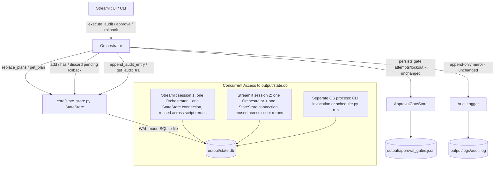

# Design Document: Phase 2 Persistent State

## Overview

This design addresses one backlog issue, INF-1, by generalizing the existing `ApprovalGateStore` persistence pattern into a new `StateStore` covering the three remaining pieces of in-memory approval-flow state: `_last_plans`, `_pending_rollbacks`, and `_audit_trail`. All three currently live as plain Python `list`/`list`/`set` instance attributes on `Orchestrator` with no load/save path (`orchestrator.py:449,452,455`), which means a plan generated in one process is invisible to `approve()` in another process, a pending rollback vanishes on restart, and the rich audit trail (`get_audit_trail()`) is lost — only the flat `audit.log` text file survives.

The remediation is organized into two functional areas:

1. **Persistence Layer** (Req 1, 5, 6) — a new `StateStore` class backed by SQLite (stdlib `sqlite3`), with WAL mode for multi-process safety and fail-closed behavior on genuine corruption — carefully distinguished from transient lock contention (`sqlite3.OperationalError`), which raises a separate, non-fatal `StateStoreUnavailableError` instead (Req 5.6).
2. **Orchestrator Wiring** (Req 2, 3, 4, 7) — `Orchestrator` reads and writes plans, pending rollbacks, and audit entries exclusively through the `StateStore`, with no behavior change to the approval/rollback control flow itself — only *where the state lives* changes.

All changes are confined to one new module (`src/cloud_janitor/core/state_store.py`), one new constant in `src/cloud_janitor/core/paths.py`, and edits to `src/cloud_janitor/orchestrator/orchestrator.py`. No new external dependencies are introduced — `sqlite3` is part of the Python standard library. No changes are made to `ApprovalGateStore` or `AuditLogger`; both continue to exist and operate exactly as they do today.

## Architecture

### Component Interaction After Remediation



**Correcting the concurrency model this diagram depicts**: this app does not currently run "multiple Streamlit worker processes." `app.py:528` constructs exactly one `Orchestrator` (and therefore one `StateStore`/SQLite connection) per browser session, stored in `st.session_state.orchestrator` — confirmed at `app.py:528,877,924,977,1066,1088,1110`. A single Streamlit server process serves many such sessions, each with its own long-lived `Orchestrator`/`StateStore` instance and its own SQLite connection to the same `output/state.db` file. `check_same_thread=False` is required not because of multiple OS processes, but because Streamlit executes each script rerun of a given session on a fresh `ScriptRunner` thread — the *same* session's `Orchestrator` instance (and its one `sqlite3.Connection`) is therefore called from a different OS thread on every rerun, which the stdlib `sqlite3` module forbids by default. The genuinely multi-*process* case is a separate CLI invocation or a `scheduler.py` (`scheduler.py:201`) run against the same `output/` directory, which is what WAL mode and `busy_timeout` are actually defending against across process boundaries.

**Concurrency assumption for a single session**: within one session, Streamlit does not run two reruns of the same session's script concurrently — a new interaction cancels/supersedes the in-flight rerun before starting the next one — so overlapping calls into the *same* `Orchestrator`/`StateStore` instance from that session are assumed not to happen today. As defense-in-depth against this assumption becoming false in the future (e.g. a background thread, an async callback, or a change to Streamlit's execution model), `StateStore` additionally guards `self._conn` with a `threading.RLock` around every method body that touches the connection (see Component 1) — cheap insurance, not a response to an observed concurrency bug.

### Key Architectural Decisions

| Decision | Rationale |
|----------|-----------|
| SQLite (stdlib `sqlite3`) over Postgres/Redis | No load balancer, session-affinity infrastructure, or multi-instance deployment story exists anywhere in this repo today. The near-term deployment target is a single shared host, so an embedded single-file database is correct now; a future move to Postgres remains possible if the deployment model changes to an autoscaled service, and is deliberately not designed here (YAGNI). |
| One `StateStore` class covering three concerns (plans, pending rollbacks, audit trail) rather than three separate stores | All three share the same lifecycle (constructed at Orchestrator `__init__`, read/written throughout the approval/rollback flow) and the same underlying file; a single cohesive persistence boundary is simpler than three parallel ones and matches how `ApprovalGateStore` is a single class for gate state. |
| SQLite's own transaction/journaling replaces `ApprovalGateStore`'s write-then-rename | `ApprovalGateStore` hand-rolls atomic writes (`tempfile.mkstemp` + `os.replace`) because it manages a flat JSON file with no built-in transaction support. SQLite already provides transactional atomicity and crash consistency natively — reimplementing write-then-rename for a `.db` file would be redundant and strictly less correct than using the database's own guarantees. |
| WAL mode + `busy_timeout`, not exclusive locking | WAL allows concurrent readers to proceed alongside a single in-progress writer, matching the read-heavy (plan/pending-rollback lookups during approval flow) / write-light (plan replace once per audit, rollback add/discard, audit append) usage pattern of many concurrent per-session `StateStore` connections plus occasional separate CLI/scheduler processes (see corrected concurrency model above). |
| No migration path from any prior version | `_last_plans`, `_pending_rollbacks`, and `_audit_trail` were never persisted in any released version — there is no legacy on-disk format to read or upgrade from. A newer-than-supported `PRAGMA user_version` is therefore also treated as a fail-closed error, not tolerated with best-effort compatibility (see corruption row below). |
| `plans` table replaced wholesale per audit run, not merged | Matches the existing `self._last_plans = plans` replacement semantics exactly (`orchestrator.py:560`) — changing plan-retention behavior itself is out of scope for a persistence-only phase. |
| Audit trail persisted **in addition to** `audit.log`, not instead of it | `audit.log` is the tamper-resistant, append-only durability record used for out-of-band review; the StateStore's `audit_trail` table is the queryable structured mirror that `get_audit_trail()` and, later, OBS-2's query/export API will read. The two serve different purposes and neither is removed. |
| Corrupted store fails closed at `StateStore` construction (raises), not deferred to first use | Matches the operator-facing behavior already established by `ApprovalGateStore`'s corruption guard and by TF_CMD/output-directory fail-fast checks in `Orchestrator.__init__` — better to refuse to start than run with ambiguous plan/rollback state. |
| Transient lock contention at construction (`sqlite3.OperationalError`) raises `StateStoreUnavailableError`, not `StateStoreCorruptedError` | `sqlite3.OperationalError` (e.g. "database is locked") is a subclass of `sqlite3.DatabaseError`, so a naive `except sqlite3.DatabaseError` catch-all misclassifies ordinary transient contention — an antivirus scanner hold, another connection's WAL checkpoint, or plain lock contention — as fatal corruption. That would make the Orchestrator refuse to start on exactly the kind of transient event the WAL/`busy_timeout` machinery exists to tolerate. `StateStoreUnavailableError` is caught separately and treated as retryable, never as a corruption signal. |
| `StateStore` keeps one long-lived connection per process (per session, in practice — see corrected concurrency model above), not one connection per call | SQLite + WAL is designed around long-lived connections; opening/closing a connection per call adds overhead and complicates transaction scoping for no benefit at this scale. |
| Storing `remediation_hcl`/`rollback_hcl` in `state.db` duplicates plaintext already on disk | Both fields are also written in plaintext to `output/remediations/*.tf` and `output/rollbacks/*.tf` under the same trust boundary as `output/state.db`. Storing them again in the `plans` table is not a new exposure — it is documented here explicitly so it is not re-raised as a fresh security concern in a future review. |
| `append_audit_entry()`'s bounded retry (Req 6.6) uses its own short, retry-scoped `busy_timeout` (~250ms x up to 3 attempts) instead of the connection's default 5000ms | An earlier draft simply re-ran the insert up to 3 times inside `with self._lock, self._conn:`, which re-incurred the FULL default `busy_timeout` (5000ms) on every attempt — a worst case of ~15.2s for a single `_log_action()` call, which runs synchronously from `approve()`/`rollback()` and 8+ times per `execute_audit()` run with no circuit breaker. Scoping each retry attempt to a much shorter, method-local `busy_timeout` (restored to the connection default in a `finally` block) bounds the worst case to roughly 1 second instead, while still giving the retry loop's own backoff a real chance to ride out brief contention. |
| Every `sqlite3.OperationalError` at `StateStore` construction is treated identically as retryable lock contention | `OperationalError` also covers some non-transient conditions that are not lock contention — e.g. "unable to open database file" (permissions) or "disk I/O error" (failing storage) — which get the same "safe to retry" `StateStoreUnavailableError` treatment as genuine contention. This is a known diagnostics-quality imprecision, not a correctness bug: the original sqlite3 exception message is preserved via `raise ... from exc` chaining, so the real cause remains visible in logs/tracebacks. Parsing SQLite error text to distinguish the two cases is deliberately not implemented — judged not worth the added complexity for a persistence-only phase; see the code comment on the `except sqlite3.OperationalError` clause in Component 1. |

### Deployment Constraints

WAL mode requires the database file and its containing directory to reside on a filesystem that supports POSIX-style file locking (`fcntl`/`flock` semantics). Local disk — and this project's existing `output/` directory in its default single-shared-host deployment — satisfies this. **This is not guaranteed on network filesystems** (e.g. an `output/` directory mounted over NFS or SMB/CIFS): WAL mode's shared-memory index file (`state.db-shm`) and lock coordination depend on locking semantics that some network filesystem clients implement incorrectly, incompletely, or not at all, which can silently degrade WAL's crash-consistency and multi-reader guarantees rather than failing loudly. Per Requirement 6.5, this is a documented constraint of the single-shared-host deployment model this phase targets — operators SHALL keep `output/` (and therefore `state.db`) on local disk, and running Cloud Janitor with `output/` on a network mount is explicitly unsupported by this design, not a defect to be engineered around here.

## Components and Interfaces

### 1. Schema and Connection Setup (`src/cloud_janitor/core/state_store.py`)

```python
"""Persistent state store for plans, pending rollbacks, and the audit trail.

Generalizes the ApprovalGateStore persistence pattern (agents/approval_gate.py)
to the remaining mutable Orchestrator state. Backed by SQLite (stdlib sqlite3)
in WAL mode — see design.md "Key Architectural Decisions" for why SQLite was
chosen over Postgres/Redis for this phase.
"""

from __future__ import annotations

import json
import logging
import sqlite3
import threading
import time
from dataclasses import asdict
from pathlib import Path
from typing import Any

logger = logging.getLogger(__name__)

_SCHEMA_VERSION = 1

# NOTE: no FOREIGN KEY constraint declares the plans.run_id / audit_trail.run_id
# relationship. This is intentional, not an oversight: replace_plans() performs
# a wholesale DELETE+INSERT of the plans table per run (Req 2.5), and a real FK
# from audit_trail.run_id -> plans.run_id would force ON DELETE semantics/ordering
# decisions that this persistence-only phase has no need to make (audit_trail
# rows must survive a plans DELETE regardless of run_id). Consequently no
# `PRAGMA foreign_keys` pragma is set either — there being no FK constraint to
# enforce, the pragma would be inert.
_SCHEMA_DDL = """
CREATE TABLE IF NOT EXISTS plans (
    resource_id             TEXT PRIMARY KEY,
    run_id                  TEXT NOT NULL,
    finding_json            TEXT NOT NULL,
    blocked                 INTEGER NOT NULL DEFAULT 0,
    block_reason            TEXT NOT NULL DEFAULT '',
    dependency_report_json  TEXT,
    remediation_hcl         TEXT,
    rollback_hcl            TEXT,
    created_at              TEXT NOT NULL
);

CREATE TABLE IF NOT EXISTS pending_rollbacks (
    resource_id  TEXT PRIMARY KEY,
    requested_at TEXT NOT NULL
);

CREATE TABLE IF NOT EXISTS audit_trail (
    id          INTEGER PRIMARY KEY AUTOINCREMENT,
    timestamp   TEXT NOT NULL,
    actor       TEXT NOT NULL,
    action      TEXT NOT NULL,
    resource_id TEXT NOT NULL,
    result      TEXT NOT NULL,
    details     TEXT NOT NULL DEFAULT '',
    run_id      TEXT
);

CREATE INDEX IF NOT EXISTS idx_audit_resource ON audit_trail(resource_id);
CREATE INDEX IF NOT EXISTS idx_audit_timestamp ON audit_trail(timestamp);
CREATE INDEX IF NOT EXISTS idx_audit_run_id ON audit_trail(run_id);
CREATE INDEX IF NOT EXISTS idx_plans_run_id ON plans(run_id);
"""


class StateStoreCorruptedError(Exception):
    """Raised when the underlying SQLite file exists but cannot be opened
    or queried as a valid database — a genuine sqlite3.DatabaseError that is
    NOT a sqlite3.OperationalError (see StateStoreUnavailableError below) —
    or when its PRAGMA user_version is newer than this build's _SCHEMA_VERSION.
    Callers MUST treat this as a hard stop — the Orchestrator refuses to start
    (Req 5.1, 5.2)."""


class StateStoreUnavailableError(Exception):
    """Raised when StateStore construction fails for a transient reason —
    a sqlite3.OperationalError such as "database is locked" — rather than
    genuine corruption. sqlite3.OperationalError IS a subclass of
    sqlite3.DatabaseError, so it must be caught and handled separately from
    StateStoreCorruptedError; conflating the two would make the Orchestrator
    refuse to start on ordinary transient lock contention (e.g. an antivirus
    scanner hold, or another connection's in-progress WAL checkpoint) — the
    exact class of event WAL mode + busy_timeout exist to tolerate. Callers
    MAY retry construction once after a short delay (Req 5.6)."""


class StateStore:
    """Persists plans, pending rollbacks, and the audit trail to a single
    SQLite database file, in WAL mode for multi-process safety.

    Fresh files are created automatically — there is no prior on-disk
    format to migrate from (Req 7.2).
    """

    def __init__(self, db_path: Path, busy_timeout_ms: int = 5000) -> None:
        self._path = db_path
        # Defense-in-depth guard around self._conn (see design.md "Concurrency
        # assumption for a single session"): overlapping calls into the same
        # StateStore instance are not expected today, but the lock costs
        # nothing and protects against that assumption changing later.
        self._lock = threading.RLock()
        self._conn: sqlite3.Connection | None = None
        # Retained so append_audit_entry() can restore the connection-level
        # busy_timeout after temporarily shortening it for its own retry loop
        # (see Component 4 — Req 6.6 latency fix).
        self._busy_timeout_ms = busy_timeout_ms
        initialized = False
        try:
            # mkdir() lives INSIDE this try block (not before it, as an earlier
            # draft had it) specifically so an OSError here — permission
            # denied, a read-only filesystem, a path component that is
            # actually a file, etc. — is caught below and raised as
            # StateStoreUnavailableError instead of propagating as a raw,
            # unhandled OSError. A directory-permission problem is an
            # environmental/transient condition, not database corruption, so
            # it belongs in this design's existing two-exception taxonomy
            # (StateStoreCorruptedError / StateStoreUnavailableError) rather
            # than escaping it entirely.
            self._path.parent.mkdir(parents=True, exist_ok=True)
            self._conn = sqlite3.connect(
                str(self._path),
                timeout=busy_timeout_ms / 1000,
                check_same_thread=False,
            )
            self._conn.execute("PRAGMA journal_mode=WAL")
            # busy_timeout_ms and _SCHEMA_VERSION are internal module/constructor
            # constants, never user-supplied input — f-string interpolation here
            # carries no injection risk. Called out explicitly since raw
            # interpolation would be unsafe practice if either value ever
            # originated from external input.
            self._conn.execute(f"PRAGMA busy_timeout={busy_timeout_ms}")
            with self._conn:
                # NOTE: executescript() issues its own implicit COMMIT before
                # running and does NOT participate in this `with self._conn:`
                # block's transaction the normal way — it is not atomic together
                # with the PRAGMA user_version check below. This is safe in
                # practice only because every statement in _SCHEMA_DDL is
                # idempotent (`CREATE ... IF NOT EXISTS`), not because of any
                # transactional guarantee from the surrounding `with` block.
                self._conn.executescript(_SCHEMA_DDL)
                current_version = self._conn.execute("PRAGMA user_version").fetchone()[0]
                if current_version == 0:
                    self._conn.execute(f"PRAGMA user_version={_SCHEMA_VERSION}")
                elif current_version > _SCHEMA_VERSION:
                    # No migration path exists (Req 7.2) — there is no version-
                    # aware read/write logic to back a "proceed with best-effort
                    # compatibility" promise, so this fails closed instead,
                    # consistent with the corruption-guard's fail-fast stance.
                    raise StateStoreCorruptedError(
                        f"State database at {self._path} has schema version "
                        f"{current_version}, newer than this build's "
                        f"{_SCHEMA_VERSION}. Move the file aside (see recovery "
                        f"guidance) or upgrade Cloud Janitor."
                    )
            initialized = True
        except OSError as exc:
            # Directory creation failed. Listed first because mkdir() is the
            # first operation in this try block; ordering relative to the
            # sqlite3.* handlers below doesn't otherwise matter since OSError
            # and sqlite3.Error are disjoint exception hierarchies. Treated as
            # StateStoreUnavailableError, not StateStoreCorruptedError: the
            # database file itself was never opened or found corrupted, and a
            # permissions/filesystem problem may well be transient (e.g.
            # resolved once an operator fixes directory permissions), so it
            # should not be conflated with genuine database corruption.
            logger.warning(
                "StateStore could not create directory %s (%s) — treating as "
                "unavailable, not corrupted.",
                self._path.parent, exc,
            )
            raise StateStoreUnavailableError(
                f"State database directory {self._path.parent} could not be "
                f"created: {exc}"
            ) from exc
        except sqlite3.OperationalError as exc:
            # MUST be caught before sqlite3.DatabaseError below —
            # OperationalError is a DatabaseError subclass, and a transient
            # lock hit here (e.g. "database is locked") is not corruption.
            #
            # KNOWN IMPRECISION (documented, not fixed here): sqlite3.OperationalError
            # is also raised for some NON-transient conditions that are not lock
            # contention at all — e.g. "unable to open database file" (a
            # permissions problem distinct from the mkdir() case above) or
            # "disk I/O error" (failing storage). Every OperationalError reaching
            # this except clause is treated identically as "transient, safe to
            # retry," which could mask a genuine, non-recoverable problem behind
            # misleading "try again" messaging. This is a diagnostics-quality gap,
            # not a correctness bug: the original sqlite3 exception message is
            # preserved via `raise ... from exc` chaining, so the real cause is
            # still visible to anyone inspecting the full traceback or logging
            # `exc` directly. A full fix would parse the SQLite error message/code
            # to distinguish lock-contention from I/O-type errors before choosing
            # StateStoreUnavailableError vs. StateStoreCorruptedError; deliberately
            # not implemented here — judged not worth the added complexity for a
            # persistence-only phase (see design.md's Key Architectural Decisions).
            logger.warning(
                "StateStore at %s is temporarily unavailable (%s) — likely "
                "transient lock contention (antivirus scan hold, another "
                "connection's WAL checkpoint, or ordinary contention), not "
                "corruption. Safe to retry.",
                self._path, exc,
            )
            raise StateStoreUnavailableError(
                f"State database at {self._path} is temporarily unavailable: {exc}"
            ) from exc
        except sqlite3.DatabaseError as exc:
            logger.error("StateStore at %s is corrupted or unreadable: %s", self._path, exc)
            raise StateStoreCorruptedError(
                f"State database at {self._path} could not be opened: {exc}"
            ) from exc
        finally:
            # sqlite3.connect() succeeds even against a corrupted file (SQLite
            # doesn't validate file format until first real access) — so on
            # any failure path above, self._conn is a live handle that must be
            # closed before we re-raise, or it leaks a connection every time
            # (compounding under Streamlit's one-StateStore-per-session pattern).
            # On the OSError path above, self._conn is never assigned (mkdir()
            # fails before sqlite3.connect() is reached), so this is a no-op
            # there — nothing to close.
            if not initialized and self._conn is not None:
                self._conn.close()

    def close(self) -> None:
        with self._lock:
            self._conn.close()
```

### 2. Plans Table Operations

```python
    def replace_plans(self, plans: list["RemediationPlan"], run_id: str) -> bool:
        """Atomically replace the entire plans table with a new batch.

        Matches the existing `self._last_plans = plans` wholesale-replacement
        semantics (Req 2.5) rather than merging with prior runs.
        """
        try:
            with self._lock, self._conn:  # single transaction — commit or full rollback
                self._conn.execute("DELETE FROM plans")
                self._conn.executemany(
                    """
                    INSERT INTO plans (
                        resource_id, run_id, finding_json, blocked, block_reason,
                        dependency_report_json, remediation_hcl, rollback_hcl, created_at
                    ) VALUES (?, ?, ?, ?, ?, ?, ?, ?, datetime('now'))
                    """,
                    [
                        (
                            p.resource_id,
                            run_id,
                            json.dumps(p.finding),
                            int(p.blocked),
                            p.block_reason,
                            json.dumps(asdict(p.dependency_report)) if p.dependency_report else None,
                            p.remediation_hcl,
                            p.rollback_hcl,
                        )
                        for p in plans
                    ],
                )
            return True
        except sqlite3.Error as exc:
            logger.warning("StateStore.replace_plans failed (%s): %s", type(exc).__name__, exc)
            return False

    def get_plan(self, resource_id: str) -> "RemediationPlan | None":
        """Return the plan for resource_id, or None if absent, blocked, or on read error.

        Blocked plans are intentionally excluded to preserve the existing
        `_find_plan()` filter (Req 2.3): a blocked plan is treated identically
        to "no plan found" by approve().
        """
        from cloud_janitor.agents.remediation_architect import DependencyReport, RemediationPlan

        try:
            with self._lock:
                row = self._conn.execute(
                    "SELECT resource_id, finding_json, blocked, block_reason, "
                    "dependency_report_json, remediation_hcl, rollback_hcl "
                    "FROM plans WHERE resource_id = ?",
                    (resource_id,),
                ).fetchone()
        except sqlite3.Error as exc:
            logger.warning("StateStore.get_plan failed (%s): %s", type(exc).__name__, exc)
            return None

        if row is None or bool(row[2]):  # missing, or blocked
            return None

        dep_json = row[4]
        dependency_report = DependencyReport(**json.loads(dep_json)) if dep_json else None
        return RemediationPlan(
            resource_id=row[0],
            finding=json.loads(row[1]),
            blocked=bool(row[2]),
            block_reason=row[3],
            dependency_report=dependency_report,
            remediation_hcl=row[5],
            rollback_hcl=row[6],
        )
```

### 3. Pending Rollbacks Table Operations

```python
    def add_pending_rollback(self, resource_id: str) -> bool:
        try:
            with self._lock, self._conn:
                self._conn.execute(
                    "INSERT OR IGNORE INTO pending_rollbacks (resource_id, requested_at) "
                    "VALUES (?, datetime('now'))",
                    (resource_id,),
                )
            return True
        except sqlite3.Error as exc:
            logger.warning("StateStore.add_pending_rollback failed (%s): %s", type(exc).__name__, exc)
            return False

    def has_pending_rollback(self, resource_id: str) -> bool:
        try:
            with self._lock:
                row = self._conn.execute(
                    "SELECT 1 FROM pending_rollbacks WHERE resource_id = ?", (resource_id,)
                ).fetchone()
            return row is not None
        except sqlite3.Error as exc:
            logger.warning("StateStore.has_pending_rollback failed (%s): %s", type(exc).__name__, exc)
            return False

    def discard_pending_rollback(self, resource_id: str) -> bool:
        try:
            with self._lock, self._conn:
                self._conn.execute(
                    "DELETE FROM pending_rollbacks WHERE resource_id = ?", (resource_id,)
                )
            return True
        except sqlite3.Error as exc:
            logger.warning("StateStore.discard_pending_rollback failed (%s): %s", type(exc).__name__, exc)
            return False
```

### 4. Audit Trail Table Operations

```python
    _AUDIT_APPEND_MAX_ATTEMPTS = 3
    _AUDIT_APPEND_BACKOFF_SECONDS = (0.05, 0.15)  # short, increasing; internal constants
    # Retry-scoped busy_timeout, deliberately much shorter than the connection's
    # default busy_timeout_ms (5000ms) — see the latency-correction note below.
    _AUDIT_APPEND_RETRY_BUSY_TIMEOUT_MS = 250

    def append_audit_entry(self, entry: "AuditEntry", run_id: str | None = None) -> bool:
        """Insert one audit row. Append-only — no update/delete method exists (Req 1.6).

        `run_id` is optional and independent of `AuditEntry`'s own fields — it tags which
        `execute_audit()` batch (if any) was active when the entry was written, so OBS-2's
        query layer can correlate an audit entry with the same run's Findings_Store and
        Reasoning_Log files (see phase3c-run-scoped-artifacts's `core/run_context.py`). Actions taken
        outside a scan (e.g. `approve()`/`rollback()` calls against a stale plan from a prior
        process) pass `run_id=None`.

        Applies a short bounded retry (Req 6.6) because `audit_trail` is the
        compliance-critical table this phase's "compliance-focused operator" framing
        (Req 4) cares about most — silently dropping a write here is worse than the
        read-path's ordinary fail-soft behavior (Req 5.3).

        **Latency correction (post-review fix)**: naively re-entering `with self._conn:`
        on each of the 3 attempts would each re-incur the connection's FULL
        `busy_timeout_ms` (default 5000ms) before raising `sqlite3.OperationalError` —
        a worst case of 3 x 5000ms + backoff =~ 15.2s for a SINGLE call. That is
        unacceptable given `_log_action()` runs synchronously from `approve()`/
        `rollback()` and is called 8+ times within a single `execute_audit()` run, with
        no circuit breaker — a sustained-contention scenario could stall the Streamlit
        UI thread or CLI for well over a minute. To bound this, this method temporarily
        lowers the connection's `busy_timeout` to `_AUDIT_APPEND_RETRY_BUSY_TIMEOUT_MS`
        (250ms) for the duration of its own retry loop: the loop already provides its
        own explicit backoff-and-retry strategy, so it gains nothing from also letting
        SQLite's busy handler separately wait a further full 5 seconds on every attempt.
        `self._lock` is held for the ENTIRE method body — unlike the other write
        methods, which re-acquire it per call — specifically so no other thread's call
        on this same connection can ever observe the temporarily-shortened busy_timeout;
        the original value (`self._busy_timeout_ms`) is restored in a `finally` block
        before the method returns, whether it succeeded, exhausted its retries, or a
        PRAGMA call itself raised.

        New worst case: 3 x 250ms + (0.05 + 0.15)s backoff =~ 0.95s — roughly 1 second,
        down from ~15.2s.
        """
        last_exc: sqlite3.Error | None = None
        with self._lock:
            self._conn.execute(
                f"PRAGMA busy_timeout={self._AUDIT_APPEND_RETRY_BUSY_TIMEOUT_MS}"
            )
            try:
                for attempt in range(self._AUDIT_APPEND_MAX_ATTEMPTS):
                    try:
                        with self._conn:
                            self._conn.execute(
                                "INSERT INTO audit_trail (timestamp, actor, action, resource_id, result, details, run_id) "
                                "VALUES (?, ?, ?, ?, ?, ?, ?)",
                                (entry.timestamp, entry.actor, entry.action, entry.resource_id,
                                 entry.result, entry.details, run_id),
                            )
                        return True
                    except sqlite3.Error as exc:
                        last_exc = exc
                        if attempt < self._AUDIT_APPEND_MAX_ATTEMPTS - 1:
                            time.sleep(self._AUDIT_APPEND_BACKOFF_SECONDS[attempt])
            finally:
                # Restore the connection-level busy_timeout used by every other
                # StateStore method (Req 6.2's default 5000ms) before releasing
                # self._lock, so no other read/write call ever observes the
                # temporarily-shortened retry-scoped timeout set above.
                self._conn.execute(f"PRAGMA busy_timeout={self._busy_timeout_ms}")

        # Retry budget exhausted (Req 6.6) — this write is genuinely lost.
        # Logged with a `data_loss` marker so it is distinguishable from a
        # routine, self-healing warning during operator log review (Req 6.3).
        logger.warning(
            "StateStore.append_audit_entry failed after %d attempts (%s): %s "
            "[data_loss] audit entry for %s/%s was NOT persisted to state.db "
            "(it IS still in audit.log via AuditLogger).",
            self._AUDIT_APPEND_MAX_ATTEMPTS, type(last_exc).__name__, last_exc,
            entry.action, entry.resource_id,
        )
        return False

    def get_audit_trail(self) -> "list[AuditEntry] | None":
        """Returns AuditEntry objects in append order, or None on a read failure.

        `None` (not `[]`) signals failure specifically so callers can distinguish
        "the StateStore read failed" from "the audit trail is genuinely empty" —
        Orchestrator.get_audit_trail() falls back to its in-memory `_audit_trail`
        cache when this returns None (Req 4.3, Req 5.3 exception).

        Returns AuditEntry objects only — unchanged shape, run_id omitted since AuditEntry
        has no such field. OBS-2's query/export layer queries the audit_trail table directly
        via `execute_readonly_query()` (see below) when it needs to filter or return run_id
        (see phase3f-audit-query).
        """
        from cloud_janitor.orchestrator.orchestrator import AuditEntry

        try:
            with self._lock:
                rows = self._conn.execute(
                    "SELECT timestamp, action, resource_id, actor, result, details "
                    "FROM audit_trail ORDER BY id ASC"
                ).fetchall()
        except sqlite3.Error as exc:
            logger.warning("StateStore.get_audit_trail failed (%s): %s", type(exc).__name__, exc)
            return None

        return [
            AuditEntry(timestamp=r[0], action=r[1], resource_id=r[2], actor=r[3],
                       result=r[4], details=r[5])
            for r in rows
        ]

    def execute_readonly_query(self, sql: str, params: tuple = ()) -> list[tuple]:
        """Execute an arbitrary read-only SQL statement and return all rows.

        Exists so a future query/export layer (OBS-2, see phase3f-audit-query's
        `core/audit_query.py`) can run dynamically constructed, fully
        parameterized SELECT statements — e.g. a filter WHERE clause built up
        from optional resource_id/actor/result/action/run_id/date-range
        arguments — against the audit_trail table, without StateStore needing
        to expose a raw `.connection` attribute. Exposing `.connection`
        directly would let a caller bypass both `self._lock` (defeating the
        defense-in-depth concurrency guard described earlier in this design)
        and this class's fail-safe error handling.

        Read-only is a CONTRACT, not an enforced restriction: this method does
        NOT parse or validate `sql` to reject non-SELECT statements. Callers
        MUST only pass SELECT statements. A future revision could add a cheap
        guard (e.g. rejecting SQL that doesn't start with "select" after
        stripping whitespace/comments) if a caller bug ever writes through
        this path, but that guard is out of scope here.

        Unlike get_plan()/has_pending_rollback()/get_audit_trail(), a
        sqlite3.Error here is logged at WARNING and then RE-RAISED rather than
        swallowed into an empty/"not found" return value — a generic query
        method's caller needs to distinguish "the query failed" from "the
        query legitimately matched zero rows," and an empty list would
        conflate the two.
        """
        with self._lock:
            try:
                return self._conn.execute(sql, params).fetchall()
            except sqlite3.Error as exc:
                logger.warning(
                    "StateStore.execute_readonly_query failed (%s): %s",
                    type(exc).__name__, exc,
                )
                raise
```

**Note on the import cycle above**: `state_store.py` imports `RemediationPlan`/`DependencyReport` and `AuditEntry` lazily, inside the methods that need them, rather than at module scope — `orchestrator.py` already imports from `agents.remediation_architect`, and `state_store.py` needs to construct `AuditEntry`/`RemediationPlan` instances without creating a module-level circular import with `orchestrator.py`.

**Cross-phase note**: the `run_id` column exists to support phase3f-audit-query's OBS-2 (queryable audit trail, which filters by `run_id` alongside `resource_id`/`actor`/`result`/`action`) and phase3c-run-scoped-artifacts's unified `core/run_context.py` Run_ID scheme shared with the Reasoning_Log and Findings_Store. This phase (phase2) only needs to add the column and thread `self.current_run_id` through `_log_action()` — OBS-2's actual query/export API is out of scope here.

### 5. Orchestrator Wiring

```python
# core/paths.py — one new constant, alongside the existing ones:
STATE_STORE_PATH = OUTPUT_DIR / "state.db"
```

```python
# Orchestrator.__init__ — constructed the same way as _gate_store today:
import time as _time
from cloud_janitor.core.state_store import (
    StateStore, StateStoreCorruptedError, StateStoreUnavailableError,
)

state_store_path = (
    STATE_STORE_PATH if using_default_root
    else self.output_dir / "state.db"
)
try:
    self._state_store = StateStore(state_store_path)
except StateStoreUnavailableError as e:
    # Transient (e.g. lock contention) — distinct from corruption (Req 5.6).
    # One short retry before giving up, since a single-shot construction
    # failure would otherwise refuse to start over exactly the kind of
    # event WAL mode + busy_timeout exist to tolerate.
    logger.warning("StateStore unavailable on first attempt (%s), retrying once...", e)
    _time.sleep(0.5)
    try:
        self._state_store = StateStore(state_store_path)
    except (StateStoreUnavailableError, StateStoreCorruptedError) as e2:
        raise RuntimeError(
            f"Orchestrator initialization failed: state database busy, try again: {e2}"
        ) from e2
except StateStoreCorruptedError as e:
    raise RuntimeError(
        f"Orchestrator initialization failed: {e}"
    ) from e

# None until the first execute_audit() call in this process; _log_action() passes
# this straight through as audit_trail.run_id, so pre-scan actions (e.g. approve()
# against a plan persisted by a prior process) are correctly tagged run_id=None.
self.current_run_id: str | None = None
```

```python
# execute_audit() — FIRST LINE of the method body, before Step 1 (FinOps scan):
self.current_run_id = uuid.uuid4().hex
```

```python
# AuditResult (orchestrator.py:284) gains one new field (Req 5.5):
@dataclass
class AuditResult:
    """Result of execute_audit()."""

    success: bool
    findings: list[dict] = field(default_factory=list)
    plans: list[RemediationPlan] = field(default_factory=list)
    blocked_plans: list[RemediationPlan] = field(default_factory=list)
    hook_error: str | None = None
    error: str | None = None
    error_category: str | None = None
    error_agent: str | None = None
    anomalies: list[dict] = field(default_factory=list)
    drift_report: dict | None = None
    warnings: list[str] = field(default_factory=list)  # NEW (Req 5.5) — non-fatal,
    # success-preserving signals; distinct from `error`/`error_category`, which are
    # reserved for `success=False` outcomes. A populated `warnings` list with
    # `success=True` means the audit itself completed but some durability
    # guarantee (e.g. plan persistence) could not be met.
```

```python
# execute_audit() — replaces `self._last_plans = plans`, after the Remediation
# Architect step (Step 4). Reuses the run_id already assigned at the top of the
# method — does NOT generate a new one here:
audit_warnings: list[str] = []
if not self._state_store.replace_plans(plans, self.current_run_id):
    warning_msg = (
        f"Plan persistence failed for run {self.current_run_id} — plans are "
        f"only available via this AuditResult, not to a later approve() call "
        f"in this or another process."
    )
    logger.warning("[Orchestrator] %s", warning_msg)
    audit_warnings.append(warning_msg)  # surfaced via AuditResult.warnings below (Req 5.5) —
    # the audit run itself still succeeds since findings/plans were generated correctly
self._last_plans = plans  # retained only as a same-process convenience cache; see below
...
# at the AuditResult(...) construction site further down in the same method:
return AuditResult(
    success=True,
    findings=findings,
    plans=plans,
    blocked_plans=blocked_plans,
    warnings=audit_warnings,
    # ... other existing fields unchanged
)
```

**Cross-phase note on `self.current_run_id` (corrected after review — see audit report)**: this phase assigns `self.current_run_id = uuid.uuid4().hex` as the **first line of `execute_audit()`**, before any agent runs — not at the point plans are persisted — specifically so that phase3c-run-scoped-artifacts's OBS-1 (run-scoped Reasoning_Log) and BUG-2 (run-scoped Findings_Store) can tag artifacts from the very first scan step onward, not only from the Remediation Architect step. The `replace_plans()` call later in the same method reuses this already-assigned value; it does not generate a second one. An earlier draft of this design assigned `current_run_id` at the `replace_plans()` call site instead and claimed phase3c could adopt it with "no dependency ordering problem" — that was incorrect (phase3c's own requirement needs the run_id available before Step 1, a different call site, not just a different generator function) and has been corrected here. phase3c-run-scoped-artifacts's `core/run_context.py` still replaces the `uuid.uuid4().hex` call itself with a more elaborate, sortable/prunable `generate_run_id()`, continuing to assign into this same `self.current_run_id` attribute at this same call site — so whichever of phase2/phase3c is implemented first, the other only needs to swap the generator function, not relocate it.

```python
# _find_plan() — reads from the StateStore instead of the in-memory list:
def _find_plan(self, resource_id: str) -> RemediationPlan | None:
    """Find a remediation plan by resource_id via the StateStore."""
    return self._state_store.get_plan(resource_id)
```

```python
# rollback() — replaces `self._pending_rollbacks.add(resource_id)`:
self._state_store.add_pending_rollback(resource_id)

# _handle_confirm_rollback() — replaces `resource_id not in self._pending_rollbacks`:
if not self._state_store.has_pending_rollback(resource_id):
    return RollbackResult(
        success=False, resource_id=resource_id,
        error=f"No pending rollback for resource: {resource_id}. "
              f"Send 'ROLLBACK {resource_id}' first.",
    )
...
# on successful apply, replaces `self._pending_rollbacks.discard(resource_id)`:
self._state_store.discard_pending_rollback(resource_id)
```

```python
# _log_action() — writes to both the flat log and the StateStore:
def _log_action(self, action: str, resource_id: str, result: str, details: str = "") -> None:
    entry = AuditEntry(
        timestamp=datetime.now(timezone.utc).isoformat(),
        action=action, resource_id=resource_id, actor=self.approver,
        result=result, details=details,
    )
    self._audit_trail.append(entry)  # same-process convenience cache — now doubles as the
                                      # fallback get_audit_trail() reads on a StateStore read
                                      # failure (Req 4.3), not just a debugging aid
    self._audit_logger.append(entry.to_dict())          # unchanged: append-only audit.log
    # append_audit_entry() applies its own bounded retry internally (Req 6.6) before
    # returning False — this call site does not add a second retry layer on top.
    if not self._state_store.append_audit_entry(entry, run_id=self.current_run_id): # NEW: structured, queryable mirror
        logger.warning("[Orchestrator] Failed to persist audit entry for %s/%s to StateStore "
                        "after internal retries — entry IS still in audit.log.",
                        action, resource_id)

# get_audit_trail() — reads from the StateStore, falling back to the in-memory
# cache only when the StateStore read itself failed (Req 4.3, Req 5.3 exception):
def get_audit_trail(self) -> list[AuditEntry]:
    """Return the complete, persisted audit trail."""
    trail = self._state_store.get_audit_trail()
    if trail is None:
        logger.warning("[Orchestrator] StateStore audit trail read failed — "
                        "falling back to in-memory cache for this call.")
        return list(self._audit_trail)
    return trail
```

Retaining `self._last_plans` and `self._audit_trail` as same-process attributes (per Req 7.3) is a deliberate minimal-diff choice: they cost nothing to keep, remain useful for in-process debugging/tests that already reference them, and their presence does not violate the requirement as long as no *primary* read path (`approve()`, `rollback()`, `_handle_confirm_rollback()`, `get_audit_trail()`) consults them under normal operation — `_audit_trail` is now also a documented fallback for `get_audit_trail()` specifically (see above), used only when the StateStore read fails. `_pending_rollbacks` as a set attribute is removed entirely since nothing else references it once the StateStore is wired in.

## Data Models

### SQLite Schema (DDL)

See `_SCHEMA_DDL` in Component 1 above for the authoritative table definitions. Summary:

| Table | Primary Key | Purpose |
|-------|-------------|---------|
| `plans` | `resource_id` | Reconstructs a `RemediationPlan` (Req 1.4). Replaced wholesale per audit run (Req 2.5). |
| `pending_rollbacks` | `resource_id` | Existence-only set, mirroring the removed `_pending_rollbacks` set (Req 1.5). |
| `audit_trail` | `id` (autoincrement), `run_id` (nullable) | Append-only mirror of `AuditEntry` (Req 1.6, 1.7) plus a `run_id` tag; indexed on `resource_id`, `timestamp`, and `run_id` so phase3f-audit-query's OBS-2 query/export layer can filter on any of them without a further schema change. |

### Field Mapping: `plans` row ↔ `RemediationPlan`

| Column | Type | `RemediationPlan` field | Notes |
|--------|------|--------------------------|-------|
| `resource_id` | TEXT PK | `resource_id` | |
| `run_id` | TEXT | *(not a `RemediationPlan` field)* | Tags which `execute_audit()` batch produced this row |
| `finding_json` | TEXT | `finding` | JSON-serialized dict |
| `blocked` | INTEGER (0/1) | `blocked` | |
| `block_reason` | TEXT | `block_reason` | |
| `dependency_report_json` | TEXT, nullable | `dependency_report` | JSON-serialized `DependencyReport` or `NULL` |
| `remediation_hcl` | TEXT, nullable | `remediation_hcl` | |
| `rollback_hcl` | TEXT, nullable | `rollback_hcl` | |
| `created_at` | TEXT | *(not a `RemediationPlan` field)* | SQLite `datetime('now')`, for operational visibility only |

### Field Mapping: `audit_trail` row ↔ `AuditEntry`

| Column | `AuditEntry` field |
|--------|---------------------|
| `timestamp` | `timestamp` |
| `actor` | `actor` |
| `action` | `action` |
| `resource_id` | `resource_id` |
| `result` | `result` |
| `details` | `details` |

`id` (autoincrement) has no `AuditEntry` equivalent — it exists solely to guarantee stable insertion-order retrieval in `get_audit_trail()` (`ORDER BY id ASC`), since two entries can share an identical `timestamp` string at sub-millisecond granularity.

## Correctness Properties

*A property is a characteristic or behavior that should hold true across all valid executions of a system.*

### Property 1: Plan Persistence Round Trip

*For any* list of `RemediationPlan` objects (including blocked and unblocked plans, with and without a `dependency_report`), calling `replace_plans(plans, run_id)` and then `get_plan(resource_id)` for each unblocked plan's `resource_id` SHALL reconstruct a `RemediationPlan` whose fields are identical to the original.

**Validates: Requirements 1.4, 2.4**

### Property 2: Cross-Process Plan Visibility

*For any* `RemediationPlan` persisted via one `StateStore` instance pointed at a given database path, a second, independently constructed `StateStore` instance pointed at the same path SHALL return the identical plan via `get_plan()`, without any explicit reload call — simulating plan lookup from a different Streamlit session's `Orchestrator` (each session owns its own `StateStore` connection to the same file) or a restarted CLI invocation.

**Validates: Requirements 2.2, 2.4**

### Property 3: Pending Rollback Idempotence and Restart Survival

*For any* `resource_id`, calling `add_pending_rollback(resource_id)` any number of times followed by `discard_pending_rollback(resource_id)` SHALL result in `has_pending_rollback(resource_id) == False`, and a `StateStore` reopened against the same file mid-sequence (simulating a process restart between `ROLLBACK` and `CONFIRM ROLLBACK`) SHALL observe the same pending state a fresh instance would.

**Validates: Requirements 3.4, 3.5**

### Property 4: Audit Trail Append-Only Ordering

*For any* sequence of N `AuditEntry` objects appended via `append_audit_entry()`, `get_audit_trail()` SHALL return exactly N entries in the order they were appended, and no prior entry's fields SHALL be altered by a later append.

**Validates: Requirements 1.6, 4.3, 4.5**

### Property 5: WAL Concurrent Reader/Writer Non-Blocking

*For any* sequence of interleaved reads and writes issued against the `plans`, `pending_rollbacks`, and `audit_trail` tables from two separate `StateStore` connections opened against the same file (simulating two processes), no read operation SHALL raise `sqlite3.OperationalError: database is locked` given the configured `busy_timeout`, and both connections SHALL observe a consistent final state with no lost writes, within `append_audit_entry()`'s own bounded ~1-second retry budget (its short, retry-scoped `busy_timeout`, distinct from and much shorter than the ~5-second default `busy_timeout` used elsewhere; Requirement 6.6).

**Validates: Requirements 6.1, 6.2, 6.3, 6.6**

### Property 6: Fresh Store Zero-Migration Bootstrap

*For any* filesystem path that does not yet contain a database file, constructing a `StateStore` against that path SHALL create the file and all three required tables without requiring any pre-existing schema or manual migration step, and SHALL NOT raise.

**Validates: Requirements 1.2, 7.2**

## Error Handling

### Error Propagation Strategy

| Layer | Behavior | Example |
|-------|----------|---------|
| `StateStore` construction against a genuinely corrupted file, or a schema newer than this build supports | Raises `StateStoreCorruptedError` immediately; `Orchestrator.__init__` re-raises as `RuntimeError` and refuses to start | Truncated `state.db` after a disk-full crash → Orchestrator refuses to start until `state.db`/`state.db-wal`/`state.db-shm` are moved aside |
| `StateStore` construction hitting transient lock contention (`sqlite3.OperationalError`) | Raises `StateStoreUnavailableError` (distinct from corruption); `Orchestrator.__init__` retries construction once after a short delay before treating it as fatal (Req 5.6) | Antivirus scanner holding `state.db` open, or another process mid-WAL-checkpoint → Orchestrator retries once, succeeds without operator intervention in the common case |
| Read operations (`get_plan`, `has_pending_rollback`, `get_audit_trail`) after successful construction | Catch `sqlite3.Error`, log WARNING, return the empty/"not found" value. `get_audit_trail()` is the one exception: it returns `None` (not `[]`) on failure so `Orchestrator.get_audit_trail()` can fall back to its in-memory cache instead of reporting a false-empty trail (Req 4.3) | Transient disk I/O error mid-query → `get_plan()` returns `None`, `approve()` reports "no plan found" (safe direction — rejects rather than guesses) |
| Write operations (`replace_plans`, `add_pending_rollback`, `discard_pending_rollback`) | Catch `sqlite3.Error`, log WARNING, return `False`; transaction rolls back automatically (no partial writes) | Lock-wait timeout during `replace_plans()` → prior plans remain intact, caller is told the replace failed |
| `execute_readonly_query()` specifically | Deliberately the odd one out: catches `sqlite3.Error`, logs a WARNING, then RE-RAISES rather than returning an empty/"not found" value — a generic caller-supplied query needs "the query failed" to be distinguishable from "zero rows matched" | Malformed SQL or a transient I/O error from a future OBS-2 query call → the exception propagates to `core/audit_query.py` (phase3f-audit-query), which is responsible for its own error handling at that layer |
| `append_audit_entry()` specifically | Applies a bounded retry with short backoff (Req 6.6), each attempt scoped to a short retry-only `busy_timeout` (~250ms, not the connection's default 5000ms) so the worst-case total latency for one call is ~1 second rather than ~15 seconds, before catching `sqlite3.Error`, logging a WARNING tagged `[data_loss]`, and returning `False` — a stronger guarantee than the other write operations, since this is the compliance-critical table | Contention outlasts the retry-scoped `busy_timeout` on all 3 attempts (~1s total, not ~15s) → entry is genuinely dropped from `state.db` (still present in `audit.log`), logged distinguishably from a routine warning |
| `_log_action()`'s StateStore write specifically | Non-blocking — matches `AuditLogger.append()`'s existing contract; never raises into the caller | StateStore write fails during an `approve()` call → the approval itself still succeeds; only the structured audit mirror is missing that entry (the flat `audit.log` still has it) |
| Plan-persistence failure at the end of `execute_audit()` | Non-fatal to the audit run itself (findings/plans are still returned in `AuditResult`), but surfaced via the concrete `AuditResult.warnings: list[str]` field so the operator knows a later `approve()` in another process may not find the plan | `replace_plans()` fails → `AuditResult` still reports `success=True` with the generated plans, plus a message appended to `warnings` per Req 5.5 |

### Critical Error Paths

1. **Corrupted state database**: `Orchestrator` refuses to start (matches the existing TF_CMD / output-directory fail-fast pattern) — operator must move aside or delete all three of `output/state.db`, `output/state.db-wal`, and `output/state.db-shm` (the WAL-mode sidecar files) and restart. Deleting only `state.db` while leaving a stale `state.db-wal` behind risks that WAL data being replayed into the fresh file.
2. **Transient store unavailability at construction**: `Orchestrator` retries `StateStore` construction once after a short delay rather than immediately refusing to start (Req 5.6) — only a second consecutive failure (of either kind) is treated as fatal.
3. **Plan persistence failure mid-audit**: the audit run itself is not failed (agents already did real work), but plan durability cannot be guaranteed across a process boundary — the design accepts this as a degraded-but-safe outcome rather than failing the whole audit for a persistence-layer hiccup.
4. **Concurrent writer contention**: resolved by `busy_timeout` retry, not by failing the caller — an ordinary write (e.g. `replace_plans()`, `add_pending_rollback()`) that would otherwise raise `database is locked` waits up to 5 seconds (the default `busy_timeout`) before returning `False`. `append_audit_entry()` specifically layers a bounded retry (Req 6.6) on top given the compliance sensitivity of the audit trail, but scopes each of its up to 3 retry attempts to a much shorter, retry-only `busy_timeout` (~250ms) instead of re-incurring the full 5-second default on every attempt — bounding the worst case for a single call to roughly 1 second (3 x 250ms + backoff), not the ~15 seconds that naively re-waiting the full default on each attempt would produce. This matters because `_log_action()` runs synchronously from `approve()`/`rollback()` and 8+ times per `execute_audit()` run, with no circuit breaker.

### Error Recovery Matrix

| Error | Automatic Recovery | Operator Action Required |
|-------|--------------------|--------------------------|
| Corrupted `state.db` (or newer-than-supported schema version) | No — Orchestrator refuses to start | Move aside/delete `output/state.db`, `output/state.db-wal`, and `output/state.db-shm` (all three — the WAL sidecar files can carry stale data), restart |
| Transient unavailability at construction (lock contention) | Yes — one automatic retry after a short delay (Req 5.6) | None unless the retry also fails (rare); if so, wait and restart |
| Transient read failure | Yes — treated as "not found" (or, for `get_audit_trail()`, falls back to the in-memory cache), caller's existing not-found handling applies | None (logged for review) |
| Transient write failure | Yes — logged, caller told the write failed; underlying data unchanged | Retry the operation (e.g. re-run the audit, re-request the rollback) |
| Writer lock contention | Yes — `busy_timeout` retries internally before giving up (up to 5s for ordinary writes); `append_audit_entry()` additionally retries beyond that using its own short, retry-scoped `busy_timeout` (~250ms x up to 3 attempts, ~1s worst case total — not an additive ~15s) rather than compounding the full default timeout (Req 6.6) | None unless the full retry budget is exceeded under sustained load |
| Audit-mirror write failure during `_log_action()`, after `append_audit_entry()`'s retries are exhausted | No — the entry is genuinely absent from `state.db`, logged at WARNING with a `[data_loss]` marker; `audit.log` still has it | Review logs for `[data_loss]` markers; cross-reference `audit.log` for the authoritative record |

## Testing Strategy

### Testing Approach

Dual approach consistent with the project's established convention (see `.kiro/specs/audit-remediation/design.md`, `.kiro/specs/phase1-trust-hardening/design.md`): Hypothesis property tests (`@settings(max_examples=100)`) for the 6 properties above, plus pytest example-based unit tests for specific scenarios, edge cases, and integration points.

### Property Test Mapping

| Property | Test Module |
|----------|-------------|
| 1: Plan Persistence Round Trip | `tests/test_state_store_plan_properties.py` |
| 2: Cross-Process Plan Visibility | `tests/test_state_store_plan_properties.py` |
| 3: Pending Rollback Idempotence and Restart Survival | `tests/test_state_store_rollback_properties.py` |
| 4: Audit Trail Append-Only Ordering | `tests/test_state_store_audit_properties.py` |
| 5: WAL Concurrent Reader/Writer Non-Blocking | `tests/test_state_store_concurrency_properties.py` |
| 6: Fresh Store Zero-Migration Bootstrap | `tests/test_state_store_bootstrap_properties.py` |

### Example-Based Unit Tests

| Requirement | Test Focus | Test Module |
|-------------|-----------|-------------|
| Req 1 | Schema creation on fresh file; WAL/`busy_timeout` pragmas actually applied (`PRAGMA journal_mode` readback); `audit_trail` exposes no update/delete method; `execute_readonly_query()` returns `.fetchall()`-shaped rows for a parameterized `SELECT`, acquires `self._lock` (verified via a mocked/instrumented lock), and re-raises (rather than swallowing) a mocked `sqlite3.Error` | `tests/test_state_store_schema.py` |
| Req 2 | `execute_audit()` persists plans; `approve()` finds a plan via a *second* `Orchestrator`/`StateStore` instance pointed at the same output dir; blocked plan is not returned by `get_plan()` | `tests/test_orchestrator_plan_persistence.py` |
| Req 3 | `ROLLBACK` then simulated restart (new Orchestrator, same dir) then `CONFIRM ROLLBACK` succeeds; double `ROLLBACK` before confirmation does not duplicate rows | `tests/test_orchestrator_rollback_persistence.py` |
| Req 4 | `_log_action()` writes to both `audit.log` and `state.db`; `get_audit_trail()` after a simulated restart includes prior-process entries; StateStore write failure does not affect the caller's return value (mocked `sqlite3.Error`) | `tests/test_orchestrator_audit_persistence.py` |
| Req 5 | Corrupted file (non-SQLite bytes) raises `StateStoreCorruptedError` at construction; a valid SQLite file held open with an exclusive/reserved lock by another connection at construction time raises `StateStoreUnavailableError`, NOT `StateStoreCorruptedError` (Req 5.6 — the CRITICAL regression test); a `PRAGMA user_version` newer than `_SCHEMA_VERSION` raises `StateStoreCorruptedError`; mocked `sqlite3.Error` on a read returns the empty value (or `None` for `get_audit_trail()`) without raising; mocked `sqlite3.Error` on a write returns `False` and leaves prior data intact; on any construction failure, `self._conn` is confirmed closed (no leaked handle) | `tests/test_state_store_corruption.py` |
| Req 6 | Two `StateStore` instances against the same file: writer A replaces plans while writer B appends audit entries concurrently (threaded test); both writes are observed afterward; `append_audit_entry()` retries internally under sustained contention before returning `False` with a `[data_loss]`-tagged WARNING | `tests/test_state_store_concurrency.py` |
| Req 7 | `StateStore` constructed in `Orchestrator.__init__` at the documented path; no code path reads `_last_plans`/`_pending_rollbacks` for control-flow decisions (grep-style assertion or mock-and-assert-not-read) | `tests/test_orchestrator_state_store_wiring.py` |

### Test Quality Requirements

Per project convention (`.kiro/specs/audit-remediation/design.md`): no tautological assertions, no pass-by-default fixtures, negative cases required for every module, only mock external I/O (`sqlite3` connection errors, filesystem) — never mock the unit under test (`StateStore` itself, or `Orchestrator`'s wiring to it).

### Running Tests

```bash
# All tests
".venv/Scripts/python.exe" -m pytest tests/

# Property tests only
".venv/Scripts/python.exe" -m pytest tests/ -k "properties"

# StateStore tests only
".venv/Scripts/python.exe" -m pytest tests/test_state_store_*.py tests/test_orchestrator_*persistence*.py -v
```
