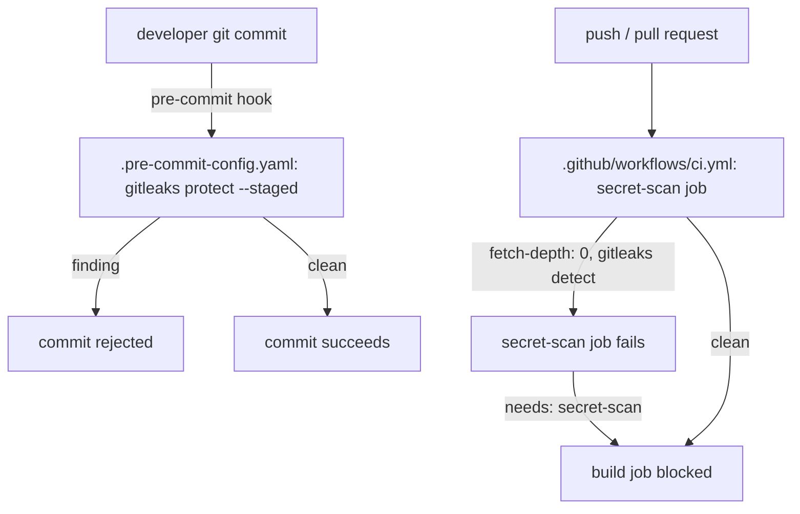

# Design Document: Secret Scanning (DX-1)

## Overview

This design addresses DX-1: enforcing `gitleaks` secret scanning in both the local pre-commit hook and CI. It is a standalone, zero-dependency spec — it does not touch the Orchestrator, the Streamlit UI, or any other Python module. All changes are confined to two new/modified config files (`.pre-commit-config.yaml`, `.github/workflows/ci.yml`), a possible `.gitleaksignore` baseline, and a `README.md` documentation update.

No new Python dependency is introduced — `gitleaks` is an external CLI/Action, not a Python package.

## Architecture

### Component Interaction



### Key Architectural Decisions

| Decision | Rationale |
|----------|-----------|
| `gitleaks` over `detect-secrets`, run in both pre-commit and CI | Single-binary CI integration, no baseline-file maintenance burden for a small team; running it in both places catches commits made without hooks installed (a `git commit --no-verify` or a push from a machine without the hook) |
| CI scans full history (`fetch-depth: 0`) via `gitleaks detect`, pre-commit scans only staged changes via `gitleaks protect --staged` | The two modes are complementary, not redundant: pre-commit catches a leak before it's committed at all (fast, incremental); CI catches anything that slipped past a bypassed or missing local hook, against the entire history reachable from the pushed ref |
| Confirmed false positives are allowlisted by fingerprint in `.gitleaksignore`, never by disabling a rule class | Preserves the scan's ability to catch a genuine future secret matching the same pattern elsewhere in the repo — a documented, auditable exception beats a silently weakened detector |

## Components and Interfaces

### 1. Pre-Commit Hook (`.pre-commit-config.yaml`)

```yaml
repos:
  - repo: https://github.com/gitleaks/gitleaks
    rev: v8.21.2
    hooks:
      - id: gitleaks
```

The official `gitleaks` pre-commit hook entry runs `gitleaks protect --staged` under the hood, scanning only the staged diff — fast enough to run on every commit without meaningfully slowing down the developer loop.

### 2. CI Job (`.github/workflows/ci.yml`)

```yaml
  secret-scan:
    runs-on: ubuntu-latest
    steps:
      - uses: actions/checkout@v4
        with:
          fetch-depth: 0
      - uses: gitleaks/gitleaks-action@v2
        env:
          GITHUB_TOKEN: ${{ secrets.GITHUB_TOKEN }}

  build:
    runs-on: ubuntu-latest
    needs: [lint, type-check, test, secret-scan]
    ...  # unchanged
```

`fetch-depth: 0` is required because a shallow clone (the GitHub Actions default) would let a secret introduced in an earlier commit on the branch — then later removed — slip past a scan of only the final checked-out tree; `gitleaks detect` walks full commit history, so it needs the full history present locally.

### 3. False-Positive Baseline (`.gitleaksignore`)

If the first repo-wide `gitleaks detect` run flags `accounts.example.json` (a template file with placeholder-shaped values) or any other confirmed false positive, a `.gitleaksignore` file is committed alongside, listing each finding's fingerprint — the false positive is documented and allowlisted by fingerprint, not silenced by disabling a rule class. Whether this is needed can only be determined by actually running `gitleaks detect` against the repository, which is an implementation-time step (task 1.3 in `tasks.md`), not something this design can predict from static reading.

### 4. Documentation (`README.md`)

A new section (or addition to an existing "Development Setup" section) documents:

```markdown
## Secret Scanning

This repo runs `gitleaks` locally (pre-commit) and in CI to catch committed
credentials before they reach a shared branch.

Install the pre-commit hook once per clone:

    pip install pre-commit
    pre-commit install

If gitleaks flags a genuine false positive (e.g. a placeholder value that
matches a secret pattern), regenerate the baseline:

    gitleaks detect --report-path .gitleaksignore --report-format gitleaksignore

Never widen or disable a gitleaks rule to silence a false positive — allowlist
the specific fingerprint in `.gitleaksignore` instead.
```

## Correctness Properties

This spec has no properties amenable to Hypothesis-style property testing — `gitleaks` itself is an external binary, and its detection logic is not code owned by this repository. Verification is entirely example-based (see Testing Strategy).

## Error Handling

### Error Propagation Strategy

| Layer | Behavior | Example |
|-------|----------|---------|
| Pre-commit hook | Blocks the commit; developer must remove the secret or (if a genuine false positive) add a fingerprint to `.gitleaksignore` and retry | Committed AWS key → pre-commit hook exits non-zero, commit rejected |
| CI `secret-scan` job | Fails the job, which blocks `build` via its `needs` list | Secret pushed without local hooks installed → CI catches it, `build` never runs |
| Missing `gitleaks` binary locally (developer hasn't run `pre-commit install`) | Pre-commit hook is simply not installed — no protection until the developer runs the one-time setup documented in `README.md`. CI is the backstop for this case. | New contributor skips `pre-commit install` → CI's `secret-scan` job is still the final gate before merge |

### Critical Error Paths

1. **Genuine secret committed**: blocked locally if hooks are installed; blocked in CI regardless. Developer must remove the secret from history (not just the working tree) before the branch can merge.
2. **False positive on a placeholder value**: documented via `.gitleaksignore` fingerprint, not a rule change — the detector's sensitivity for genuine secrets is preserved.

## Testing Strategy

### Testing Approach

Consistent with the project's convention of pairing structural/config assertions with a lightweight functional smoke test where the tool itself can't be meaningfully unit-tested (gitleaks is an external CLI, not code owned by this repo).

### Example-Based Tests

| Requirement | Test Focus | Test Module |
|-------------|-----------|-------------|
| Req 1.1, 1.2 | Assert `.pre-commit-config.yaml` and the CI workflow both reference `gitleaks` (structural/config assertion, not a gitleaks functional test) | `tests/test_secret_scan_config.py` |
| Req 1.3 | If `gitleaks` is available in the test environment, shell out to `gitleaks detect` against a throwaway fixture file containing a synthetic AWS-key-shaped string and assert it is flagged; skip (not fail) if the binary is unavailable | `tests/test_secret_scan_config.py` |
| Req 1.2 | Assert the CI `secret-scan` job's checkout step specifies `fetch-depth: 0` | `tests/test_secret_scan_config.py` |
| Req 1.3 | Assert `build`'s `needs` list in `ci.yml` includes `secret-scan` | `tests/test_secret_scan_config.py` |
| Req 1.4 | (Manual, one-time) Run `gitleaks detect` against the full repository history; if findings are confirmed false positives, commit `.gitleaksignore` with fingerprints — outcome not predictable from this design | Implementation-time step, not a repeatable automated test |
| Req 1.5 | Assert `README.md` contains a `pre-commit install` reference and baseline-regeneration instructions (string-presence assertion) | `tests/test_secret_scan_config.py` |

### Test Quality Requirements

Per project steering rules (`.kiro/specs/audit-remediation/design.md`): no tautological assertions, no pass-by-default fixtures. The `gitleaks`-availability-dependent test SHALL be explicitly skipped (with a clear skip reason), never silently passed, when the binary is absent from the test environment.

### Running Tests

```bash
".venv/Scripts/python.exe" -m pytest tests/test_secret_scan_config.py
```
