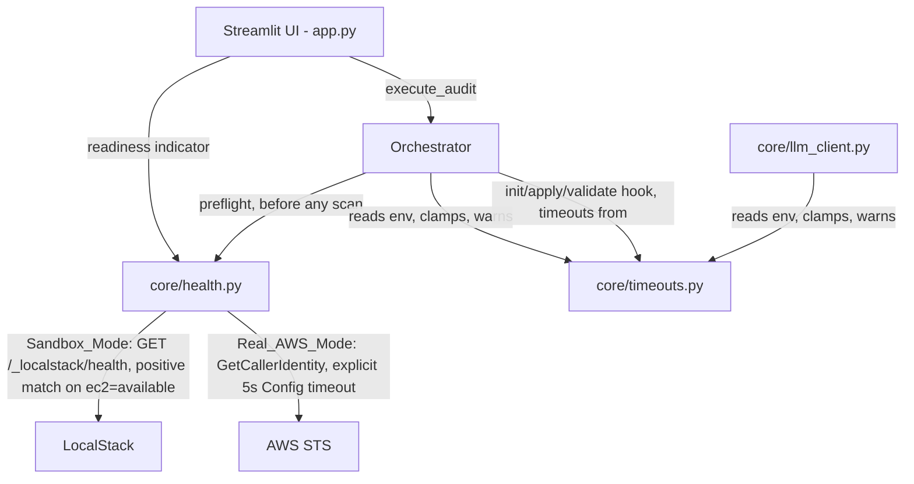

# Design Document: Backend Preflight and Configurable Timeouts (BUG-3 + TECH-1)

## Overview

This design addresses two independent, small ops-hygiene fixes:

1. **Fail-Fast Preflight** (Req 1) — a backend reachability probe gates `execute_audit()`, distinguishing "backend unreachable" from "credentials invalid" so the failure mode is actionable.
2. **Configurable Timeouts** (Req 2) — Terraform/hook subprocess timeouts and the LLM client timeout move from hardcoded literals to env-configurable values with sane ceilings.

Both are confined to the Orchestrator (`orchestrator/orchestrator.py`), the LLM client (`core/llm_client.py`), and two new supporting modules (`core/health.py`, `core/timeouts.py`), plus one small addition to the existing AWS provider (`mcp_server/backends/aws_provider.py`). No new external dependencies are introduced.

## Architecture

### Component Interaction



### Key Architectural Decisions

| Decision | Rationale |
|----------|-----------|
| Block-by-default health preflight, with `JANITOR_SKIP_HEALTH_CHECK=1` escape hatch | Proceeding into a scan against an unreachable backend just produces a confusing deep failure later; fail-fast costs a reachable backend nothing extra, and legitimate users are never blocked (Req 1) |
| Health check's STS client uses an explicit `botocore.config.Config(connect_timeout=5, read_timeout=5)`, not `aws_provider._make_client()` as-is | `_make_client()` only ever sets `region_name`/`endpoint_url` — no timeout parameter exists. Against a genuinely unreachable STS endpoint, reusing it unmodified would hang for boto3's much larger, retry-multiplied default timeout, defeating the entire "fail fast" purpose of this ticket. A small optional `config` parameter is added to `_make_client()` itself (a minimal change to existing AWS-provider code, not just new code), rather than duplicating client-construction logic in a second, parallel constructor (Req 1) |
| `HealthStatus` distinguishes "unreachable" from "invalid_credentials" via a dedicated field, not one flat `io_failure` category | An operator (or the UI) seeing "unreachable" knows to start LocalStack or check network/DNS; seeing "invalid_credentials" knows to check IAM/session state. Collapsing both into one generic failure category makes the preflight less actionable than a plain stack trace would have been (Req 1) |
| LocalStack health check matches positively (`services.ec2 == "available"`), not negatively (`!= "unavailable"`) | Mirrors the existing `Makefile:9`/`Makefile:36` precedent's actual semantics exactly. LocalStack's health payload has intermediate states (e.g. `"starting"`) that a negative-match check would incorrectly treat as reachable, potentially green-lighting a scan against a still-booting LocalStack (Req 1) |
| Timeouts become env-configurable with the current hardcoded values as defaults, plus a 1800s ceiling | Simplest possible mechanism — no new config file format — while a ceiling prevents an operator's typo (e.g. `JANITOR_TF_APPLY_TIMEOUT=999999999`) from hanging the process indefinitely (Req 2) |
| `_run_pre_remediation_hook_full()`'s 60s timeout is excluded from this spec's scope | That method is never called by `execute_audit()` in production — only its own unit tests exercise it. Making its timeout configurable would add a public env var with zero effect on any real path. Wiring the method into the live pipeline is a materially larger change than "make timeouts configurable" and is out of scope here (Req 2) |

## Components and Interfaces

### 1. Backend Reachability Preflight (`core/health.py`)

```python
"""Backend reachability preflight for Cloud Janitor.

Used by Orchestrator.execute_audit() to fail fast on an unreachable
backend, and by the Streamlit UI to render a readiness indicator —
both call the exact same function so they can never disagree.
"""

from __future__ import annotations

import json
import os
import urllib.error
import urllib.request
from dataclasses import dataclass
from typing import Literal

_PROBE_TIMEOUT_SECONDS = 5

# Distinguishes *why* a probe failed, not just *that* it failed — an
# operator (or the UI) needs a different remediation for "start
# LocalStack" than for "fix your AWS credentials." Collapsing both into
# one flat io_failure category was flagged in design review as making
# the preflight less actionable than a plain exception would have been.
HealthMode = Literal["healthy", "unreachable", "invalid_credentials"]


@dataclass
class HealthStatus:
    reachable: bool
    environment: str   # "sandbox_localstack" | "real_aws" — which probe ran
    mode: HealthMode    # "healthy" | "unreachable" | "invalid_credentials"
    detail: str
    endpoint: str


def _is_real_aws_mode() -> bool:
    is_localstack = bool(os.environ.get("AWS_ENDPOINT_URL"))
    return os.environ.get("JANITOR_BACKEND", "fixture") == "aws" and not is_localstack


def check_backend_health() -> HealthStatus:
    """Probe the active backend. Never raises — failures are encoded in the result."""
    if _is_real_aws_mode():
        return _check_sts()
    return _check_localstack()


def _check_localstack() -> HealthStatus:
    """Positive-match check, mirroring Makefile:9/:36 exactly.

    The Makefile precedent greps for '"ec2": "available"' — a positive
    match — not for the absence of "unavailable". LocalStack's health
    payload has intermediate states (e.g. "starting") that a negative-match
    check would incorrectly treat as reachable, potentially green-lighting
    a scan against a still-booting LocalStack.
    """
    endpoint = os.environ.get("AWS_ENDPOINT_URL", "http://localhost:4566")
    url = f"{endpoint.rstrip('/')}/_localstack/health"
    try:
        with urllib.request.urlopen(url, timeout=_PROBE_TIMEOUT_SECONDS) as resp:
            if resp.status != 200:
                return HealthStatus(False, "sandbox_localstack", "unreachable", f"HTTP {resp.status}", url)
            body = json.loads(resp.read().decode("utf-8"))
            if body.get("services", {}).get("ec2") != "available":
                return HealthStatus(
                    False, "sandbox_localstack", "unreachable",
                    f"ec2 service not available (status: {body.get('services', {}).get('ec2')!r})", url,
                )
            return HealthStatus(True, "sandbox_localstack", "healthy", "ok", url)
    except (urllib.error.URLError, TimeoutError, json.JSONDecodeError, OSError) as exc:
        return HealthStatus(False, "sandbox_localstack", "unreachable", str(exc), url)


def _check_sts() -> HealthStatus:
    """Probe real AWS via STS GetCallerIdentity with an explicit, short timeout.

    Deliberately does NOT call aws_provider._make_client("sts", region=None)
    unmodified — that function has no timeout/Config parameter, so a call
    against a genuinely unreachable STS endpoint would hang for boto3's
    default (much larger, retry-multiplied) timeout, defeating this
    requirement's "fail fast" purpose. Passes an explicit Config instead,
    via the small `config=` addition made to _make_client() in this spec
    (see Component 3 below).
    """
    from botocore.config import Config
    from botocore.exceptions import ClientError, EndpointConnectionError, NoCredentialsError

    from cloud_janitor.mcp_server.backends.aws_provider import _make_client

    timeout_config = Config(connect_timeout=_PROBE_TIMEOUT_SECONDS, read_timeout=_PROBE_TIMEOUT_SECONDS)
    try:
        client = _make_client("sts", region=None, config=timeout_config)
        client.get_caller_identity()
        return HealthStatus(True, "real_aws", "healthy", "ok", "sts:GetCallerIdentity")
    except (ClientError, NoCredentialsError) as exc:
        # Reached AWS (or a credential resolver ran) but was rejected —
        # this is a credentials/permissions problem, not a network one.
        return HealthStatus(False, "real_aws", "invalid_credentials", str(exc), "sts:GetCallerIdentity")
    except (EndpointConnectionError, OSError, TimeoutError) as exc:
        # Never reached AWS at all — network/DNS/timeout.
        return HealthStatus(False, "real_aws", "unreachable", str(exc), "sts:GetCallerIdentity")
    except Exception as exc:  # noqa: BLE001 — unexpected shape, still "not reachable"
        return HealthStatus(False, "real_aws", "unreachable", str(exc), "sts:GetCallerIdentity")
```

### 2. Small Addition to Existing AWS Provider (`mcp_server/backends/aws_provider.py`)

```python
# BEFORE (existing code, unchanged signature otherwise):
def _make_client(service: str, region: Optional[str]):
    """Return a boto3 client, wiring in AWS_ENDPOINT_URL when present."""
    import boto3
    kwargs: dict = {"region_name": region}
    endpoint = os.environ.get("AWS_ENDPOINT_URL")
    if endpoint:
        kwargs["endpoint_url"] = endpoint
    return boto3.client(service, **kwargs)

# AFTER — one new optional parameter, fully backward compatible with every
# existing call site (all of which omit it and get today's behavior unchanged):
def _make_client(service: str, region: Optional[str], config: "botocore.config.Config | None" = None):
    """Return a boto3 client, wiring in AWS_ENDPOINT_URL when present.

    `config` is optional and defaults to None (boto3's own default Config),
    preserving every existing caller's behavior exactly. Added so
    core/health.py's STS preflight can pass an explicit short timeout
    without duplicating this function's endpoint-wiring logic in a second,
    parallel client constructor.
    """
    import boto3
    kwargs: dict = {"region_name": region}
    endpoint = os.environ.get("AWS_ENDPOINT_URL")
    if endpoint:
        kwargs["endpoint_url"] = endpoint
    if config is not None:
        kwargs["config"] = config
    return boto3.client(service, **kwargs)
```

This is the only change to existing AWS-provider code required by this spec — every other call site in the codebase (which passes only `service`/`region`) is unaffected.

### 3. Orchestrator Preflight Wiring

```python
# At the very top of execute_audit(), before Step 1 (FinOps scan):
from cloud_janitor.core.health import check_backend_health

def execute_audit(self, status_callback=None) -> AuditResult:
    ...
    health = check_backend_health()
    if not health.reachable:
        if os.environ.get("JANITOR_SKIP_HEALTH_CHECK") == "1":
            logger.warning(
                "Backend health check failed (%s: %s) but JANITOR_SKIP_HEALTH_CHECK=1 — proceeding anyway.",
                health.mode, health.detail,
            )
        else:
            self._log_action("health_check_failed", "all", "blocked", f"{health.mode}: {health.detail}")
            error_category = "credentials_invalid" if health.mode == "invalid_credentials" else "backend_unreachable"
            return AuditResult(
                success=False,
                error=f"Backend {health.mode} ({health.environment}): {health.detail}",
                error_category=error_category,
                error_agent="Orchestrator",
            )
    # ... existing pipeline continues unchanged
```

`error_category` now takes one of two distinct values (`"backend_unreachable"` / `"credentials_invalid"`) instead of the single generic `"io_failure"` the original design used — the Streamlit UI (Component 5 below) branches its rendering on this value.

### 4. Configurable Timeouts (`core/timeouts.py`)

```python
"""Centralized, validated timeout configuration.

Each getter reads its env var fresh (not module-level) so tests can
monkeypatch os.environ without reimporting the module.

Note: _run_pre_remediation_hook_full()'s 60s internal timeout is
deliberately NOT included here — that method is never called by
execute_audit() in production (only its own unit tests exercise it),
so making its timeout configurable would add a public env var with no
effect on any real path. See design.md's "Key Architectural Decisions".
"""

import logging
import os

logger = logging.getLogger(__name__)

_CEILING_SECONDS = 1800  # 30 minutes — see Requirement 2.4

_DEFAULTS = {
    "JANITOR_TF_INIT_TIMEOUT": 120,
    "JANITOR_TF_APPLY_TIMEOUT": 120,
    "JANITOR_TF_VALIDATE_TIMEOUT": 180,
    "JANITOR_HOOK_TIMEOUT": 30,
    "JANITOR_LLM_TIMEOUT": 30,
}


def get_timeout(name: str) -> int:
    """Return the configured timeout for `name`, validated and clamped.

    `name` must be a key of _DEFAULTS. Invalid (non-positive-integer)
    values fall back to the default with a WARNING. Values above the
    ceiling (only applies to Terraform/hook timeouts, not the LLM one,
    which has its own much smaller practical ceiling) are clamped with
    a WARNING.
    """
    default = _DEFAULTS[name]
    raw = os.environ.get(name)
    if raw is None:
        return default
    try:
        value = int(raw)
        if value <= 0:
            raise ValueError
    except ValueError:
        logger.warning("Invalid %s=%r — falling back to default %ds", name, raw, default)
        return default
    if name != "JANITOR_LLM_TIMEOUT" and value > _CEILING_SECONDS:
        logger.warning("%s=%ds exceeds ceiling %ds — clamping", name, value, _CEILING_SECONDS)
        return _CEILING_SECONDS
    return value
```

Every hardcoded `timeout=120` / `timeout=180` / `timeout=30` literal in `orchestrator.py` at the real-path call sites (lines 924, 945, 1123, 1168, 1551, 1574 — `_run_pre_remediation_hook_full()`'s line 1189 excluded per the scope note above) is replaced with `timeout=get_timeout("JANITOR_TF_INIT_TIMEOUT")` etc. `core/llm_client.py:39`'s `_TIMEOUT = 30` module constant becomes a call to `get_timeout("JANITOR_LLM_TIMEOUT")` at client-construction time in `get_client()` (not at import time, so the env var can still be read per-call in tests).

Timeout-fired handling wraps each `subprocess.run(...)` call already guarded by a try/except for non-zero exit codes; a `subprocess.TimeoutExpired` catch is added alongside it:

```python
try:
    result = subprocess.run([...], timeout=get_timeout("JANITOR_TF_APPLY_TIMEOUT"), ...)
except subprocess.TimeoutExpired as exc:
    logger.warning(
        "terraform apply timed out after %ds for %s", exc.timeout, resource_id
    )
    self._log_action("execution", resource_id, "failure", f"terraform apply timed out after {exc.timeout}s")
    self._record_error(exc, "Orchestrator", context="tf_apply")
    return ApprovalResult(success=False, error=f"terraform apply timed out after {exc.timeout}s", resource_id=resource_id)
```

**Non-goal (see Open Questions below):** automatically running a Terraform state-check/import-reconciliation pass after a killed `apply` is not implemented in this phase — it requires state inspection logic (`terraform show`/`state list` diffing) that is a larger feature than "make the number configurable."

### 5. Streamlit UI Readiness Indicator

The UI renders `check_backend_health()`'s result immediately above the "Run Audit" control, using the same four-state rendering the Orchestrator's error path now supports:

| `HealthStatus` | UI rendering |
|---|---|
| `reachable=True` | "Ready" (green) |
| `reachable=False, mode="unreachable"` | "Backend unreachable — check LocalStack is running / network connectivity" (red) |
| `reachable=False, mode="invalid_credentials"` | "Credentials invalid — check AWS session/IAM permissions" (red, distinct message from the above) |
| (probe in flight) | "Checking..." (grey, transient) |

## Correctness Properties

*A property is a characteristic or behavior that should hold true across all valid executions of a system.*

### Property 1: Health Preflight Blocks By Default

*For any* `check_backend_health()` result with `reachable=False` and `JANITOR_SKIP_HEALTH_CHECK` unset or not `"1"`, `execute_audit()` SHALL invoke zero agent scan methods and SHALL return `AuditResult(success=False, ...)`.

**Validates: Requirement 1.4**

### Property 2: Health Preflight Override Invariant

*For any* `check_backend_health()` result and `JANITOR_SKIP_HEALTH_CHECK=1`, `execute_audit()` SHALL proceed to Step 1 (FinOps scan) regardless of the health result.

**Validates: Requirement 1.5**

### Property 3: LocalStack Positive-Match Partition

*For any* LocalStack health JSON body, `_check_localstack()` SHALL return `reachable=True` if and only if `body["services"]["ec2"] == "available"` — every other string value (including `"unavailable"`, `"starting"`, or any unrecognized state) SHALL yield `reachable=False`.

**Validates: Requirement 1.2**

### Property 4: Health Failure Classification Partition

*For any* STS call outcome, `_check_sts()` SHALL classify the result as exactly one of `"healthy"`, `"unreachable"`, or `"invalid_credentials"` — a `ClientError`/`NoCredentialsError` (reached AWS, rejected) SHALL always classify as `"invalid_credentials"`, and a connection-level failure (`EndpointConnectionError`, `OSError`, `TimeoutError`) SHALL always classify as `"unreachable"`.

**Validates: Requirement 1.7**

### Property 5: Timeout Validation Partition

*For any* string value of a timeout environment variable, `get_timeout()` SHALL return: the parsed integer if it is a positive integer at or below 1800 (or unbounded for `JANITOR_LLM_TIMEOUT`); `1800` if it is a positive integer above that ceiling (Terraform/hook vars only); the variable's default in all other cases (non-numeric, zero, negative, unset).

**Validates: Requirements 2.3, 2.4**

## Error Handling

### Error Propagation Strategy

| Layer | Behavior | Example |
|-------|----------|---------|
| Health probe | Never raises; failure is encoded in `HealthStatus.reachable=False` plus a specific `mode` | LocalStack not started → `reachable=False, mode="unreachable"`, orchestrator blocks |
| Health probe (STS, credential rejection) | Classified distinctly from a network failure | Expired session token → `reachable=False, mode="invalid_credentials"` |
| Timeout validation | Invalid/out-of-range env values degrade to a safe default/ceiling with a WARNING, never an exception at startup | `JANITOR_TF_APPLY_TIMEOUT=abc` → falls back to 120s |
| Subprocess timeout fired | Caught alongside the existing non-zero-exit-code handling; returns the same failure result shape | `apply` exceeds configured timeout → `ApprovalResult(success=False, ...)`, same as a non-zero exit |

### Critical Error Paths

1. **Backend unreachable at audit start**: zero agent calls made, clear error surfaced distinguishing "unreachable" from "invalid credentials", operator fixes environment/credentials and retries (or explicitly overrides).
2. **Terraform timeout mid-apply**: treated identically to a non-zero exit code; the isolated `apply_dir` is left in place for post-mortem inspection (existing `finally: shutil.rmtree` behavior in `approve()` is preserved — this does not change cleanup semantics, only which exception type triggers the failure branch).

## Open Questions

**Should a killed `apply` (Requirement 2.5, `TimeoutExpired`) be followed by automatic Terraform state reconciliation?** When a `terraform apply` is killed by the new configurable timeout, Terraform may have already created or partially modified real infrastructure before the process was cut off — the on-disk state file in `apply_dir` can then disagree with actual cloud state. This spec deliberately stops at surfacing the timeout as a failure result (Requirement 2.5) and leaves `apply_dir` in place for manual post-mortem inspection (see Critical Error Path 2 above); it does not attempt to automatically run `terraform show`/`state list`/`import` to reconcile the two. Whether a future phase should add automatic state-check/reconciliation after a killed apply — and if so, whether that belongs in this Orchestrator or as a separate operator-triggered tool — is left open. Raised here rather than resolved because it requires state inspection logic that is a materially larger feature than "make the timeout number configurable," this spec's actual scope.

## Testing Strategy

### Testing Approach

Dual approach consistent with the project's existing convention (`.kiro/specs/audit-remediation/design.md`, `.kiro/specs/phase1-trust-hardening/design.md`): Hypothesis property tests (`@settings(max_examples=100)`) for the 5 properties above, plus pytest example-based unit tests for specific scenarios and integration points.

### Property Test Mapping

| Property | Test Module |
|----------|-------------|
| 1, 2: Health Preflight Block/Override | `tests/test_health_properties.py` |
| 3: LocalStack Positive-Match Partition | `tests/test_health_properties.py` |
| 4: Health Failure Classification Partition | `tests/test_health_properties.py` |
| 5: Timeout Validation Partition | `tests/test_timeouts_properties.py` |

### Example-Based Unit Tests

| Requirement | Test Focus | Test Module |
|-------------|-----------|-------------|
| Req 1.2 | Mocked LocalStack HTTP 200 with `ec2: "available"` → reachable; `ec2: "unavailable"` → not reachable; `ec2: "starting"` → not reachable (regression test for the negative-match bug fixed in this design) | `tests/test_health.py` |
| Req 1.3 | Mocked STS success/failure in real-AWS mode; assert the constructed client's `Config` has `connect_timeout=5, read_timeout=5` (mock `_make_client` and inspect the `config` kwarg passed) | `tests/test_health.py` |
| Req 1.7 | `ClientError`/`NoCredentialsError` → `mode="invalid_credentials"`; `EndpointConnectionError`/`OSError`/`TimeoutError` → `mode="unreachable"` | `tests/test_health.py` |
| Req 1.1, 1.4, 1.5, 1.6 | Orchestrator preflight wiring: unreachable + no override → zero calls to `self._finops.scan()`; unreachable + override → proceeds with a WARNING; reachable → no behavior change | `tests/test_orchestrator_health_preflight.py` |
| Req 1.8 | UI renders four distinct states (ready/unreachable/invalid-credentials/checking) calling the same `check_backend_health()` function | `tests/test_health.py` (UI rendering logic, mocked) |
| Req 2.1, 2.2 | Clamp/fallback matrix for each of the 5 timeout vars (excludes the dropped `JANITOR_HOOK_TOTAL_TIMEOUT`) | `tests/test_timeouts.py` |
| Req 2.5 | `TimeoutExpired` caught at each real-path call site (init, apply, `_run_pre_remediation_hook()`'s validate call, post-remediation hook) and returns a failure result | `tests/test_timeout_handling.py` |
| — | `_make_client()`'s new `config=` parameter is optional and every existing call site (omitting it) is unaffected — regression test | `tests/test_aws_provider.py` |

### Test Quality Requirements

Per project steering rules (`.kiro/specs/audit-remediation/design.md`): no tautological assertions, no pass-by-default fixtures, negative cases required for every module, only mock external I/O (subprocess, filesystem, network, STS) — never mock the unit under test.

### Running Tests

```bash
# All tests
".venv/Scripts/python.exe" -m pytest tests/

# Property tests only
".venv/Scripts/python.exe" -m pytest tests/ -k "properties"
```
