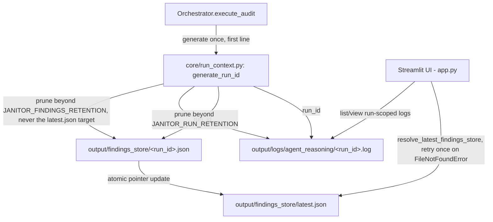

# Design Document: Run-Scoped Artifacts (OBS-1 + BUG-2)

## Overview

This design addresses two genuinely coupled backlog issues by generalizing a single new concept — a per-run identifier — into both the Reasoning_Log (OBS-1) and the Findings_Store (BUG-2):

1. **Shared Run Identifier** (Req 1) — one `Run_ID` generated once per `execute_audit()` invocation, exposed via `self.current_run_id` and `AuditResult.run_id`.
2. **Run-Scoped Reasoning Log** (Req 2) — replaces the existing "wipe the single shared file on every run" pattern with per-run files plus configurable retention.
3. **Run-Scoped Findings Store** (Req 3) — replaces the existing "one shared mutable file" pattern with per-run files plus a `latest.json` pointer and configurable retention.

All changes are confined to `orchestrator/orchestrator.py`, `agents/reasoning_logger.py`, `agents/finops_auditor.py`, `agents/secops_guard.py`, `agents/remediation_architect.py`, `core/paths.py`, `app.py`, plus one new supporting module, `core/run_context.py`. No new external dependencies are introduced.

## Architecture

### Component Interaction



### Key Architectural Decisions

| Decision | Rationale |
|----------|-----------|
| One `Run_ID` shared by the Reasoning_Log and the Findings_Store, generated in `core/run_context.py` | Both problems ("wiped on every run" and "one shared mutable file") are instances of the same missing concept — a per-run scope. A single generator + a single pruning helper avoids two divergent retention implementations (Req 1, 2, 3) |
| Run_ID assigned at the top of `execute_audit()`, reusing phase2-persistent-state's existing call site if phase2 has landed | Phase2's design already assigns `self.current_run_id` as the first line of `execute_audit()`, specifically anticipating this spec's need for the identifier to exist before the first agent runs. This spec does not introduce a second call site or move phase2's — it only swaps the generator function (`uuid.uuid4().hex` → `generate_run_id()`) if phase2 exists, or performs the same assignment itself at the same call site if phase2 hasn't landed yet (Req 1) |
| OBS-1 and BUG-2 implemented and shipped as a single unit | Both consume the same Run_ID at the same generation point; splitting them further would require either duplicating the Run_ID concept or creating an artificial ordering dependency between two specs for no benefit. The original bundled spec's requirements document claimed BUG-2 was independent while its own tasks.md anchored it to OBS-1 landing first — this design states the coupling plainly instead (Req 1) |
| Run-scoped files with a configurable retention window (default 20 runs each) rather than unbounded accumulation or size-based rotation | Rotation-by-size (the status quo) still eventually deletes old runs, defeating the stated goal ("a given audit's reasoning/findings can be retrieved later"). A fixed count bounds disk usage; making it configurable (`JANITOR_RUN_RETENTION`, `JANITOR_FINDINGS_RETENTION`) — rather than a single hardcoded `20` — follows the same pattern TECH-1 established for timeout constants, and lets an operator running frequent scheduled scans (phase3e) widen the window so a run's artifacts survive long enough to be useful (Req 2, 3) |
| Findings_Store gains a `latest.json` pointer instead of writing back to the legacy fixed path | Writing run-scoped files eliminates the corruption window entirely (two runs never touch the same file); a pointer read is a single small atomic operation, so even a race on the pointer itself just picks a well-formed "last writer wins" result, never a torn read (Req 3) |
| Findings-store reader retries pointer resolution once on `FileNotFoundError` rather than surfacing a hard error immediately | Closes the narrow TOCTOU window between `resolve_latest_findings_store()` returning a path and the caller opening it (enough runs completing + pruning in between could delete that exact file). `app.py`'s existing exception handling already catches `IOError` (an alias for `OSError`, of which `FileNotFoundError` is a subclass) — this design adds one retry of the resolution step before falling back to the existing "no data available" UI state, rather than changing the exception-handling shape (Req 3) |

## Components and Interfaces

### 1. Shared Run Identifier and Retention (`core/run_context.py`)

```python
"""Shared per-run identifier and retention helper.

Used by both the Reasoning_Log (run-scoped log files) and the
Findings_Store (run-scoped store files) so the two features share one
ID format and one pruning implementation instead of diverging.
"""

from __future__ import annotations

import logging
import os
import uuid
from datetime import datetime, timezone
from pathlib import Path

logger = logging.getLogger(__name__)

DEFAULT_RETENTION = 20


def generate_run_id() -> str:
    """Return a lexicographically sortable, unique run identifier.

    Format: <UTC timestamp>-<8 hex char UUID4 fragment>, e.g.
    "20260708T143000Z-a1b2c3d4". Timestamp-prefixing means sorting
    filenames alphabetically also sorts them by recency.
    """
    ts = datetime.now(timezone.utc).strftime("%Y%m%dT%H%M%SZ")
    return f"{ts}-{uuid.uuid4().hex[:8]}"


def get_retention(env_var: str) -> int:
    """Read a retention count from `env_var`, defaulting to 20 on unset/invalid.

    Mirrors core/timeouts.py's get_timeout() validation pattern (phase3b):
    invalid values fall back to the default with a WARNING rather than raising.
    """
    raw = os.environ.get(env_var)
    if raw is None:
        return DEFAULT_RETENTION
    try:
        value = int(raw)
        if value <= 0:
            raise ValueError
        return value
    except ValueError:
        logger.warning("Invalid %s=%r — falling back to default retention %d", env_var, raw, DEFAULT_RETENTION)
        return DEFAULT_RETENTION


def prune_run_scoped_files(directory: Path, suffix: str, keep: int, protect: set[str] | None = None) -> None:
    """Delete the oldest files matching '*<suffix>' in directory beyond `keep`.

    Files are sorted by filename (equivalent to sort-by-recency given the
    generate_run_id() format). Never raises — permission errors or files
    in use are skipped silently, matching the project's fail-silent
    filesystem convention for auxiliary/retention operations.

    Args:
        protect: filenames (not full paths) that must never be deleted
            even if they would otherwise be the oldest — e.g. the file
            currently referenced by a "latest" pointer.
    """
    if not directory.exists():
        return
    protect = protect or set()
    matches = sorted(
        p for p in directory.glob(f"*{suffix}") if p.name not in protect
    )
    excess = len(matches) - keep
    for path in matches[:max(excess, 0)]:
        try:
            path.unlink()
        except OSError:
            pass
```

### 2. Orchestrator Run_ID Assignment

```python
# execute_audit() — FIRST LINE of the method body, before Step 1 (FinOps scan).
#
# If phase2-persistent-state has already landed, this line already exists as
# `self.current_run_id = uuid.uuid4().hex` — this spec's only change at this
# call site is swapping the generator:
from cloud_janitor.core.run_context import generate_run_id

def execute_audit(self, status_callback=None) -> AuditResult:
    self.current_run_id = generate_run_id()
    run_id = self.current_run_id
    self._reasoning_logger.start_new_run(run_id)

    run_findings_path = FINDINGS_STORE_DIR / f"{run_id}.json"
    self._finops.findings_store_path = run_findings_path
    self._secops.findings_store_path = run_findings_path
    self._architect.findings_store_path = run_findings_path
    # ... Steps 1-4 (scan/scan/validate/plan) proceed unchanged, all writing
    # to run_findings_path and the run-scoped reasoning log

    # After Step 4 succeeds (all writers done for this run):
    update_findings_store_pointer(run_id, run_findings_path)
    prune_run_scoped_files(
        FINDINGS_STORE_DIR, ".json", get_retention("JANITOR_FINDINGS_RETENTION"),
        protect={run_findings_path.name, "latest.json"},
    )
    # ... existing pipeline continues, AuditResult now includes run_id=run_id
```

**Note on `self.current_run_id`'s assignment point (corrected per cross-phase review):** an earlier draft of the original bundled `phase3-ops-hardening` design incorrectly implied this spec would need to move `self.current_run_id`'s assignment point within `execute_audit()`. That was wrong — phase2-persistent-state's design was itself corrected during the same review to assign `self.current_run_id` as the *first line* of `execute_audit()`, exactly so that this spec's run-scoped artifacts could be tagged from the very first scan step onward. This spec therefore only swaps the *generator function* (`uuid.uuid4().hex` → `generate_run_id()`) at that already-correct call site — it does not relocate anything. If this spec is implemented before phase2, it performs the assignment itself at the same call site (top of `execute_audit()`), and phase2 (when implemented) finds that assignment already in place and adopts `generate_run_id()` unchanged.

### 3. Run-Scoped Reasoning Log (`agents/reasoning_logger.py`)

`ReasoningLogger` keeps its existing `emit()` signature and JSONL shape; only the file-selection and lifecycle methods change. `truncate()` is retired from the `execute_audit()` call site (Requirement 2.2) but left in the class, marked deprecated, so any external caller does not break immediately.

```python
class ReasoningLogger:
    ...
    def start_new_run(self, run_id: str) -> None:
        """Point this logger at a fresh run-scoped file and prune old runs.

        Unlike truncate(), this never deletes or overwrites another run's
        file — it only creates the new one and prunes beyond the configured
        retention (JANITOR_RUN_RETENTION, default 20). Since agents
        (FinOpsAuditor, SecOpsGuard, ...) hold a reference to this same
        ReasoningLogger instance (injected at Orchestrator.__init__),
        mutating self._log_path here redirects all of them without needing
        to re-wire each agent's reference.
        """
        from cloud_janitor.core.run_context import get_retention, prune_run_scoped_files
        run_dir = self._log_path.parent / "agent_reasoning"
        run_dir.mkdir(parents=True, exist_ok=True)
        self._log_path = run_dir / f"{run_id}.log"
        try:
            self._log_path.touch(exist_ok=True)
        except OSError as exc:
            print(f"ReasoningLogger: failed to create {self._log_path}: {exc}", file=sys.stderr)
        prune_run_scoped_files(run_dir, ".log", get_retention("JANITOR_RUN_RETENTION"))

    def truncate(self) -> None:
        """Deprecated: retained for backward compatibility. Prefer start_new_run()."""
        ...  # unchanged existing implementation
```

**Note on redaction (integration point with phase1's SEC-2):** once `core/redaction.py` exists (phase1-trust-hardening Requirement 4), `emit()`'s `message` parameter is a good candidate for `redact()` before being written, since reasoning traces can restate finding data verbatim. This spec does not implement that wiring — the reasoning log is written to local disk only (never sent to an LLM or third party), so it is a defense-in-depth enhancement, not a blocking dependency for this spec.

### 4. Run-Scoped Findings Store (`core/paths.py`, `orchestrator.py`)

```python
# core/paths.py additions
FINDINGS_STORE_DIR = OUTPUT_DIR / "findings_store"
FINDINGS_STORE_LATEST_POINTER = FINDINGS_STORE_DIR / "latest.json"


def resolve_latest_findings_store() -> Path | None:
    """Return the current run-scoped Findings_Store path, or the legacy
    fixed-path file as a one-time migration fallback, or None."""
    if FINDINGS_STORE_LATEST_POINTER.exists():
        try:
            data = json.loads(FINDINGS_STORE_LATEST_POINTER.read_text(encoding="utf-8"))
            candidate = Path(data["path"])
            if candidate.exists():
                return candidate
        except (json.JSONDecodeError, OSError, KeyError):
            pass
    if FINDINGS_STORE_PATH.exists():  # legacy shared file, pre-dates this feature
        return FINDINGS_STORE_PATH
    return None


def update_findings_store_pointer(run_id: str, path: Path) -> None:
    """Atomically point 'latest.json' at this run's Findings_Store."""
    FINDINGS_STORE_DIR.mkdir(parents=True, exist_ok=True)
    tmp = FINDINGS_STORE_LATEST_POINTER.with_suffix(".json.tmp")
    tmp.write_text(json.dumps({"run_id": run_id, "path": str(path)}), encoding="utf-8")
    tmp.replace(FINDINGS_STORE_LATEST_POINTER)
```

This is the exact override mechanism `MultiAccountOrchestrator` already uses (`orch._finops.findings_store_path = findings_store_path`, `multi_account_orchestrator.py:243-246`) — Requirement 3 generalizes an existing pattern to the single-account default path rather than inventing a new one.

### 5. `app.py` — Retry-Once Reader (fixes the narrow TOCTOU race)

```python
# app.py — replaces the current FINDINGS_STORE_PATH import and the two
# read sites at app.py:607,610.
from cloud_janitor.core.paths import resolve_latest_findings_store


def load_findings() -> list[dict]:
    path = resolve_latest_findings_store()
    if path is None:
        return []
    try:
        with open(path) as f:
            data = json.load(f)
        return data.get("findings", [])
    except FileNotFoundError:
        # Narrow TOCTOU race: the pointed-to file was pruned between
        # resolve_latest_findings_store() returning it and this open()
        # call. Retry resolution once — by the time we retry, latest.json
        # points at a file that (by construction) is never itself pruned
        # while it's the current pointer target.
        path = resolve_latest_findings_store()
        if path is None:
            return []
        try:
            with open(path) as f:
                data = json.load(f)
            return data.get("findings", [])
        except (json.JSONDecodeError, IOError):
            return []
    except (json.JSONDecodeError, IOError):
        # Any other read/parse failure — existing "no data available"
        # fallback behavior, unchanged.
        return []
```

`IOError` is an alias for `OSError` in Python 3, and `FileNotFoundError` is a subclass of `OSError` — so `app.py`'s pre-existing `except (json.JSONDecodeError, IOError)` clause already structurally covers this case today. The change here is behavioral, not about widening what's caught: instead of falling straight through to "no data available" on the first `FileNotFoundError`, the reader gets one retry of the pointer resolution, because a fresh resolution is very likely to succeed (the pruning logic never deletes the file `latest.json` currently references — see Requirement 3, criterion 6 — so a `FileNotFoundError` here is a small window between pointer-move-away and this read, not a case with no valid file at all).

## Correctness Properties

*A property is a characteristic or behavior that should hold true across all valid executions of a system.*

### Property 1: Run_ID Uniqueness and Sortability

*For any* two calls to `generate_run_id()` separated by at least one second, the two returned strings SHALL be unequal, and the lexicographically greater string SHALL correspond to the later call.

**Validates: Requirements 1.1, 1.2**

### Property 2: Reasoning Log Retention Bound

*For any* sequence of N calls to `start_new_run()` where N exceeds the configured `JANITOR_RUN_RETENTION` value, the `agent_reasoning/` directory SHALL contain at most that many `.log` files after the Nth call, and the remaining files SHALL be the most recently created.

**Validates: Requirement 2.3**

### Property 3: Findings Store Isolation

*For any* two `execute_audit()` invocations with distinct Run_IDs, no write performed by one invocation's agents SHALL be visible in the other invocation's run-scoped Findings_Store file, and both files SHALL independently pass `_validate_findings_store()` if their source scans succeeded.

**Validates: Requirement 3.7**

### Property 4: Findings Store Pointer Never References a Pruned File

*For any* sequence of runs and any point in time, `resolve_latest_findings_store()`'s returned path SHALL exist on disk — `prune_run_scoped_files()` SHALL never delete the file currently referenced by `latest.json`.

**Validates: Requirement 3.6**

### Property 5: Retention Configuration Partition

*For any* string value of `JANITOR_RUN_RETENTION` or `JANITOR_FINDINGS_RETENTION`, `get_retention()` SHALL return the parsed integer if it is a positive integer, and `20` in all other cases (non-numeric, zero, negative, unset).

**Validates: Requirements 2.7, 3.8**

## Error Handling

### Error Propagation Strategy

| Layer | Behavior | Example |
|-------|----------|---------|
| Run-scoped reasoning log | Filesystem errors logged to stderr, never raised (unchanged from existing `truncate()`/`emit()` convention) | Disk full → warning printed, run continues without reasoning trail |
| Run-scoped findings store | Pointer write failure surfaces as an `io_failure` structured error; the run-scoped store file itself may still be valid on disk even if the pointer update fails | `os.replace` failure on pointer → error logged, findings store file still exists at its run-scoped path for manual recovery |
| Findings-store reader TOCTOU race | One retry of `resolve_latest_findings_store()`, then falls back to the existing "no data available" UI state | Pointer target pruned between resolve and open → retry resolves to the new current file, or falls back gracefully if truly none exists |
| Retention configuration | Invalid/out-of-range env values degrade to the default (20) with a WARNING, never an exception | `JANITOR_RUN_RETENTION=abc` → falls back to 20 |

### Critical Error Paths

1. **Findings-store pointer corruption**: `resolve_latest_findings_store()` falls back to the legacy fixed-path file if present, else `None` — the UI shows "no data available" rather than crashing.
2. **TOCTOU race on pointer resolution**: handled by a single retry before falling back — see Component 5.

## Testing Strategy

### Testing Approach

Dual approach consistent with the project's existing convention (`.kiro/specs/audit-remediation/design.md`, `.kiro/specs/phase1-trust-hardening/design.md`): Hypothesis property tests (`@settings(max_examples=100)`) for the 5 properties above, plus pytest example-based unit tests for specific scenarios and integration points.

### Property Test Mapping

| Property | Test Module |
|----------|-------------|
| 1: Run_ID Uniqueness/Sortability | `tests/test_run_context_properties.py` |
| 2: Reasoning Log Retention | `tests/test_reasoning_log_retention_properties.py` |
| 3, 4: Findings Store Isolation/Pointer Safety | `tests/test_findings_store_properties.py` |
| 5: Retention Configuration Partition | `tests/test_run_context_properties.py` |

### Example-Based Unit Tests

| Requirement | Test Focus | Test Module |
|-------------|-----------|-------------|
| Req 1 | `start_new_run()` swaps path without deleting prior file; pruning beyond configured retention; UI log listing | `tests/test_reasoning_log_run_scoped.py` |
| Req 1 | `prune_run_scoped_files` deletes oldest beyond `keep`, respects `protect` set, never raises on a permission-denied `unlink` (mocked) | `tests/test_run_context.py` |
| Req 2 | Two sequential `start_new_run()` calls leave both files present with correct, distinct content (no truncation of the first); 21st call (default retention) prunes exactly the single oldest file; `JANITOR_RUN_RETENTION=5` prunes at the correct boundary; `emit()` after `start_new_run()` writes to the new run's file only; filesystem error during `start_new_run()` logs to stderr, does not raise | `tests/test_reasoning_log_run_scoped.py` |
| Req 3 | Two overlapping `Orchestrator` instances write distinct files; pointer resolution fallback to legacy path; pruning never deletes the pointed-to file; `resolve_latest_findings_store()` returns the pointer's target when present, falls back to `FINDINGS_STORE_PATH` when the pointer is absent but the legacy file exists, returns `None` when neither exists | `tests/test_findings_store_run_scoped.py` |
| Req 3 | `load_findings()` retries once on a mocked `FileNotFoundError` from the first `open()` call and succeeds on the second resolution; falls back to `[]` if the retry also fails | `tests/test_app_findings_reader.py` |

### Test Quality Requirements

Per project steering rules (`.kiro/specs/audit-remediation/design.md`): no tautological assertions, no pass-by-default fixtures, negative cases required for every module, only mock external I/O (filesystem) — never mock the unit under test.

### Running Tests

```bash
# All tests
".venv/Scripts/python.exe" -m pytest tests/

# Property tests only
".venv/Scripts/python.exe" -m pytest tests/ -k "properties"
```
