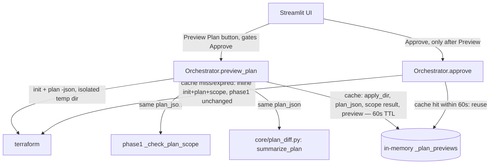

# Design Document: Structured Terraform Plan Preview (FEAT-1)

## Overview

This design addresses FEAT-1: a structured, human-readable summary of a Terraform plan, shown to an operator before they approve a remediation, built on top of phase1-trust-hardening's existing `plan -json` call rather than duplicating it. All changes are confined to `orchestrator/orchestrator.py`, one new supporting module (`core/plan_diff.py`), and the Streamlit UI (`app.py`). No new external dependencies are introduced.

## Architecture

### Component Interaction



### Key Architectural Decisions

| Decision | Rationale |
|----------|-----------|
| `preview_plan()` reuses phase1's single `plan -json` call via an in-memory cache keyed by `resource_id`, rather than a second invocation | `terraform plan` against real AWS is not free (API calls, latency); running it twice per approval (once to preview, once inside `approve()`) doubles apply-path latency and blast-radius-window for no benefit |
| Cache TTL reduced from an originally-proposed 10 minutes to 60 seconds (design review correction) | The design's own justification for skipping a second `plan` call is "the plan is deterministic between calls seconds apart." A 10-minute-stale cached plan can still be trusted by the scope check inside `approve()` — explicitly "the actual security control" per Requirement 1, criterion 7 — against infrastructure state that has since changed, which contradicts the stated rationale. 60 seconds preserves the realistic "operator previews, reads, then approves" workflow (typically well under a minute) while bounding staleness to something consistent with "seconds apart," rather than adding a second re-validation `plan` call for a marginal freshness gain (see "Alternative considered" below) |
| Structured diff (parsed `resource_changes` table) over raw plan text | Friendlier for a non-Terraform-expert operator; phase1's scope-check work already parses this exact JSON structure, so the incremental parsing cost is a partition step, not a new parser |
| "Preview Plan" gates "Approve" in the UI only, not in `approve()` itself | The scope check inside `approve()` (phase1) is the actual security control and runs unconditionally regardless of whether a preview occurred; the UI gate is a guardrail against a human clicking "Approve" without having looked at the effective diff, nothing more |

**Alternative considered and rejected:** adding a cheap re-validation step (re-running just `plan -json`, not full `init`) when a cached preview is older than a short freshness window, instead of shortening the TTL outright. This was rejected as unnecessary added complexity for this ticket's scope — a flat 60-second TTL already keeps the staleness window small enough to match the "seconds apart" rationale, without introducing a second code path (fresh-cache-hit vs. stale-cache-needs-reverify vs. cache-miss) for a marginal reduction in an already-small window. If a future security review finds 60 seconds still too permissive, re-validation-on-staleness is the natural next design point, not this spec's job to build speculatively.

## Components and Interfaces

### 1. Plan Summary (`core/plan_diff.py`)

```python
"""Structured summary of a `terraform plan -json` result.

Reuses the exact plan_json produced by phase1-trust-hardening's
_check_plan_scope() call site — this module only adds a
human-readable partition on top of the same data, it does not
invoke `terraform plan` itself.
"""

from __future__ import annotations

from dataclasses import dataclass, field


@dataclass
class PlanChange:
    address: str
    resource_type: str
    actions: list[str]
    changed_keys: list[str] = field(default_factory=list)


@dataclass
class PlanPreview:
    creates: list[PlanChange] = field(default_factory=list)
    updates: list[PlanChange] = field(default_factory=list)
    deletes: list[PlanChange] = field(default_factory=list)
    replacements: list[PlanChange] = field(default_factory=list)


_ACTION_BUCKET = {
    ("create",): "creates",
    ("update",): "updates",
    ("delete",): "deletes",
    ("create", "delete"): "replacements",
    ("delete", "create"): "replacements",
}


def summarize_plan(plan_json: dict) -> PlanPreview:
    preview = PlanPreview()
    for change in plan_json.get("resource_changes", []):
        if change.get("mode") != "managed":
            continue
        actions = change["change"]["actions"]
        if actions == ["no-op"]:
            continue
        bucket_name = _ACTION_BUCKET.get(tuple(sorted(actions)))
        if bucket_name is None:
            continue  # unrecognized action combination — skip, don't crash the UI

        before = change["change"].get("before") or {}
        after = change["change"].get("after") or {}
        changed_keys = sorted(
            k for k in set(before) | set(after) if before.get(k) != after.get(k)
        ) if bucket_name in ("updates", "replacements") else []

        entry = PlanChange(
            address=change["address"],
            resource_type=change.get("type", ""),
            actions=actions,
            changed_keys=changed_keys,
        )
        getattr(preview, bucket_name).append(entry)
    return preview
```

### 2. Orchestrator Preview Cache and Wiring

```python
# orchestrator.py — return type of preview_plan(), and the preview cache/method
@dataclass
class PlanPreviewResult:
    success: bool
    resource_id: str | None = None
    error: str | None = None
    preview: PlanPreview | None = None
    scope_ok: bool | None = None
    scope_reason: str | None = None
    flow: str = "remediate"  # this spec's preview_plan()/approve() only ever cover the
                              # remediation path today — _handle_confirm_rollback() (the
                              # "rollback" flow in phase1's _check_plan_scope) is untouched
                              # by this spec, so this is always "remediate" here. Carried
                              # as an explicit field (rather than left implicit) so a future
                              # rollback-preview spec has a natural place to plug in without
                              # changing this dataclass's shape.

@dataclass
class _CachedPreview:
    apply_dir: Path
    plan_json: dict
    plan_preview: PlanPreview
    scope_ok: bool
    scope_reason: str
    flow: str  # always "remediate" for this spec — see PlanPreviewResult.flow above;
               # threaded through so the cached entry carries everything approve() needs
               # to call phase1's _check_plan_scope(..., flow=...) without recomputing it
    created_at: float  # time.monotonic()

PREVIEW_TTL_SECONDS = 60  # see design.md "Key Architectural Decisions" — reduced
                          # from an originally-proposed 600s during design review,
                          # to stay consistent with this feature's own "deterministic
                          # between calls seconds apart" rationale for skipping a
                          # second `plan` call inside approve().

class Orchestrator:
    def __init__(self, ...):
        ...
        self._plan_previews: dict[str, _CachedPreview] = {}

    def preview_plan(self, resource_id: str) -> PlanPreviewResult:
        self._evict_expired_previews()
        plan = self._find_plan(resource_id)
        if plan is None:
            return PlanPreviewResult(success=False, error="No plan found for resource")

        apply_dir = self._build_apply_dir(plan)  # extracted from approve()'s existing inline logic
        init_result = subprocess.run([self.tf_cmd, "init", "-input=false"],
                                      timeout=get_timeout("JANITOR_TF_INIT_TIMEOUT"),
                                      cwd=str(apply_dir), capture_output=True, text=True,
                                      env=_build_subprocess_env("terraform"))
        if init_result.returncode != 0:
            shutil.rmtree(apply_dir, ignore_errors=True)
            return PlanPreviewResult(success=False, error=_redact(init_result.stderr))

        plan_result = subprocess.run([self.tf_cmd, "plan", "-json", "-input=false"],
                                      timeout=get_timeout("JANITOR_TF_INIT_TIMEOUT"),
                                      cwd=str(apply_dir), capture_output=True, text=True,
                                      env=_build_subprocess_env("terraform"))
        plan_json = _parse_plan_json_stream(plan_result.stdout)  # tf plan -json emits one JSON object per line

        # If phase1-trust-hardening has not landed yet, _check_plan_scope does not
        # exist at all (NameError). If it HAS landed but under an older/incompatible
        # signature than the one this spec targets, calling it with flow= as a 4th
        # positional argument raises TypeError, not NameError — a plain
        # `except NameError` would not catch that and this call would crash instead
        # of falling back. Catching both is the simplest fix that covers "phase1
        # hasn't landed" and "phase1 landed with a signature this spec doesn't
        # recognize" as the same fallback condition, without the extra complexity of
        # an `inspect.signature()` pre-check.
        try:
            scope_ok, scope_reason = _check_plan_scope(plan_json, resource_id, plan.finding, flow="remediate")
        except (NameError, TypeError):
            scope_ok, scope_reason = True, "scope check pending phase1-trust-hardening"

        self._plan_previews[resource_id] = _CachedPreview(
            apply_dir=apply_dir, plan_json=plan_json,
            plan_preview=summarize_plan(plan_json),
            scope_ok=scope_ok, scope_reason=scope_reason,
            flow="remediate",
            created_at=time.monotonic(),
        )
        return PlanPreviewResult(success=True, resource_id=resource_id,
                                  preview=self._plan_previews[resource_id].plan_preview,
                                  scope_ok=scope_ok, scope_reason=scope_reason,
                                  flow="remediate")

    def approve(self, resource_id: str, ...) -> ApprovalResult:
        ...  # existing validation
        cached = self._plan_previews.pop(resource_id, None)
        if cached is not None and time.monotonic() - cached.created_at < PREVIEW_TTL_SECONDS:
            apply_dir, scope_ok, scope_reason = cached.apply_dir, cached.scope_ok, cached.scope_reason
            # skip init + plan -json — already have them; go straight to scope-check result then apply
        else:
            if cached is not None:
                shutil.rmtree(cached.apply_dir, ignore_errors=True)  # expired — discard
            apply_dir = self._build_apply_dir(plan)
            # ... run init, plan -json, _check_plan_scope inline (phase1's existing design, unchanged)
        if not scope_ok:
            self._log_action("scope_check_failed", resource_id, "blocked", scope_reason)
            shutil.rmtree(apply_dir, ignore_errors=True)
            return ApprovalResult(success=False, error=f"Scope check failed: {scope_reason}", resource_id=resource_id)
        # ... proceed to terraform apply using apply_dir, as phase1 designed
```

`_evict_expired_previews()` runs at the top of both `preview_plan()` and `approve()`, deleting any cached `apply_dir` older than `PREVIEW_TTL_SECONDS` — mirroring `drift_detector.py`'s `_cleanup_stale_tmp()` pattern for bounding temp-directory disk usage.

### 3. Streamlit UI

The UI adds a "Preview Plan" button per pending plan that calls `orch.preview_plan(resource_id)`, renders `PlanPreview` as three/four expandable tables (Creates / Updates / Deletes / Replacements, each row: address, type, changed keys), and only then renders that resource's "Approve" button — gated on `resource_id in st.session_state.previewed_resources`, a UI-only convenience set populated when `preview_plan()` returns `success=True`.

## Correctness Properties

*A property is a characteristic or behavior that should hold true across all valid executions of a system.*

### Property 1: Plan Summary Partition Completeness

*For any* Plan_JSON, every entry in `resource_changes` with `mode == "managed"` and `actions != ["no-op"]` SHALL appear in exactly one of `PlanPreview.creates/updates/deletes/replacements`, and no entry with `mode == "data"` or `actions == ["no-op"]` SHALL appear in any of the four lists.

**Validates: Requirement 1.1**

### Property 2: Preview Cache Reuse Invariant

*For any* `resource_id` with a non-expired (< 60s old) cached preview, calling `approve(resource_id)` SHALL result in zero additional `terraform plan` subprocess invocations beyond the one already made by `preview_plan()`.

**Validates: Requirements 1.3, 1.4**

### Property 3: Preview Cache Expiry Invariant

*For any* `resource_id` with a cached preview older than 60 seconds, calling `approve(resource_id)` SHALL discard the expired cache entry (including removing its `apply_dir`) and run `init`/`plan -json`/scope-check inline, exactly as it would with no cache entry at all.

**Validates: Requirements 1.5, 1.6, 1.8**

## Error Handling

### Error Propagation Strategy

| Layer | Behavior | Example |
|-------|----------|---------|
| Plan preview cache | Expired/missing cache falls back to phase1's inline init+plan+scope-check path; a cache hit that turns out stale (apply_dir deleted externally) is treated as a cache miss | `preview_plan()` never called → `approve()` behaves exactly as phase1 designed |
| `preview_plan()` before phase1 exists, or phase1 exists with an incompatible `_check_plan_scope` signature | Stubs `scope_ok=True` with an explanatory reason string, marked with a `# TODO(phase1)` comment — does not block this spec's own delivery. The call site catches `(NameError, TypeError)`: `NameError` for "phase1 hasn't landed at all," `TypeError` for "phase1 landed but `_check_plan_scope` doesn't accept this spec's `flow=` argument the way expected" | Implemented before phase1-trust-hardening ships → preview still renders the structured diff, scope check is a placeholder until phase1 lands |

### Critical Error Paths

1. **`terraform init`/`plan` failure inside `preview_plan()`**: returns `PlanPreviewResult(success=False, ...)` with a redacted error message; the UI shows the failure and does not enable "Approve" for that resource (since no successful preview occurred).
2. **Cache entry expires between preview and approve**: `approve()` transparently falls back to the inline path — the operator experiences a slightly slower approval, not a failure.

## Testing Strategy

### Testing Approach

Dual approach consistent with the project's existing convention (`.kiro/specs/audit-remediation/design.md`, `.kiro/specs/phase1-trust-hardening/design.md`): Hypothesis property tests (`@settings(max_examples=100)`) for the 3 properties above, plus pytest example-based unit tests for specific scenarios and integration points.

### Property Test Mapping

| Property | Test Module |
|----------|-------------|
| 1: Plan Summary Partition Completeness | `tests/test_plan_diff_properties.py` |
| 2: Preview Cache Reuse Invariant | `tests/test_orchestrator_preview_properties.py` |
| 3: Preview Cache Expiry Invariant | `tests/test_orchestrator_preview_properties.py` |

### Example-Based Unit Tests

| Requirement | Test Focus | Test Module |
|-------------|-----------|-------------|
| Req 1.1, 1.2 | One test per action bucket (create, update, delete, replace via `["create","delete"]` and `["delete","create"]`) using realistic `resource_changes` fixtures; `mode == "data"` entries and `actions == ["no-op"]` entries excluded from all buckets; unrecognized action combination is skipped without raising; update/replace entries carry the correct `changed_keys` | `tests/test_plan_diff.py` |
| Req 1.3 | `preview_plan()` runs exactly one `init` + one `plan -json` per call; caches with a 60-second TTL keyed by `resource_id` | `tests/test_orchestrator_preview.py` |
| Req 1.3, 1.4 | `preview_plan()` then `approve()` within the 60s TTL results in exactly one `plan -json` subprocess call total (mock and count `subprocess.run` invocations with `"plan"` in argv) | `tests/test_orchestrator_preview.py` |
| Req 1.5, 1.6 | `approve()` without a prior `preview_plan()` call behaves identically to phase1's design (no regression); a cache entry older than 60s is discarded and its `apply_dir` removed, and `approve()` falls back to the inline path | `tests/test_orchestrator_preview.py` |
| Req 1.7 | UI only renders "Approve" for a resource after `preview_plan()` has succeeded for it in the current session | `tests/test_app_plan_preview_ui.py` |
| — | `preview_plan()` called before phase1's `_check_plan_scope` exists (mocked `NameError`/absent import) stubs `scope_ok=True` with a `# TODO(phase1)`-referenced reason string, and does not attempt a second `plan` invocation once phase1 is later wired in | `tests/test_orchestrator_preview.py` |
| — | `preview_plan()` called against a `_check_plan_scope` that exists but rejects the `flow=` keyword (simulated `TypeError`, e.g. an older/incompatible phase1 signature) is also caught by the same fallback and stubs `scope_ok=True` without raising — regression test for the crash this fix addresses | `tests/test_orchestrator_preview.py` |

### Test Quality Requirements

Per project steering rules (`.kiro/specs/audit-remediation/design.md`): no tautological assertions, no pass-by-default fixtures, negative cases required for every module, only mock external I/O (subprocess, filesystem) — never mock the unit under test.

### Running Tests

```bash
# All tests
".venv/Scripts/python.exe" -m pytest tests/

# Property tests only
".venv/Scripts/python.exe" -m pytest tests/ -k "properties"
```
