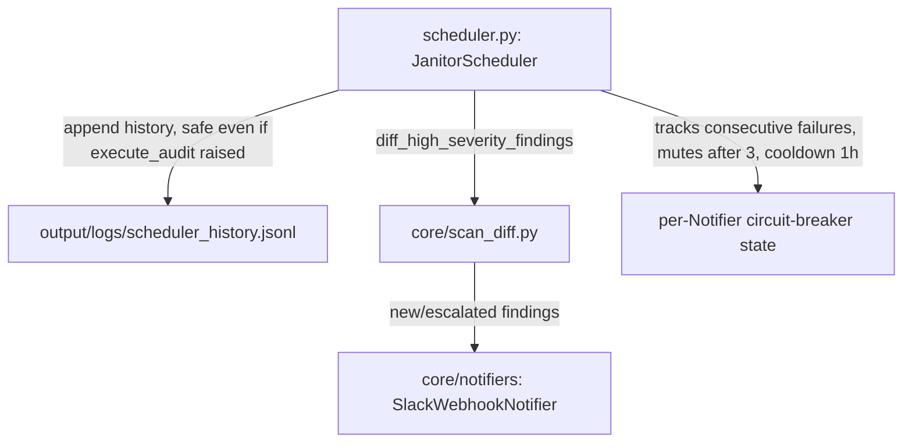

# Design Document: Scheduled-Scan Run History and Alerting (FEAT-2)

## Overview

This design addresses FEAT-2: persisting scheduled-scan run history and notifying an operator via Slack when a scan finds new or worsened HIGH/CRITICAL findings. All changes are confined to `scheduler.py` plus two new supporting modules (`core/scan_diff.py`, `core/notifiers/`). No new external dependencies are introduced — Slack notification uses the standard library `urllib.request` rather than adding `requests`/`slack-sdk`.

## Architecture

### Component Interaction



### Key Architectural Decisions

| Decision | Rationale |
|----------|-----------|
| `findings = []` pre-initialized outside the `try:` block, alongside the existing `total_findings = 0`/`total_waste = 0.0` defaults (design review correction) | The current `scheduler.py` deliberately binds `result` only inside `try:` so that `except`/`finally` never touch an unbound name if `Orchestrator(...)` construction or `execute_audit()` itself raises. The original bundled design's snapshot/diff logic referenced `result.findings` unconditionally in that same `except`/`finally` path — an `UnboundLocalError` on exactly the failure case the `except` clause exists to catch. Pre-initializing a safe `findings` default and building the snapshot/diff from it (never from `result` directly) closes this (Req 1) |
| FEAT-2 notifies only on new/changed HIGH or CRITICAL findings relative to the previous run | Matches the ticket's own stated concern (alert fatigue); notifying on every run's HIGH/CRITICAL findings would retrain operators to ignore the channel (Req 1) |
| FEAT-2's run history is its own lightweight JSONL file, independent of any `StateStore` | The backlog lists FEAT-2 with `Depends on: —`; it is not gated on phase2-persistent-state. A future migration into a shared state store is possible but not required for this spec (Req 1) |
| Slack webhook via `JANITOR_SLACK_WEBHOOK_URL` + stdlib `urllib.request`, behind a pluggable `Notifier` interface, single attempt with a short (10s) timeout and no in-process retry loop | Simplest to configure (one env var, no SMTP server); the interface leaves room for an email/PagerDuty implementation later without changing the Scheduler. No retry loop keeps a single `_run_scan()` call's worst-case notification-related delay bounded to one Notifier timeout per configured Notifier, not a multiplied retry count (Req 1) |
| Circuit-breaker: mute a Notifier after 3 consecutive failures, retry once per hour | A sustained Slack webhook outage would otherwise cause every scheduled run with new/escalated HIGH+ findings to block `_run_scan()` for up to the Notifier's timeout, on every single qualifying run, for the duration of the outage. Muting after 3 consecutive failures bounds this to one blocking attempt per hour per Notifier during a sustained outage, while a single successful probe after the cooldown immediately restores normal operation — simpler than exponential backoff for this scale of usage (a handful of scheduled runs per day, not per second) (Req 1) |

## Components and Interfaces

### 1. Severity Diff (`core/scan_diff.py`)

```python
def diff_high_severity_findings(previous_snapshot: dict[str, str], current_findings: list[dict]) -> list[dict]:
    _RANK = {"LOW": 0, "MEDIUM": 1, "HIGH": 2, "CRITICAL": 3}
    escalated = []
    for finding in current_findings:
        severity = finding.get("severity", "LOW")
        if _RANK.get(severity, 0) < _RANK["HIGH"]:
            continue
        prior = previous_snapshot.get(finding["resource_id"])
        if prior is None or _RANK.get(prior, 0) < _RANK.get(severity, 0):
            escalated.append(finding)
    return escalated
```

### 2. Notifiers with Circuit Breaker (`core/notifiers/`)

```python
# core/notifiers/base.py
from abc import ABC, abstractmethod

class Notifier(ABC):
    @abstractmethod
    def notify(self, summary: str, findings: list[dict]) -> bool: ...

# core/notifiers/slack.py
import json
import os
import urllib.error
import urllib.request

class SlackWebhookNotifier(Notifier):
    def __init__(self, webhook_url: str) -> None:
        self._url = webhook_url

    def notify(self, summary: str, findings: list[dict]) -> bool:
        """Single attempt, 10s timeout, no internal retry loop.

        A failed attempt is reported back to the Scheduler as False —
        retry/backoff/muting policy lives in the Scheduler's circuit
        breaker (Component 3), not duplicated here.
        """
        lines = "\n".join(f"- [{f.get('severity')}] {f.get('resource_id')}: {f.get('description', '')}" for f in findings[:20])
        payload = json.dumps({"text": f"{summary}\n{lines}"}).encode("utf-8")
        req = urllib.request.Request(self._url, data=payload, headers={"Content-Type": "application/json"})
        try:
            with urllib.request.urlopen(req, timeout=10) as resp:
                return 200 <= resp.status < 300
        except (urllib.error.URLError, OSError):
            return False


def build_notifiers_from_env() -> list[Notifier]:
    notifiers: list[Notifier] = []
    slack_url = os.environ.get("JANITOR_SLACK_WEBHOOK_URL")
    if slack_url:
        notifiers.append(SlackWebhookNotifier(slack_url))
    return notifiers
```

### 3. Scheduler Circuit Breaker and History (`scheduler.py`)

```python
from dataclasses import dataclass, field
from datetime import datetime, timedelta, timezone

from cloud_janitor.core.scan_diff import diff_high_severity_findings
from cloud_janitor.core.notifiers import build_notifiers_from_env

HISTORY_RETENTION = 500
MUTE_AFTER_CONSECUTIVE_FAILURES = 3
MUTE_COOLDOWN = timedelta(hours=1)


@dataclass
class _NotifierState:
    consecutive_failures: int = 0
    muted_until: datetime | None = None


class JanitorScheduler:
    def __init__(self, project_root=None, notifiers: list[Notifier] | None = None):
        ...
        self._notifiers = notifiers if notifiers is not None else build_notifiers_from_env()
        self._notifier_state: dict[int, _NotifierState] = {
            id(n): _NotifierState() for n in self._notifiers
        }
        self._history_path = self._project_root / "output" / "logs" / "scheduler_history.jsonl"

    def _run_scan(self) -> None:
        """Execute a single scan. Skips if previous scan still running."""
        if self._scan_running.is_set():
            self._logger.warning("Skipping scheduled scan — previous scan still in progress")
            return

        self._scan_running.set()
        scan_id = str(uuid.uuid4())[:8]
        start_time = datetime.now(timezone.utc)
        status = "success"
        total_findings = 0
        total_waste = 0.0
        # NEW — pre-initialized outside the try block, alongside the existing
        # total_findings/total_waste defaults, for exactly the same reason:
        # this must be a safe value the except/finally path can read even
        # if Orchestrator(...) construction or execute_audit() itself raises.
        findings: list[dict] = []

        try:
            self._logger.info(f"Starting scheduled scan: {scan_id}")

            orchestrator = Orchestrator(project_root=self._project_root)
            result = orchestrator.execute_audit()

            findings = result.findings  # NEW — only reference `result` inside this try block
            total_findings = len(findings)
            total_waste = sum(f.get("cost_estimate_monthly", 0.0) for f in findings)

            if not result.success:
                status = "failed"
                self._logger.error(f"Scan {scan_id} failed: {result.error or 'unknown error'}")
            else:
                self._logger.info(
                    f"Scan {scan_id} completed: {total_findings} findings, ${total_waste:.2f}/month waste"
                )

        except Exception as e:
            status = "failed"
            self._logger.error(f"Scan {scan_id} raised exception: {type(e).__name__}: {e}")
            # `findings` remains [] here — set outside the try block precisely
            # for this path. History is still appended below with an empty
            # snapshot rather than crashing with UnboundLocalError.

        finally:
            self._scan_running.clear()
            end_time = datetime.now(timezone.utc)
            self._last_run = end_time
            self._runs_completed += 1

            # NEW — history/notification logic operates exclusively on the
            # safe `findings` local, never on `result` (which may not exist
            # if the exception happened before `result = orchestrator.execute_audit()`
            # completed, e.g. inside Orchestrator(...) construction itself).
            previous_snapshot = self._load_last_snapshot()
            current_snapshot = {f["resource_id"]: f.get("severity", "LOW") for f in findings}

            record = {
                "scan_id": scan_id, "timestamp_start": start_time.isoformat(),
                "timestamp_end": end_time.isoformat(), "status": status,
                "total_findings": total_findings, "total_waste": total_waste,
                "findings_snapshot": current_snapshot,
            }
            self._append_history(record)

            escalated = diff_high_severity_findings(previous_snapshot, findings) if status == "success" else []
            if escalated:
                summary = f"Cloud Janitor scan {scan_id}: {len(escalated)} new/escalated HIGH+ finding(s)"
                for notifier in self._notifiers:
                    self._notify_with_circuit_breaker(notifier, summary, escalated)

            self._logger.info(
                f"Scan summary | scan_id={scan_id} | timestamp={end_time.isoformat()} | "
                f"total_findings={total_findings} | total_waste={total_waste:.2f} | "
                f"status={status} | duration={(end_time - start_time).total_seconds():.1f}s"
            )

    def _notify_with_circuit_breaker(self, notifier: Notifier, summary: str, findings: list[dict]) -> None:
        state = self._notifier_state[id(notifier)]
        now = datetime.now(timezone.utc)

        if state.muted_until is not None and now < state.muted_until:
            self._logger.warning(
                "Notifier %s is muted until %s (sustained failures) — skipping",
                type(notifier).__name__, state.muted_until.isoformat(),
            )
            return

        try:
            ok = notifier.notify(summary, findings)
        except Exception as exc:
            ok = False
            self._logger.warning("Notifier %s raised: %s", type(notifier).__name__, exc)

        if ok:
            if state.consecutive_failures > 0 or state.muted_until is not None:
                self._logger.info("Notifier %s recovered after prior failures — un-muting", type(notifier).__name__)
            state.consecutive_failures = 0
            state.muted_until = None
        else:
            state.consecutive_failures += 1
            self._logger.warning(
                "Notifier %s returned False (%d consecutive failure(s))",
                type(notifier).__name__, state.consecutive_failures,
            )
            if state.consecutive_failures >= MUTE_AFTER_CONSECUTIVE_FAILURES:
                state.muted_until = now + MUTE_COOLDOWN
                self._logger.warning(
                    "Notifier %s muted until %s after %d consecutive failures",
                    type(notifier).__name__, state.muted_until.isoformat(), state.consecutive_failures,
                )

    def _load_last_snapshot(self) -> dict[str, str]:
        if not self._history_path.exists():
            return {}
        try:
            *_, last_line = self._history_path.read_text(encoding="utf-8").strip().splitlines() or [None]
            return json.loads(last_line)["findings_snapshot"] if last_line else {}
        except (OSError, ValueError, json.JSONDecodeError, KeyError):
            return {}

    def _append_history(self, record: dict) -> None:
        try:
            with open(self._history_path, "a", encoding="utf-8") as f:
                f.write(json.dumps(record) + "\n")
            self._prune_history()
        except OSError as exc:
            self._logger.warning("Failed to write scheduler history: %s", exc)

    def _prune_history(self) -> None:
        lines = self._history_path.read_text(encoding="utf-8").splitlines()
        if len(lines) > HISTORY_RETENTION:
            self._history_path.write_text("\n".join(lines[-HISTORY_RETENTION:]) + "\n", encoding="utf-8")
```

Note that `_run_scan()`'s exception-path notification is also conditioned on `status == "success"` (rather than trying to diff against an empty `findings` list when the pipeline raised) — this avoids a spurious "everything is newly missing" diff and matches the requirement's intent that alerting is about newly-discovered risk, not about the absence of data from a failed run.

## Correctness Properties

*A property is a characteristic or behavior that should hold true across all valid executions of a system.*

### Property 1: History Append Survives Pipeline Exceptions

*For any* exception raised by `Orchestrator(...)` construction or `execute_audit()` inside `_run_scan()`, exactly one history record SHALL be appended to `scheduler_history.jsonl` with `status="failed"` and `findings_snapshot={}`, and no exception SHALL propagate out of `_run_scan()`.

**Validates: Requirement 1.1**

### Property 2: Severity Escalation Diff Correctness

*For any* `previous_snapshot` and `current_findings`, `diff_high_severity_findings()` SHALL return a finding if and only if its severity is HIGH or CRITICAL AND (its `resource_id` is absent from `previous_snapshot` OR its previous severity ranked strictly lower than its current severity).

**Validates: Requirements 1.3, 1.5, 1.6**

### Property 3: Circuit Breaker Mute Threshold

*For any* Notifier experiencing exactly `MUTE_AFTER_CONSECUTIVE_FAILURES` (3) consecutive failed `notify()` calls, the Scheduler SHALL mute it (skip subsequent `notify()` calls) until `MUTE_COOLDOWN` (1 hour) has elapsed since the mute began, and SHALL reset its consecutive-failure count to zero upon the first successful call after the mute period ends.

**Validates: Requirement 1.9**

## Error Handling

### Error Propagation Strategy

| Layer | Behavior | Example |
|-------|----------|---------|
| `execute_audit()`/`Orchestrator(...)` raises inside `_run_scan()` | Caught by the existing `except Exception` clause; `findings` remains its pre-initialized `[]` default; history is still appended with `status="failed"` | LocalStack down mid-scan → history record written, no crash |
| Notifier failure (single attempt) | Caught per-notifier, logged as WARNING, never fails the scan; counted toward the circuit breaker | Slack webhook URL unreachable → warning logged, scan `status` unaffected, failure counted |
| Sustained notifier outage | After 3 consecutive failures, muted for 1 hour; at most one blocking attempt per hour during the outage, not one per qualifying scan | Slack down for 6 hours across 12 scheduled runs → at most ~6 blocking attempts total, not 12 |

### Critical Error Paths

1. **Pipeline exception inside `_run_scan()`**: history append never crashes with `UnboundLocalError` — `findings`, `total_findings`, and `total_waste` all have safe pre-initialized defaults reachable from the `finally` block regardless of where inside the `try` block the exception originated.
2. **Sustained Slack outage**: bounded to one blocking notification attempt per hour per Notifier after 3 consecutive failures, rather than blocking every qualifying scheduled run for the duration of the outage.

## Testing Strategy

### Testing Approach

Dual approach consistent with the project's existing convention (`.kiro/specs/audit-remediation/design.md`, `.kiro/specs/phase1-trust-hardening/design.md`): Hypothesis property tests (`@settings(max_examples=100)`) for the 3 properties above, plus pytest example-based unit tests for specific scenarios and integration points.

### Property Test Mapping

| Property | Test Module |
|----------|-------------|
| 1: History Append Survives Pipeline Exceptions | `tests/test_scheduler_history_properties.py` |
| 2: Severity Escalation Diff Correctness | `tests/test_scan_diff_properties.py` |
| 3: Circuit Breaker Mute Threshold | `tests/test_scheduler_notifier_circuit_breaker_properties.py` |

### Example-Based Unit Tests

| Requirement | Test Focus | Test Module |
|-------------|-----------|-------------|
| Req 1.1 | Mocked `Orchestrator.__init__` raising an exception → history record appended with `status="failed"`, `findings_snapshot={}`, no exception propagates out of `_run_scan()` (regression test for the original design's `UnboundLocalError` defect) | `tests/test_scheduler_history.py` |
| Req 1.1 | Mocked `execute_audit()` raising an exception mid-call (after `Orchestrator()` succeeds) → same safe behavior | `tests/test_scheduler_history.py` |
| Req 1.2 | Pruning caps the file at 500 lines | `tests/test_scheduler_history.py` |
| Req 1.3 | Escalation diff scenarios (new HIGH, same HIGH twice, MEDIUM→HIGH, HIGH→CRITICAL, HIGH→HIGH no-op) | `tests/test_scan_diff.py` |
| Req 1.4 | `SlackWebhookNotifier.notify()` success (mocked `urlopen` returning 200), failure (non-2xx, `URLError`, timeout) all return `bool` without raising, single attempt only (no retry loop) | `tests/test_notifiers.py` |
| Req 1.5, 1.6 | A run introducing a new CRITICAL finding triggers `notify()`; a run with only previously-seen HIGH findings does not | `tests/test_scheduler_history.py` |
| Req 1.7 | A raising/`False`-returning notifier is logged as a WARNING and does not alter the history record's `status` | `tests/test_scheduler_history.py` |
| Req 1.8 | `build_notifiers_from_env()` returns `[]` when `JANITOR_SLACK_WEBHOOK_URL` unset, one `SlackWebhookNotifier` when set | `tests/test_notifiers.py` |
| Req 1.9 | 3 consecutive failures mute the notifier; a 4th qualifying scan within the cooldown skips the call entirely (mocked `notify` not called); after cooldown, exactly one attempt is made; a successful attempt resets the consecutive-failure count and un-mutes | `tests/test_scheduler_notifier_circuit_breaker.py` |

### Test Quality Requirements

Per project steering rules (`.kiro/specs/audit-remediation/design.md`): no tautological assertions, no pass-by-default fixtures, negative cases required for every module, only mock external I/O (subprocess, filesystem, network, Slack webhook) — never mock the unit under test.

### Running Tests

```bash
# All tests
".venv/Scripts/python.exe" -m pytest tests/

# Property tests only
".venv/Scripts/python.exe" -m pytest tests/ -k "properties"
```
