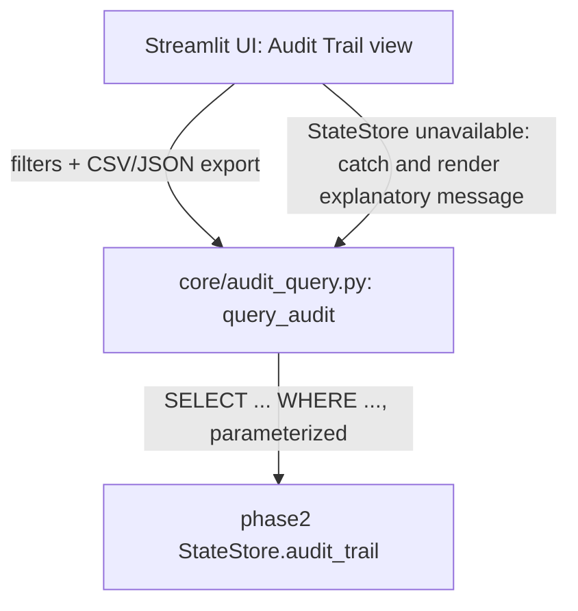

# Design Document: Queryable and Exportable Audit Trail (OBS-2)

## Overview

This design addresses OBS-2: a filterable, exportable query layer over phase2-persistent-state's `StateStore.audit_trail` table. It does not implement persistence — that is phase2's responsibility and phase2 must ship before this spec's end-to-end behavior can be verified. All changes are confined to one new module (`core/audit_query.py`) and the Streamlit UI (`app.py`). No new external dependencies are introduced.

## Architecture

### Component Interaction



### Key Architectural Decisions

| Decision | Rationale |
|----------|-----------|
| `query_audit()` is a thin function layer over phase2's `StateStore`, not a new persistence mechanism | Phase 2 already owns the durable `audit_trail` table; duplicating storage here would create two sources of truth. This spec adds read/export behavior only |
| Fully parameterized SQL `WHERE` clause construction | No filter value is ever interpolated into the SQL string — every value is passed as a bound parameter, eliminating SQL injection risk even for adversarially-shaped filter input |
| Tamper-evidence (hash-chaining) explicitly deferred | No named compliance requirement currently requires it; building it speculatively is YAGNI and would complicate phase2's schema before there is a concrete need |
| `run_id` included as a first-class filter | Correlates an audit-trail entry with the same run's Reasoning_Log and Findings_Store files, if phase3c (run-scoped artifacts) has also landed — but this spec does not require phase3c, since `run_id` is populated by phase2's schema regardless |
| `query_audit()` calls `state_store.execute_readonly_query(sql, params)`, not a raw `.connection.execute(...)` | Phase2's `StateStore` (see phase2-persistent-state's design.md) exposes only a private, lock-guarded `self._conn` and a fixed set of methods — it has no public `.connection` accessor. `execute_readonly_query()` is the method phase2 added specifically for this need: it acquires the same internal lock as every other `StateStore` method and returns `.fetchall()`, so this spec's dynamically constructed SELECT statements go through the same concurrency-safe path as phase2's own reads, instead of reaching around the class's encapsulation |
| A distinct sentinel, `UNSCOPED`, distinguishes "filter to `run_id IS NULL`" from "don't filter on `run_id`" | `run_id` is the one `audit_trail` column phase2 declares nullable in real data (actions taken outside a scan, e.g. a stale-plan `approve()`/`rollback()` call in a separate process, get `run_id=NULL`). Since `run_id: str \| None = None` already uses `None` to mean "no filter on this column" (matching every other filter parameter), a second, distinct value is needed to mean "filter specifically to rows where `run_id` is NULL" — reusing `None` for both meanings would make that case inexpressible through this API |
| `_ALLOWED_FILTERS` is wired in as an active guard, not left as unreferenced dead code | A caller passing an unrecognized/typo'd filter keyword should get a loud `ValueError`, not have the typo silently ignored and an unfiltered (or wrongly-filtered) result set returned — cheap defense-in-depth for a query function whose filters are assembled dynamically |

## Components and Interfaces

### 1. Query and Export Layer (`core/audit_query.py`)

```python
"""Query/export layer over phase2's StateStore.audit_trail table.

Does not implement persistence — see phase2-persistent-state for the
StateStore itself. This module assumes a table with columns matching
AuditEntry's fields plus `run_id` (already part of phase2's schema).

This spec is gated on phase2-persistent-state shipping for end-to-end
enablement; the functions below can be developed and unit-tested against
an in-memory SQLite fixture matching the assumed schema before phase2
ships, since they have no runtime dependency on a real StateStore
instance beyond its documented shape — only on `execute_readonly_query()`
being present with phase2's documented signature and behavior.
"""

from __future__ import annotations

import csv
import io
import json

# Column order matches phase2-persistent-state's audit_trail DDL exactly
# (see phase2-persistent-state's design.md _SCHEMA_DDL). Selected explicitly
# by name (not `SELECT *`) so this module's row-to-dict mapping does not
# silently depend on the physical column order phase2 happens to create the
# table with.
_AUDIT_TRAIL_COLUMNS = (
    "id", "timestamp", "actor", "action", "resource_id", "result", "details", "run_id",
)

_ALLOWED_FILTERS = {"resource_id", "actor", "result", "action", "run_id"}


class _UnscopedType:
    """Sentinel type for UNSCOPED — see UNSCOPED below."""

    def __repr__(self) -> str:
        return "UNSCOPED"


UNSCOPED = _UnscopedType()
"""Pass as `run_id=UNSCOPED` to query_audit() to filter to entries with
`run_id IS NULL` — i.e. actions logged outside any execute_audit() run
(phase2's audit_trail.run_id column is nullable for exactly this case).

This is distinct from the default `run_id=None`, which means "do not filter
on run_id at all," matching every other query_audit() filter parameter's
"None means no filter" convention. Without a value distinct from None,
"show me only unscoped entries" would be inexpressible through this API,
since None is already taken to mean "no filter."
"""


def query_audit(
    state_store,
    resource_id: str | None = None,
    actor: str | None = None,
    result: str | None = None,
    action: str | None = None,
    run_id: str | None | object = None,
    date_from: str | None = None,
    date_to: str | None = None,
    limit: int = 1000,
) -> list[dict]:
    """Query state_store.audit_trail with a parameterized WHERE clause.

    Calls `state_store.execute_readonly_query(sql, params)` — the public,
    lock-guarded method phase2-persistent-state's StateStore exposes
    specifically for this purpose (see phase2's design.md). StateStore has
    no public `.connection` attribute; this function never reaches for one,
    and never interpolates a filter *value* into the SQL string (column
    names come only from the fixed, hardcoded tuples below — never from
    caller input).

    `run_id` has three distinct meanings:
      - `None` (the default): no filter on run_id at all.
      - `UNSCOPED` (this module's sentinel, see above): filter to
        `run_id IS NULL` specifically.
      - any other string: filter to `run_id = <that string>`.

    Raises `ValueError` if an internal filter name is not recognized in
    `_ALLOWED_FILTERS` — defense-in-depth so a future edit that adds a new
    filter parameter without updating the allowlist (or vice versa) fails
    loudly instead of silently applying no filter for that column.
    """
    equality_filters = {
        "resource_id": resource_id, "actor": actor,
        "result": result, "action": action,
    }
    for name in equality_filters:
        if name not in _ALLOWED_FILTERS:
            raise ValueError(f"Unrecognized audit_trail filter: {name!r}")
    if "run_id" not in _ALLOWED_FILTERS:
        raise ValueError("Unrecognized audit_trail filter: 'run_id'")

    clauses: list[str] = []
    params: list[str] = []

    for column, value in equality_filters.items():
        if value is not None:
            clauses.append(f"{column} = ?")
            params.append(value)

    if run_id is UNSCOPED:
        clauses.append("run_id IS NULL")
    elif run_id is not None:
        clauses.append("run_id = ?")
        params.append(run_id)

    if date_from is not None:
        clauses.append("timestamp >= ?")
        params.append(date_from)
    if date_to is not None:
        clauses.append("timestamp <= ?")
        params.append(date_to)

    where = f"WHERE {' AND '.join(clauses)}" if clauses else ""
    columns_sql = ", ".join(_AUDIT_TRAIL_COLUMNS)
    sql = f"SELECT {columns_sql} FROM audit_trail {where} ORDER BY timestamp DESC LIMIT ?"
    params.append(str(limit))

    rows = state_store.execute_readonly_query(sql, tuple(params))
    return [dict(zip(_AUDIT_TRAIL_COLUMNS, row)) for row in rows]


def export_audit_csv(rows: list[dict]) -> str:
    if not rows:
        return ""
    buf = io.StringIO()
    writer = csv.DictWriter(buf, fieldnames=list(rows[0].keys()))
    writer.writeheader()
    writer.writerows(rows)
    return buf.getvalue()


def export_audit_json(rows: list[dict]) -> str:
    return json.dumps(rows, indent=2, default=str)
```

### 2. Streamlit UI

The "Audit Trail" view adds filter widgets (`st.text_input` for resource ID/actor, `st.selectbox` for result/action, `st.date_input` range, plus a tri-state "run scope" control offering "All," "Scoped to a run" (free-text run_id), and "Unscoped only" (passes `run_id=UNSCOPED`)) that call `query_audit()` on change, render `st.dataframe(rows)`, and offer `st.download_button` wired to `export_audit_csv`/`export_audit_json`. If the `StateStore` isn't wired up yet (phase2 not deployed, so `execute_readonly_query()` doesn't exist), the view catches the resulting `AttributeError`/`sqlite3.OperationalError` and renders "Audit trail querying requires phase2-persistent-state" rather than crashing the page.

## Correctness Properties

*A property is a characteristic or behavior that should hold true across all valid executions of a system.*

### Property 1: Audit Query Filter Conjunction

*For any* non-empty combination of `query_audit()` filter arguments and any `audit_trail` table contents, every row returned SHALL satisfy all supplied filters, and no row satisfying all supplied filters SHALL be excluded (subject to `limit`/ordering).

**Validates: Requirements 1.1, 1.2**

## Error Handling

### Error Propagation Strategy

| Layer | Behavior | Example |
|-------|----------|---------|
| `StateStore` unavailable (phase2 not yet deployed) | The Audit Trail UI view catches the query failure and renders an explanatory message rather than a stack trace | `query_audit()` called before phase2 ships → `AttributeError`/`sqlite3.OperationalError` caught, UI shows "requires phase2-persistent-state" |
| Empty result set | `export_audit_csv([])` returns `""` without raising | No matching rows for a filter combination → empty CSV string, UI shows "no results" |

### Critical Error Paths

1. **StateStore unavailable**: the Audit Trail UI view catches the query failure and renders an explanatory message rather than a stack trace — this is the primary error path this spec must handle gracefully, since it will be true of every deployment until phase2 ships.

## Testing Strategy

### Testing Approach

Dual approach consistent with the project's existing convention (`.kiro/specs/audit-remediation/design.md`, `.kiro/specs/phase1-trust-hardening/design.md`): a Hypothesis property test for the 1 property above, plus pytest example-based unit tests for specific scenarios and integration points, run against an in-memory SQLite fixture matching phase2's assumed schema (usable before phase2 ships).

### Property Test Mapping

| Property | Test Module |
|----------|-------------|
| 1: Audit Query Filter Conjunction | `tests/test_audit_query_properties.py` |

### Example-Based Unit Tests

| Requirement | Test Focus | Test Module |
|-------------|-----------|-------------|
| Req 1.1, 1.2, 1.3 | Build a throwaway `sqlite3.Connection` with a table matching the assumed `audit_trail` schema (`timestamp`, `action`, `resource_id`, `actor`, `result`, `details`, `run_id`) seeded with flaggable rows, wrapped in a minimal stand-in exposing `execute_readonly_query()` (mirroring phase2's method signature). Single-filter and multi-filter (AND) queries return exactly the matching rows; no-filter query returns most-recent-`limit` ordered descending | `tests/test_audit_query.py` |
| Req 1.4 | `export_audit_csv()`/`export_audit_json()` round-trip: exporting then re-parsing reproduces the same row set; `export_audit_csv([])` returns `""` without raising | `tests/test_audit_query.py` |
| Req 1.1 | SQL-injection-shaped filter values (e.g. `resource_id="x'; DROP TABLE audit_trail; --"`) are treated as literal string filters, not executed as SQL | `tests/test_audit_query.py` |
| Req 1.7 (NULL run_id filtering) | Seed rows with a mix of non-NULL `run_id` values and `run_id IS NULL` rows; `query_audit(run_id=UNSCOPED)` returns only the NULL-`run_id` rows; `query_audit()` (default `run_id=None`) returns rows regardless of `run_id`, including both NULL and non-NULL; `query_audit(run_id="abc")` returns only rows matching that literal value — all three are distinguished correctly | `tests/test_audit_query.py` |
| Req 1.8 (filter allowlist guard) | Confirms `_ALLOWED_FILTERS` is actually consulted: a test that monkeypatches/shrinks `_ALLOWED_FILTERS` (or otherwise forces a name mismatch) asserts `query_audit()` raises `ValueError` rather than silently applying no filter | `tests/test_audit_query.py` |
| Req 1.5 | Filter widgets render and call `query_audit()` on change; CSV/JSON download buttons produce the expected content; `StateStore`-unavailable error is caught and renders an explanatory message instead of a stack trace | `tests/test_app_audit_trail_ui.py` |
| — (end-to-end, blocked on phase2) | `_log_action()` actually writes through a live `StateStore` and `query_audit()` sees it; this test SHALL NOT be marked passing/complete until phase2-persistent-state has shipped | `tests/test_audit_query_e2e.py` (skipped/xfail until phase2 ships) |

### Test Quality Requirements

Per project steering rules (`.kiro/specs/audit-remediation/design.md`): no tautological assertions, no pass-by-default fixtures, negative cases required for every module. Tests against the in-memory SQLite fixture are real unit tests against real (if synthetic) data — they are not a substitute for the end-to-end test against phase2's actual `StateStore`, which remains gated as noted above.

### Running Tests

```bash
# All tests
".venv/Scripts/python.exe" -m pytest tests/

# Property tests only
".venv/Scripts/python.exe" -m pytest tests/ -k "properties"
```
