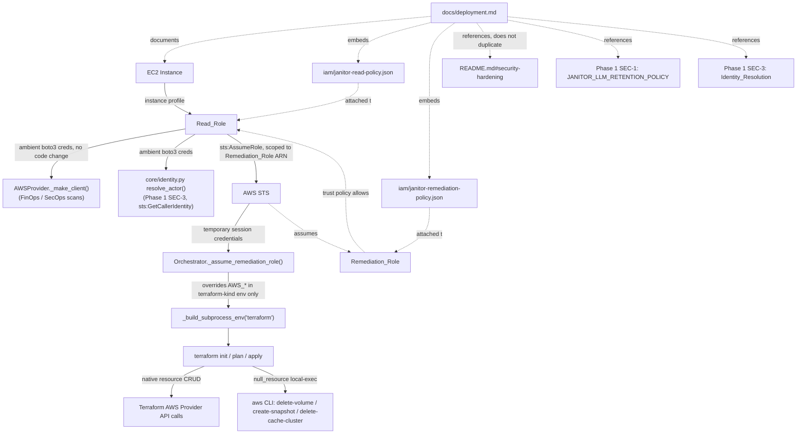

# Design Document: Phase 4 AWS Lockdown

## Overview

This design addresses 3 backlog issues (SEC-5, INF-2, DOC-1) that together define what it means to run Cloud Janitor's `aws` backend against a real AWS account rather than LocalStack or a fixture. The remediation is organized into three functional areas:

1. **Credential Sourcing & Role Split** (Req 1, 2) — Instance-role credentials replace any notion of static keys; a second, separately-scoped Remediation_Role is assumed only around the `terraform apply` lifecycle.
2. **Least-Privilege Policy Artifacts** (Req 3, 4) — Two ready-to-attach IAM policy JSON documents, each derived directly from code (`aws_provider.py` for read, `remediation_architect.py`'s templates for write), checked into a new `iam/` directory.
3. **Consolidated Deployment Guide** (Req 5) — `docs/deployment.md`, written last, ties together this phase's role/policy work with Phase 1's identity (SEC-3) and privacy (SEC-1) designs.

**What does not change:** `AWSProvider._make_client()` (`mcp_server/backends/aws_provider.py:25-33`) is untouched — it already delegates to boto3's default credential chain, which is exactly what an EC2 instance profile plugs into. The only new code is in `orchestrator/orchestrator.py` (`_assume_remediation_role()` and its call sites in `approve()`/`_handle_confirm_rollback()`), plus two static JSON artifacts and one new documentation file.

**What is confirmed, not assumed, about the existing code:**

| Claim | Evidence |
|---|---|
| `AWSProvider` is purely read-only | Zero `create_*`/`delete_*`/`modify_*`/`authorize_*`/`revoke_*` boto3 calls in `aws_provider.py` — every call is `describe_*`/`get_*`, confirmed by reading all three public methods and `_make_client`/`_dep_client` call sites in full. |
| All AWS mutation goes through Terraform subprocesses | `Orchestrator.approve()` (`orchestrator.py:765`) and `_handle_confirm_rollback()` run `subprocess.run([TF_CMD, "init"/"apply", ...], env=_build_subprocess_env("terraform"), ...)` — no boto3 write calls exist in the orchestrator either. |
| `_build_subprocess_env("terraform")` currently forwards ambient `AWS_*` vars unchanged | `orchestrator.py:174-188` — no distinction is made between a read-path and write-path credential source; whatever is in the parent process environment (or nothing, if relying on instance-metadata) is what Terraform's AWS provider sees. |
| Terraform's `null_resource`+`local-exec` provisioners shell out to the AWS CLI | `remediation_architect.py`'s `_remediation_ebs_waste`/`_remediation_elasticache_waste`/`_rollback_...` methods embed literal `aws ec2 delete-volume`/`aws elasticache create-snapshot`/`aws elasticache delete-cache-cluster` commands in `provisioner "local-exec"` blocks — these inherit the apply subprocess's environment, not a separate credential path. |

## Architecture

### Component Interaction



### Key Architectural Decisions

| Decision | Rationale |
|----------|-----------|
| No code change to `AWSProvider._make_client()` | An EC2 instance profile is simply the production-grade member of boto3's existing default credential chain; the read path already works correctly once deployed under an instance role (Req 1). |
| Two IAM roles (Read_Role, Remediation_Role), not one broadened role | `AWSProvider` is confirmed read-only; giving the process that runs audit scans any write permission at all means a compromised auditor can mutate infrastructure. Splitting means the blast radius of a compromised read-path process is limited to read access (Req 2). |
| Remediation_Role is assumed per-invocation via STS, not configured as the instance's primary role | The instance's primary (attached) role must remain the narrowly-scoped Read_Role at all times — the write role only exists as temporary, explicitly-requested credentials scoped to the exact subprocess call that needs them, minimizing the window where write credentials exist in any process's environment (Req 2). |
| Fail closed on `sts:AssumeRole` failure — zero Terraform subprocess calls | Mirrors the same fail-closed pattern Phase 1 SEC-3 uses for `sts:GetCallerIdentity` (`.kiro/specs/phase1-trust-hardening/design.md`, Property 1) — an unconfirmed write-credential path must never silently fall through to whatever the ambient environment happens to provide (Req 2.4). |
| `JANITOR_REMEDIATION_ROLE_ARN` unset ⇒ warn-and-fall-back, not hard failure | Preserves today's single-role LocalStack/demo behavior without a breaking change; production deployments are expected to set it per the Deployment_Guide, but local/dev workflows are not forced to configure IAM roles that don't exist in LocalStack (Req 2.3). |
| Policy actions derived from code, not from AWS managed policies or judgment calls | `iam/janitor-read-policy.json` is built by reading every `_make_client(...).<method>` call site in `aws_provider.py`; `iam/janitor-remediation-policy.json` is built by reading every resource type and `local-exec` command in `remediation_architect.py`'s templates. Both are backed by an automated test that fails if the code adds a new call the policy doesn't cover (Req 3.5, 4.5). |
| `Resource: "*"` used only where AWS documents no resource-level permission support, stated explicitly per action; used for operational simplicity (also stated explicitly) where AWS supports scoping but resource IDs aren't known ahead of a scan | A cloud security reviewer's first question about `"Resource": "*"` is "why not scoped?" — this design answers that per-statement instead of leaving it to be discovered as an audit finding, and distinguishes "AWS can't scope this" from "we chose not to scope this" rather than conflating the two (Req 3.3, 4.3). |
| `iam/janitor-remediation-policy.json` covers both Terraform-provider actions and the local-exec-invoked CLI actions in one policy | IAM authorizes an API call by caller identity, not by which process/tool issued it — a `null_resource` local-exec invocation of `aws ec2 delete-volume` authenticates as the same Remediation_Role as the Terraform provider's own `ec2:DeleteVolume` calls elsewhere, so there is no way to grant one path without the other (Req 4.4). |
| `iam/janitor-remediation-policy.json` requires real-AWS (or `iam:SimulateCustomPolicy`) validation before merge, not just LocalStack-based tests | LocalStack does not enforce IAM, so this repo's LocalStack-backed test suite cannot validate real IAM enforcement behavior at all — including optional-resource-type nuances like `security-group-rule`'s `TagSpecifications`-conditional enforcement for `Authorize`/`RevokeSecurityGroupIngress` (see Component 4's corrected justification). A real-AWS or `iam:SimulateCustomPolicy` check is the only way to confirm actual enforcement behavior before merge, rather than relying on this design's reading of AWS's documentation (Req 4.6). |
| `docs/deployment.md` documents one Reference_Architecture (single shared EC2 instance), not a scaled topology | No autoscaling infrastructure exists anywhere in the codebase today; this is the same YAGNI reasoning `.kiro/specs/phase2-persistent-state/requirements.md` uses to justify a single-shared-host SQLite `StateStore` over Postgres/Redis — designing deployment docs for infrastructure that doesn't exist yet would be speculative and likely wrong once autoscaling is actually built (Req 5.2). |
| DOC-1 sequenced after SEC-5/INF-2 land conceptually, and explicitly depends on Phase 1 SEC-1/SEC-3 | A deployment guide that describes a role split or identity check that doesn't exist yet is worse than no guide — it would need a rewrite the moment the real behavior landed. Writing it last means every claim in it is checkable against real code and real JSON files (Req 5.6). A tracked follow-up task (this phase's `tasks.md`, cross-referenced in `phase1-trust-hardening/tasks.md`) ensures the guide's "designed, pending implementation" wording is revisited once Phase 1 actually ships, rather than going stale unflagged (Req 5.7). |

## Components and Interfaces

### 1. Remediation Role Assumption (`orchestrator/orchestrator.py`)

New function, called from both write-path entry points. Reuses the `_make_client` pattern already established by `aws_provider.py` (and by Phase 1's `core/identity.py`, per that design) so LocalStack (`AWS_ENDPOINT_URL`) continues to work unmodified in dev/demo — LocalStack's STS accepts `AssumeRole` calls against arbitrary ARNs without validating a real IAM trust policy, so this code path is exercised in the local test environment without requiring real AWS.

```python
"""Remediation-role credential assumption for the terraform apply lifecycle."""

import logging
import os
import time

logger = logging.getLogger(__name__)

_REMEDIATION_ROLE_WARNED = False  # module-level, once-per-process warning latch


class RemediationRoleAssumptionError(Exception):
    """Raised when the Remediation_Role cannot be assumed.
    Callers MUST treat this as a hard stop — no terraform subprocess may run."""


def _assume_remediation_role() -> dict[str, str] | None:
    """Assume the configured Remediation_Role and return temp AWS_* env vars.

    Returns:
        A dict with AWS_ACCESS_KEY_ID, AWS_SECRET_ACCESS_KEY, AWS_SESSION_TOKEN
        if JANITOR_REMEDIATION_ROLE_ARN is set and assumption succeeds.
        None if JANITOR_REMEDIATION_ROLE_ARN is unset (caller falls back to
        ambient credentials for the terraform subprocess).

    Raises:
        RemediationRoleAssumptionError: If the role ARN is set but AssumeRole fails.
    """
    global _REMEDIATION_ROLE_WARNED
    role_arn = os.environ.get("JANITOR_REMEDIATION_ROLE_ARN")

    if not role_arn:
        if not _REMEDIATION_ROLE_WARNED:
            logger.warning(
                "JANITOR_REMEDIATION_ROLE_ARN is not set — the terraform apply "
                "subprocess will use the same ambient credentials as the read-only "
                "audit path. Set JANITOR_REMEDIATION_ROLE_ARN to enforce the "
                "read/write credential boundary (see docs/deployment.md)."
            )
            _REMEDIATION_ROLE_WARNED = True
        return None

    from cloud_janitor.mcp_server.backends.aws_provider import _make_client

    try:
        sts = _make_client("sts", region=None)
        resp = sts.assume_role(
            RoleArn=role_arn,
            RoleSessionName=f"janitor-remediation-{int(time.time())}",
            DurationSeconds=900,  # 15 minutes — covers init+plan+apply, not reused
        )
        creds = resp["Credentials"]
        return {
            "AWS_ACCESS_KEY_ID": creds["AccessKeyId"],
            "AWS_SECRET_ACCESS_KEY": creds["SecretAccessKey"],
            "AWS_SESSION_TOKEN": creds["SessionToken"],
        }
    except Exception as exc:
        raise RemediationRoleAssumptionError(
            f"Could not assume Remediation_Role '{role_arn}': {exc}. "
            "Refusing to run terraform against this resource."
        ) from exc
```

### 2. Orchestrator Wiring (`approve()` / `_handle_confirm_rollback()`)

**Why this section spells out all four call sites explicitly:** `approve()` and `_handle_confirm_rollback()` each build the terraform subprocess environment TWICE today — once inline for the `init` call, once inline for the `apply` call (confirmed at `orchestrator.py:921-927` and `orchestrator.py:942-948` inside `approve()`, and `orchestrator.py:1548-1554` and `orchestrator.py:1571-1577` inside `_handle_confirm_rollback()` — four `env=_build_subprocess_env("terraform")` call sites total, not one). An earlier draft of this design described the fix only as "call `_terraform_env_for_apply()` once, immediately before the existing init subprocess call," which is ambiguous about whether the SAME computed env must also replace the `apply` call's inline env. Left ambiguous, an implementer could wire remediation-role credentials into `init` (which needs no AWS credentials at all, since no remote backend is configured) while leaving `apply` — the actual mutating call — on ambient credentials, silently defeating SEC-5. The fix below computes the env once per method invocation and threads the identical dict into both the `init` and `apply` calls of that method.

```python
def _terraform_env_for_apply(self, resource_id: str) -> dict[str, str] | None:
    """Build the env for the init/plan/apply subprocess sequence.

    Returns None if the Remediation_Role is configured but could not be assumed —
    callers MUST treat None as "abort, do not run terraform".
    """
    env = _build_subprocess_env("terraform")
    try:
        write_creds = _assume_remediation_role()
    except RemediationRoleAssumptionError as exc:
        self._log_action(
            "remediation_role_assumption_failed", resource_id, "blocked", str(exc)
        )
        return None
    if write_creds is not None:
        env.update(write_creds)  # overrides ambient AWS_* for this call only
    return env
```

**All four call sites, before/after.** Each method calls `_terraform_env_for_apply(resource_id)` exactly once, near the top of its terraform sequence, and reuses the SAME returned `tf_env` dict for both its `init` and `apply` `subprocess.run` calls.

`approve()` — before (`orchestrator.py:921-927`, `orchestrator.py:942-948`):

```python
init_result = subprocess.run(
    [self.tf_cmd, "init", "-input=false"],
    ..., env=_build_subprocess_env("terraform"),
)
...
apply_result = subprocess.run(
    [self.tf_cmd, "apply", "-auto-approve"],
    ..., env=_build_subprocess_env("terraform"),
)
```

`approve()` — after:

```python
tf_env = self._terraform_env_for_apply(resource_id)
if tf_env is None:
    return ApprovalResult(success=False, ...)  # remediation role could not be assumed

init_result = subprocess.run(
    [self.tf_cmd, "init", "-input=false"],
    ..., env=tf_env,
)
...
apply_result = subprocess.run(
    [self.tf_cmd, "apply", "-auto-approve"],
    ..., env=tf_env,
)
```

`_handle_confirm_rollback()` — before (`orchestrator.py:1548-1554`, `orchestrator.py:1571-1577`):

```python
init_result = subprocess.run(
    [self.tf_cmd, "init", "-input=false"],
    ..., env=_build_subprocess_env("terraform"),
)
...
apply_result = subprocess.run(
    [self.tf_cmd, "apply", "-auto-approve"],
    ..., env=_build_subprocess_env("terraform"),
)
```

`_handle_confirm_rollback()` — after:

```python
tf_env = self._terraform_env_for_apply(resource_id)
if tf_env is None:
    return RollbackResult(success=False, ...)  # remediation role could not be assumed

init_result = subprocess.run(
    [self.tf_cmd, "init", "-input=false"],
    ..., env=tf_env,
)
...
apply_result = subprocess.run(
    [self.tf_cmd, "apply", "-auto-approve"],
    ..., env=tf_env,
)
```

Both methods abort with their respective failure-result type (`ApprovalResult(success=False, ...)` / `RollbackResult(success=False, ...)`) if `_terraform_env_for_apply()` returns `None` — before any `subprocess.run` invocation. This mirrors the existing `_resolve_actor_or_block()` pattern from Phase 1 SEC-3 (same "resolve-or-abort-before-any-subprocess-call" shape), which this design intentionally follows rather than inventing a new control-flow convention.

The hook-kind environment (`_build_subprocess_env("hook")`, used by the pre/post-remediation hooks at `orchestrator.py:1125`, `:1170`, `:1221`) is untouched — hooks continue to receive whatever ambient `AWS_*` vars they receive today. This is deliberate: hooks run `terraform validate`/`fmt`, which do not call AWS APIs, so extending the write-role boundary to them would add complexity with no security benefit.

### 3. Read-Only IAM Policy Artifact (`iam/janitor-read-policy.json`)

Every action below was verified by reading `aws_provider.py` in full and matching each `_make_client(...)`/`_dep_client(...)` call to its subsequent `.get_paginator("...")` or `.<method>(...)` call:

| Action | Source call site |
|---|---|
| `ec2:DescribeVolumes` | `get_cost_data()` EBS scan (`ec2.get_paginator("describe_volumes")`), `get_security_data()` encryption scan, `check_dependencies()` vol- branch (`ec2.describe_volumes(VolumeIds=...)`) |
| `ec2:DescribeInstances` | `get_cost_data()` EC2 scan (`ec2.get_paginator("describe_instances")`) |
| `ec2:DescribeSecurityGroups` | `get_security_data()` security-group scan (`ec2.get_paginator("describe_security_groups")`) |
| `ec2:DescribeNetworkInterfaces` | `check_dependencies()` sg- branch (`ec2.get_paginator("describe_network_interfaces")`) |
| `elasticache:DescribeCacheClusters` | `get_cost_data()` ElastiCache scan and `get_security_data()` encryption scan (`ec.get_paginator("describe_cache_clusters")`) |
| `elasticache:DescribeReplicationGroups` | `check_dependencies()` cache-/cluster- branch (`ec.describe_replication_groups()`) |
| `cloudwatch:GetMetricStatistics` | `_cw_idle_days()` helper inside `get_cost_data()` |

```json
{
  "Version": "2012-10-17",
  "Statement": [
    {
      "Sid": "JanitorReadOnlyEC2Describe",
      "Effect": "Allow",
      "Action": [
        "ec2:DescribeVolumes",
        "ec2:DescribeInstances",
        "ec2:DescribeSecurityGroups",
        "ec2:DescribeNetworkInterfaces"
      ],
      "Resource": "*"
    },
    {
      "Sid": "JanitorReadOnlyElastiCacheDescribe",
      "Effect": "Allow",
      "Action": [
        "elasticache:DescribeCacheClusters",
        "elasticache:DescribeReplicationGroups"
      ],
      "Resource": "*"
    },
    {
      "Sid": "JanitorReadOnlyCloudWatch",
      "Effect": "Allow",
      "Action": "cloudwatch:GetMetricStatistics",
      "Resource": "*"
    },
    {
      "Sid": "JanitorIdentityCheck",
      "Effect": "Allow",
      "Action": "sts:GetCallerIdentity",
      "Resource": "*"
    },
    {
      "Sid": "JanitorAssumeRemediationRole",
      "Effect": "Allow",
      "Action": "sts:AssumeRole",
      "Resource": "arn:aws:iam::ACCOUNT_ID:role/janitor-remediation-role"
    }
  ]
}
```

**Why every statement above uses `Resource: "*"` except the last:** All `ec2:Describe*` actions, plus `cloudwatch:GetMetricStatistics` and `sts:GetCallerIdentity`, are documented by AWS as not supporting resource-level permissions at all — IAM has no ARN grammar for "this specific `DescribeVolumes` call may only see volume X" (the API itself takes an optional filter, but the *permission* to call it at all is account-wide).

**Correction (principal-engineer design review, verified against AWS's live Service Authorization Reference):** an earlier draft of this design also claimed `elasticache:DescribeCacheClusters` and `elasticache:DescribeReplicationGroups` fall into that same "AWS provides no resource-level permission support" category. That claim is **false** — AWS's IAM documentation supports resource-level scoping for `elasticache:DescribeCacheClusters` (resource type `cluster`) and `elasticache:DescribeReplicationGroups` (resource type `replicationgroup`). This design still chooses `Resource: "*"` for both actions here, but the justification is **operational simplicity** — the specific cache cluster/replication-group IDs in an account are not known ahead of an account-wide scan, so scoping to a fixed set of ARNs isn't practical for a general-purpose auditor — not "AWS doesn't support scoping this." An operator reviewing this policy should read the `"*"` on the ElastiCache statement as a deliberate simplicity trade-off, distinct in kind from the `ec2:Describe*`/`cloudwatch`/`sts:GetCallerIdentity` statements immediately above it, which are unscopable by AWS regardless of choice.

`sts:AssumeRole` is the one action here that AWS lets you scope, and it is scoped to exactly the Remediation_Role ARN this same phase creates.

### 4. Remediation IAM Policy Artifact (`iam/janitor-remediation-policy.json`)

Every action below was derived from reading `remediation_architect.py`'s six live-mutation template methods in full (the two encryption templates emit only commented-out HCL and contribute nothing). **This table must match `iam/janitor-remediation-policy.json` exactly** — Property 7 (Testing Strategy, below) cross-checks the two, and an earlier draft of this design failed its own check (see the `_remediation_security_group` row correction below).

| Template method | HCL resource / local-exec command | Actions needed |
|---|---|---|
| `_remediation_ebs_waste` | `aws_ebs_snapshot "pre_remediation_*"`; `local-exec: aws ec2 delete-volume` | `ec2:CreateSnapshot`, `ec2:CreateTags`, `ec2:DeleteVolume` |
| `_rollback_ebs_waste` | `aws_ebs_volume "restore_*"` from snapshot | `ec2:CreateVolume`, `ec2:CreateTags` |
| `_remediation_security_group` / `_rollback_security_group` | `aws_security_group_rule` (ingress narrow / restore); `data.aws_vpc.current` | `ec2:AuthorizeSecurityGroupIngress`, `ec2:RevokeSecurityGroupIngress` |
| `_remediation_elasticache_waste` | `local-exec: aws elasticache create-snapshot`; `local-exec: aws elasticache delete-cache-cluster --final-snapshot-identifier ...` | `elasticache:CreateSnapshot`, `elasticache:DeleteCacheCluster` |
| `_rollback_elasticache_waste` | `aws_elasticache_cluster "restore_*"` from `snapshot_name` | `elasticache:CreateCacheCluster`, `elasticache:AddTagsToResource` |
| *(all templates)* | Terraform provider state refresh/diffing and provider init | `ec2:DescribeVolumes`, `ec2:DescribeSnapshots`, `ec2:DescribeSecurityGroups`, `ec2:DescribeSecurityGroupRules`, `ec2:DescribeVpcs`, `elasticache:DescribeCacheClusters`, `elasticache:DescribeSnapshots`, `elasticache:ListTagsForResource`, `sts:GetCallerIdentity` |

**Correction (principal-engineer design review):** the `_remediation_security_group` / `_rollback_security_group` row previously also listed `ec2:CreateTags`. That action is removed from this table because it does not correspond to any real permission need: `aws_security_group_rule` (the resource type both templates emit) does not have a `tags` argument in the Terraform AWS provider's schema, so no `CreateTags` call is ever issued for this template pair. See the flagged pre-existing bug below — the entry existed in this table only because `_rollback_security_group`'s generated HCL currently emits a `tags` block that the resource type can't actually accept.

**Flagged for implementation / fast-follow — pre-existing bug in `_rollback_security_group`, out of scope for this phase's spec:** `agents/remediation_architect.py`'s `_rollback_security_group` method (lines 378-398) calls `self._tags_block(resource_id)` (defined at lines 303-312, emitting a `tags = { ManagedBy = ..., Environment = ..., RemediatedAt = ..., RollbackRef = ... }` block) and interpolates it directly inside an `aws_security_group_rule "restore_..."` resource block (see line 396). Per current Terraform AWS-provider documentation, the classic `aws_security_group_rule` resource type does **not** support a `tags` argument — tagging was only added to the newer split `aws_vpc_security_group_ingress_rule`/`aws_vpc_security_group_egress_rule` resource types. Under this codebase's generated `providers.tf` (`orchestrator.py`, unbounded `version = ">= 4.0"` constraint for `hashicorp/aws`), this HCL may fail Terraform schema validation outright the first time a security-group rollback actually runs — a real, separate bug from the IAM findings in this document, discovered only because reconciling this table against the JSON forced a line-by-line read of the template. This design does **not** fix `remediation_architect.py` (out of scope for phase4-aws-lockdown's spec); it is flagged here with exact file/line references so it is not lost, and should be checked/fixed during implementation or filed as its own fast-follow.

```json
{
  "Version": "2012-10-17",
  "Statement": [
    {
      "Sid": "JanitorRemediationEBSSnapshotAndTagLifecycle",
      "Effect": "Allow",
      "Action": [
        "ec2:CreateSnapshot",
        "ec2:CreateTags"
      ],
      "Resource": [
        "arn:aws:ec2:*:*:volume/*",
        "arn:aws:ec2:*:*:snapshot/*"
      ]
    },
    {
      "Sid": "JanitorRemediationEBSVolumeLifecycle",
      "Effect": "Allow",
      "Action": [
        "ec2:CreateVolume",
        "ec2:DeleteVolume"
      ],
      "Resource": "arn:aws:ec2:*:*:volume/*"
    },
    {
      "Sid": "JanitorRemediationSecurityGroupRuleLifecycle",
      "Effect": "Allow",
      "Action": [
        "ec2:AuthorizeSecurityGroupIngress",
        "ec2:RevokeSecurityGroupIngress"
      ],
      "Resource": [
        "arn:aws:ec2:*:*:security-group/*",
        "arn:aws:ec2:*:*:security-group-rule/*"
      ]
    },
    {
      "Sid": "JanitorRemediationEC2ReadForStateRefresh",
      "Effect": "Allow",
      "Action": [
        "ec2:DescribeVolumes",
        "ec2:DescribeSnapshots",
        "ec2:DescribeSecurityGroups",
        "ec2:DescribeSecurityGroupRules",
        "ec2:DescribeVpcs"
      ],
      "Resource": "*"
    },
    {
      "Sid": "JanitorRemediationElastiCacheClusterAndSnapshotLifecycle",
      "Effect": "Allow",
      "Action": [
        "elasticache:CreateCacheCluster",
        "elasticache:DeleteCacheCluster",
        "elasticache:CreateSnapshot"
      ],
      "Resource": [
        "arn:aws:elasticache:*:*:cluster:*",
        "arn:aws:elasticache:*:*:snapshot:*"
      ]
    },
    {
      "Sid": "JanitorRemediationElastiCacheTagging",
      "Effect": "Allow",
      "Action": "elasticache:AddTagsToResource",
      "Resource": "arn:aws:elasticache:*:*:cluster:*"
    },
    {
      "Sid": "JanitorRemediationElastiCacheReadForStateRefresh",
      "Effect": "Allow",
      "Action": [
        "elasticache:DescribeCacheClusters",
        "elasticache:DescribeSnapshots",
        "elasticache:ListTagsForResource"
      ],
      "Resource": "*"
    },
    {
      "Sid": "JanitorRemediationProviderInitCheck",
      "Effect": "Allow",
      "Action": "sts:GetCallerIdentity",
      "Resource": "*"
    }
  ]
}
```

**Correction (second-pass review, fact-checked against AWS's Service Authorization Reference for EC2) — justification for `security-group-rule` on `JanitorRemediationSecurityGroupRuleLifecycle` corrected, ARN pattern retained:** An earlier draft of this design claimed AWS's IAM documentation "requires both" the `security-group` and `security-group-rule` resource types for `ec2:AuthorizeSecurityGroupIngress`/`ec2:RevokeSecurityGroupIngress`, and that granting only `security-group` "causes `AccessDenied`" against real AWS. That claim overstated what AWS actually documents. AWS's Service Authorization Reference lists `security-group-rule` as an **optional** resource type for these two actions, not a required one, and carries a specific footnote: policies using the `security-group-rule` resource-level permission are enforced only when the API request includes `TagSpecifications`.

This codebase's actual `_remediation_security_group`/`_rollback_security_group` methods (`agents/remediation_architect.py:358-398`) never issue an Authorize/Revoke call with `TagSpecifications` — both methods emit Terraform-managed `aws_security_group_rule` resources; the `tags` block spliced into `_rollback_security_group`'s HCL (see the flagged pre-existing bug below) is a Terraform *resource* argument, not an API-level `TagSpecifications` parameter on the Authorize/Revoke call itself. Under this codebase's current, untagged call pattern, `security-group-rule`'s resource-level enforcement would not actually be exercised, so omitting its ARN pattern would not, by itself, be expected to produce `AccessDenied` today.

The JSON policy still grants BOTH ARN patterns — being over-inclusive here is harmless, not a security regression — but the reason is forward-compatibility and defense-in-depth, not unconditional AWS requirement: it covers a future change that adds `TagSpecifications`-based tagging to these Authorize/Revoke calls, and it hedges against AWS's enforcement of this optional resource type behaving differently in practice than documented. This design does not claim certainty about AWS's live enforcement behavior for the optional-resource-type case — only that AWS's own documentation marks `security-group-rule` as optional and `TagSpecifications`-conditional for these actions. Requirement 4.6's real-AWS/`iam:SimulateCustomPolicy` gate is what actually confirms enforcement behavior empirically before merge, rather than this design asserting it.

**Correction (principal-engineer design review) — ElastiCache `Resource: "*"` justification:** as in Component 3, `elasticache:DescribeCacheClusters`, `elasticache:DescribeSnapshots`, and `elasticache:ListTagsForResource` in the `JanitorRemediationElastiCacheReadForStateRefresh` statement above ARE documented by AWS as supporting resource-level permissions (resource types `cluster`, `snapshot`, and multiple resource types respectively). `Resource: "*"` is retained here for operational simplicity — a remediation template does not know the exhaustive set of cluster/snapshot ARNs it might ever touch ahead of time — not because AWS disallows scoping.

**Trust policy for the Remediation_Role** (documented in `docs/deployment.md`, not a separate artifact — it is a one-statement trust policy, not a permission policy):

```json
{
  "Version": "2012-10-17",
  "Statement": [
    {
      "Effect": "Allow",
      "Principal": { "AWS": "arn:aws:iam::ACCOUNT_ID:role/janitor-read-role" },
      "Action": "sts:AssumeRole"
    }
  ]
}
```

**Deliberately excluded from the remediation policy:**

- `ec2:DeleteSnapshot` is **not** granted. An earlier draft justified it via "Terraform must be able to clean up a snapshot resource on `terraform destroy` of a stale apply directory" — but `terraform destroy` is never invoked anywhere in this codebase (confirmed by grepping `orchestrator.py` for `destroy`: zero matches). That justification described a code path that does not exist, so the permission was speculative scope creep and has been removed from `iam/janitor-remediation-policy.json`. **If a future `terraform destroy` cleanup path is added to the orchestrator, `ec2:DeleteSnapshot` should be added back at that time with real justification tied to the actual new code path**, not re-added preemptively.
- No `ec2:TerminateInstances`, `ec2:StopInstances`, or any instance-mutating action exists anywhere — the EC2-instance "waste" finding type surfaces stopped instances for cost visibility only; `remediation_architect.py` has no EC2-instance remediation template, so no instance-mutating permission is granted.

### 5. Deployment Guide Outline (`docs/deployment.md`)

Not reproduced in full here (it is a documentation deliverable, not code), but its required section structure per Requirement 5:

```
docs/deployment.md
├── Reference Architecture           (Req 5.2 — single shared EC2 instance; explicit non-scope statement)
├── EC2 Setup                        (Req 5.1, 5.4 — instance profile, launch template/manual steps)
├── Identity & Auth                  (Req 5.3 — instance role required; links Phase 1 SEC-3 design)
├── Least-Privilege IAM              (Req 5.4 — embeds both iam/*.json; Read_Role/Remediation_Role split;
│                                      JANITOR_REMEDIATION_ROLE_ARN; Remediation_Role trust policy)
├── BYO-Endpoint & Privacy Posture   (Req 5.5 — links Phase 1 SEC-1 design + README "Security Hardening",
│                                      does not restate either)
└── Operational Notes                (JANITOR_BACKEND=aws vs fixture/LocalStack; the one-time
                                       "read/write boundary not configured" warning from Req 2.3)
```

## Correctness Properties

*A property is a characteristic or behavior that should hold true across all valid executions of a system.*

### Property 1: Remediation-Role Credential Isolation

*For any* invocation of `_terraform_env_for_apply()` where `JANITOR_REMEDIATION_ROLE_ARN` is set and `_assume_remediation_role()` succeeds, the returned environment's `AWS_ACCESS_KEY_ID`/`AWS_SECRET_ACCESS_KEY`/`AWS_SESSION_TOKEN` SHALL be exactly the values returned by the `sts:AssumeRole` call, never a mix of assumed and ambient values. *Additionally*, within one `approve()`/`_handle_confirm_rollback()` invocation, the `env=` dict passed to the `init` `subprocess.run` call and the `env=` dict passed to the `apply` `subprocess.run` call SHALL be the same object/value (same credential set) — this is the property that closes the ambiguity described in Component 2 (an implementer wiring the new credentials into `init` only, and leaving `apply` on ambient credentials, must fail this property).

**Validates: Requirement 2.2**

### Property 2: Fail-Closed Role Assumption

*For any* `sts:AssumeRole` failure (mocked `ClientError`, timeout, or malformed response) when `JANITOR_REMEDIATION_ROLE_ARN` is set, `approve()` and `_handle_confirm_rollback()` SHALL execute zero `subprocess.run` calls and SHALL return a failure result.

**Validates: Requirement 2.4**

### Property 3: Unset-Role Fallback Invariant

*For any* runtime state where `JANITOR_REMEDIATION_ROLE_ARN` is unset, `_assume_remediation_role()` SHALL return `None` and SHALL NOT invoke `sts:AssumeRole`, and the terraform subprocess environment SHALL be byte-identical to `_build_subprocess_env("terraform")`'s unmodified output.

**Validates: Requirement 2.3**

### Property 4: Read Policy Action-Source Completeness

*For any* boto3 method call found in `aws_provider.py` following a `_make_client(...)`/`_dep_client(...)` assignment, its `service:Action` form SHALL appear in `iam/janitor-read-policy.json`'s combined action list.

**Known limitation:** this property's parser recognizes exactly one client-construction idiom — calls following a `_make_client(...)`/`_dep_client(...)` assignment. A future refactor that introduces a different client-construction indirection (e.g. a factory class, a cached-client wrapper, or a differently-named helper) would silently escape detection: the parser would simply find no matching call sites for the new pattern and under-report, rather than erroring. To prevent this from becoming a second silent policy/code drift, the parser SHALL fail loudly (raise, not skip) on any AWS client construction pattern it does not recognize — e.g. any `boto3.client(...)`/`boto3.resource(...)` call in `aws_provider.py` that is not reached via a recognized `_make_client`/`_dep_client` call site SHALL cause the test to error out explicitly, rather than the parser silently omitting it from the scanned set.

**Validates: Requirement 3.1, 3.5**

### Property 5: Read Policy Non-Mutation

*For any* action listed in `iam/janitor-read-policy.json`, the action's verb (the substring after `service:`) SHALL NOT begin with `Create`, `Delete`, `Modify`, `Put`, `Authorize`, `Revoke`, `Attach`, `Detach`, or `Update` for the `ec2` or `elasticache` service prefixes.

**Validates: Requirement 3.4**

### Property 6: Remediation Policy Resource-Level Scoping Correctness

*For any* statement in `iam/janitor-remediation-policy.json` whose actions are all present in a hardcoded reference set of AWS actions known to support resource-level permissions (EBS volume/snapshot actions, security-group-rule actions, ElastiCache cluster/snapshot mutation and tagging actions), the statement's `Resource` value SHALL NOT be `"*"`.

**Validates: Requirement 4.2**

### Property 7: Remediation Policy Template Coverage

*For any* HCL resource type or `local-exec` AWS CLI subcommand emitted by `RemediationArchitect`'s six live-mutation template methods, at least one action in `iam/janitor-remediation-policy.json` SHALL authorize it (verified via the source-derivation table in Component 4, not by re-deriving from HCL text at test time — the test asserts the table's actions are a subset of the JSON's actions).

**Known limitation (principal-engineer design review):** Properties 6 and 7, as specified, only cross-check two hand-authored artifacts — the Component 4 derivation table and the policy JSON — against each other. Neither actually renders `remediation_architect.py`'s templates, and neither checks the result against real AWS documentation. This is a structural blind spot: both the initially-omitted `security-group-rule` ARN pattern (finding 1 — since re-scoped as a defense-in-depth/forward-compatibility addition rather than an AWS-mandated one, per Component 4's corrected justification) and the erroneous `ec2:CreateTags` table entry (finding 2) were findings this pair of properties could not have caught, precisely because the table itself was one of the two hand-authored artifacts being compared and was wrong in the same way as (or independently of) the JSON. See Property 8 below, added specifically to close this gap, and Requirement 4.6's real-AWS/`iam:SimulateCustomPolicy` validation gate, which is the only check in this design capable of confirming actual IAM enforcement behavior for optional resource types like `security-group-rule` at all (LocalStack does not enforce IAM).

**Validates: Requirement 4.1, 4.4**

### Property 8: Remediation Policy HCL-Derived Coverage

*For any* of `RemediationArchitect`'s six live-mutation template methods (`_remediation_ebs_waste`, `_rollback_ebs_waste`, `_remediation_security_group`, `_rollback_security_group`, `_remediation_elasticache_waste`, `_rollback_elasticache_waste`), invoked with a representative sample finding dict and its returned HCL string parsed for the actual Terraform resource types (`resource "<type>" "..."`) and `local-exec` AWS CLI subcommands it contains, every such resource type/CLI subcommand SHALL map to at least one action already present in `iam/janitor-remediation-policy.json` — checked against the actual returned string, not against the Component 4 table. This closes the gap Properties 6/7 leave open: it is the first property in this design that renders real code output rather than comparing two hand-written documents to each other. It does not require live AWS access — it is still static analysis over a string returned by a pure function — so it complements, rather than replaces, Requirement 4.6's real-AWS/`iam:SimulateCustomPolicy` gate (which is the only check capable of validating IAM's own resource-type enforcement in practice, e.g. whether `security-group-rule`'s optional, `TagSpecifications`-conditional resource-level enforcement actually applies to this codebase's untagged call pattern).

**Validates: Requirement 4.1, 4.4**

## Error Handling

### Error Propagation Strategy

| Layer | Behavior | Example |
|-------|----------|---------|
| Remediation-role assumption | `RemediationRoleAssumptionError` caught at `_terraform_env_for_apply()` → audit entry `"remediation_role_assumption_failed"` → failure result, zero subprocess calls | Trust policy doesn't allow the Read_Role to assume it → blocked before `terraform init` |
| Unset `JANITOR_REMEDIATION_ROLE_ARN` | Once-per-process WARNING logged, ambient credentials used (today's behavior) | Local/demo deployment with no Remediation_Role configured → proceeds, logged once |
| Policy/code drift (Req 3.5, 4.5 tests) | Test failure at CI time, not a runtime error | A new `_make_client("rds", ...)` call added to `aws_provider.py` without a matching policy update → CI test fails, policy must be updated before merge |

### Critical Error Paths

1. **Remediation_Role assumption failure**: zero state-changing calls, audit entry written, operator must fix the role ARN or trust policy and retry.
2. **Policy/code drift**: caught in CI (Requirement 3.5 / 4.5 tests), not in production — a least-privilege policy that silently under-covers a new code path would otherwise surface as a confusing `AccessDenied` in production instead of a CI failure at merge time.
3. **IAM enforcement gap CI cannot see**: even with Properties 4–8 passing, an under-scoped or missing resource type, or an incorrect assumption about how AWS enforces an *optional* resource type (like `security-group-rule`'s `TagSpecifications`-conditional enforcement, examined and corrected in Component 4), can still ship, because none of Properties 4–8 call real AWS IAM. Requirement 4.6's real-AWS-account-or-`iam:SimulateCustomPolicy` gate exists specifically to catch this class of error before merge, not at CI test time.

## Known Constraints and Future Considerations

**STS session lifetime vs. a future batch/multi-resource apply mode:** this design's "assume a fresh STS role per invocation, never cache" decision (Req 2.6, Property 3) is safe today because each `approve()`/`_handle_confirm_rollback()` invocation processes exactly one resource, and both the `init` and `apply` subprocess calls are bounded by a 120-second timeout each — well under the `_assume_remediation_role()` session's `DurationSeconds=900` (15-minute) validity. If a future batch/multi-resource apply mode is added (e.g. applying several findings' HCL in one Terraform run, or a long-running queue-drain process), a longer-running batch apply could exceed a short STS session's validity mid-run, and the "never cache, assume fresh every call" model would need to be revisited (e.g. session refresh mid-batch, or a longer `DurationSeconds` bounded by the batch's worst-case runtime). This is not an issue for the single-resource-per-call architecture this phase implements; it is flagged here so it isn't rediscovered as a production incident when batch mode is eventually built.

## Testing Strategy

### Testing Approach

Consistent with the project's existing convention (`.kiro/specs/audit-remediation/design.md`, `.kiro/specs/phase1-trust-hardening/design.md`): Hypothesis property tests for Properties 1–3 (credential-boundary code, which has meaningful input variation), plus static/example-based tests for Properties 4–8 (policy-artifact correctness, which is fundamentally a fixed-input comparison against source code — and, for Property 8, against rendered HCL output — rather than a property over random inputs). Properties 4–8 are all static analysis and intentionally do not require live AWS credentials or LocalStack to run in CI — but see Requirement 4.6: CI-green on Properties 4–8 is necessary, not sufficient, for merging `iam/janitor-remediation-policy.json`, since none of them call real AWS IAM.

### Property Test Mapping

| Property | Test Module | Approach |
|----------|-------------|----------|
| 1: Remediation-Role Credential Isolation | `tests/test_remediation_role_properties.py` | Hypothesis: random valid STS `Credentials` responses, random pre-existing ambient `AWS_*` env values; asserts the `init`-call and `apply`-call `env=` values are identical within one invocation |
| 2: Fail-Closed Role Assumption | `tests/test_remediation_role_properties.py` | Hypothesis: random `ClientError` codes/messages from mocked `sts.assume_role` |
| 3: Unset-Role Fallback Invariant | `tests/test_remediation_role_properties.py` | Hypothesis: random ambient env dicts with `JANITOR_REMEDIATION_ROLE_ARN` absent |
| 4: Read Policy Action-Source Completeness | `tests/test_iam_read_policy.py` | Static: parse `aws_provider.py` via `ast`/regex, diff against `iam/janitor-read-policy.json`; parser raises on any unrecognized AWS client construction pattern rather than silently skipping it |
| 5: Read Policy Non-Mutation | `tests/test_iam_read_policy.py` | Static: regex verb-check over the policy JSON's action list |
| 6: Remediation Policy Resource-Level Scoping | `tests/test_iam_remediation_policy.py` | Static: hardcoded scopable-action reference set vs. policy JSON |
| 7: Remediation Policy Template Coverage | `tests/test_iam_remediation_policy.py` | Static: hardcoded template→action table (Component 4) vs. policy JSON — known limitation: hand-authored table vs. hand-authored JSON, see Property 7's note |
| 8: Remediation Policy HCL-Derived Coverage | `tests/test_iam_remediation_policy_hcl.py` | Static: invoke each `_remediation_*`/`_rollback_*` method with a sample finding dict, parse the returned HCL string's resource types/CLI subcommands, diff against `iam/janitor-remediation-policy.json` |

### Example-Based Unit Tests

| Requirement | Test Focus | Test Module |
|-------------|-----------|-------------|
| Req 1 | No code assertions needed — Requirement 1 is documentation-only; verified via a `docs/deployment.md` content check (Requirement 5's tests) that the instance-role guidance is present | `tests/test_deployment_docs.py` |
| Req 2 | Mocked `sts.assume_role` success/failure, explicit-env-override behavior, hook-env non-contamination (assert `_build_subprocess_env("hook")` output is unaffected by any Remediation_Role state), same-credential-object assertion across the `init` and `apply` calls in both `approve()` and `_handle_confirm_rollback()` | `tests/test_remediation_role.py`, `tests/test_orchestrator_remediation_role.py` |
| Req 3, 4 | Valid-JSON parse check for both policy files, `Version` field check, no duplicate `Sid` values, every `Resource` value is a well-formed ARN pattern or `"*"` | `tests/test_iam_policies.py` |
| Req 4.6 | Real-AWS-account or `iam:SimulateCustomPolicy` validation run covering every action/resource pair in `iam/janitor-remediation-policy.json`; gates merging the policy, not part of the standard CI test suite (requires either real AWS credentials or a dedicated `iam:SimulateCustomPolicy`-capable IAM principal) | Manual/CI-gated step, documented in `docs/deployment.md`'s Operational Notes; not a pytest module |
| Req 5 | `docs/deployment.md` exists and contains all four required section headers; contains the literal strings `janitor-read-policy.json` and `janitor-remediation-policy.json`; does not contain a duplicated copy of the README's "Security Hardening" heading text | `tests/test_deployment_docs.py` |

### Test Quality Requirements

Per project steering rules (`.kiro/specs/audit-remediation/design.md`): no tautological assertions, no pass-by-default fixtures, negative cases required for every module, only mock external I/O (STS calls, subprocess) — never mock the unit under test. The policy-artifact tests (Properties 4–8) are static-analysis tests by nature (they compare on-disk/rendered artifacts to each other), not integration tests against real AWS — they intentionally do not require live credentials or LocalStack to run in CI. This is precisely why Requirement 4.6 exists as a separate, non-CI validation gate: static analysis alone cannot confirm IAM will actually accept the policy.
