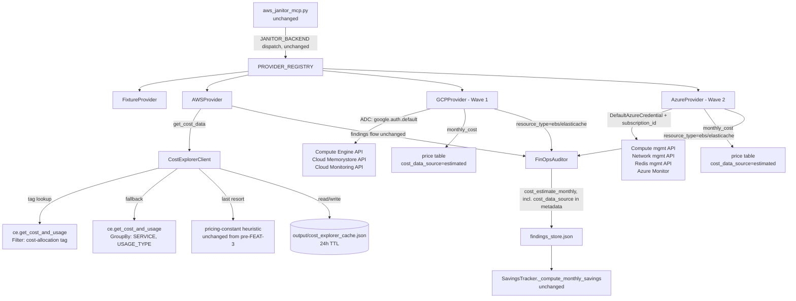

# Design Document: Phase 5 Future Enhancements

## Overview

This design covers two independent backlog issues bundled into one P3 phase: **FEAT-3** (real Cost Explorer data for the AWS provider) and **FEAT-4** (real GCP and Azure `CloudProvider` implementations). They are designed together because FEAT-4's cost-estimation approach is explicitly scoped as a smaller version of the same problem FEAT-3 solves for AWS, and both extend the `CloudProvider` interface the `provider-agnostic-backend` spec already established — no changes to that interface, to `PROVIDER_REGISTRY`, or to `aws_janitor_mcp.py`'s tool signatures are needed for either feature.

The remediation is organized into five functional areas:

1. **Cost Explorer Integration** (Req 1, 1a, 2–4) — a new `CostExplorerClient` with tag-based lookup, service-level fallback, calendar-month-aligned query periods, and a file-based TTL cache, wired into `AWSProvider.get_cost_data()`.
2. **GCP Provider** (Req 5–9) — a real `GCPProvider` implementing all three `CloudProvider` methods against Compute Engine, Cloud Memorystore, and Cloud Monitoring, using Application Default Credentials.
3. **Azure Provider** (Req 10–13, 19) — a real `AzureProvider` implementing all three `CloudProvider` methods against Azure Compute, Network, and Redis management APIs, using `DefaultAzureCredential`. (Requirement 19 formalizes `check_dependencies()`, mirroring GCP's Requirement 8 — see Requirements document.)
4. **Registry/Agent Compatibility** (Req 14, 16, 17) — verification that the only code required outside the two provider modules and `pyproject.toml` is the two small, deliberate `agents/secops_guard.py` fixes described below.
5. **Remediation Scope Boundary & Test Confidence** (Req 15, 18) — explicitly scoping GCP/Azure remediation out of this phase (`agents/remediation_architect.py` degrades to manual review), and documenting the accepted SDK-mock-only test coverage gap with a required real-account smoke-test gate.

**Sequencing decision (GCP before Azure):** GCP is implemented first, Azure second, as two internally sequenced waves rather than a flat task list — this is the single largest piece of work in the entire backlog (effort: L) and benefits from staging. **The "L" effort estimate covers audit/detection only** (Requirements 5–14, 16–18) — it does NOT include building working GCP/Azure remediation, which is explicitly out of scope for this phase (Requirement 15) and would itself be a comparably-sized follow-on effort, roughly the size of building `remediation_architect.py` again for each cloud. The decision to do GCP first is based on credential/auth ergonomics, not arbitrary ordering:

| Dimension | GCP (ADC) | Azure (`DefaultAzureCredential`) |
|---|---|---|
| Credential resolution | One function call, `google.auth.default()`, returns `(credentials, project)` | A chain of ~6-7 credential classes tried in sequence (env vars, managed identity, Azure CLI, etc.) |
| Project/subscription threading | Most GCP client libraries accept an inferred or single explicit `project` string, consistent across libraries | Every Azure management client constructor requires an explicit `subscription_id` — no equivalent to ADC's inferred default project |
| Local dev setup | `gcloud auth application-default login` — one command | `az login` plus, for automation, registering an App Registration/Service Principal and assigning an RBAC role at subscription scope — a multi-step Azure AD process |
| Structural fit with existing code | Maps directly onto `AWSProvider._make_client(service, region)`'s "one client factory, ambient credentials" shape | Requires a `subscription_id` parameter threaded through every client, a structurally different shape from the existing `_make_client` pattern |

Given this, **GCP is Wave 1** (first full implementation, establishing the pattern) and **Azure is Wave 2** (reusing the same design patterns — resource mapping table, price-table cost estimation, sensitive-port security scan — applied against Azure's SDKs and its extra `subscription_id` requirement).

**Caveat on this sequencing decision:** the analysis above is credential/SDK ergonomics only — it says nothing about which cloud target customers actually run. Customer/market fit is a real, and potentially more consequential, factor this document has no visibility into (it is not a technical question the engineering team can answer from the codebase alone). The ergonomics analysis above should be read as supporting evidence for "GCP is not harder to build first," not as the sole justification for building it first. **This sequencing SHOULD be confirmed with a product stakeholder before committing engineering time to Wave 1**, in case the actual customer base skews Azure- or AWS-adjacent (e.g. enterprise customers already standardized on Azure AD).

Almost all changes are confined to: a new `mcp_server/backends/cost_explorer.py` module, rewrites of `mcp_server/backends/aws_provider.py` (only `get_cost_data()`), `mcp_server/backends/gcp_provider.py`, and `mcp_server/backends/azure_provider.py`, plus `pyproject.toml` (two new optional extras groups) and `core/paths.py` (one new cache path constant). No changes to `mcp_server/backends/__init__.py` (the `CloudProvider` ABC), `mcp_server/aws_janitor_mcp.py` (registry/dispatch), `agents/finops_auditor.py`, or `agents/savings_tracker.py` are required.

**Correction to the original "zero agent changes" claim:** two small, deliberate exceptions exist, both documented in full below and in Requirements 15–16:

1. `agents/secops_guard.py` — `_determine_resource_type()` classifies encryption findings by AWS-only `resource_id` substring-sniffing (`"vol-"`/`"ebs"` → `ebs`; `"cache-"` → `elasticache`; else `unknown`). Left unchanged, this would silently classify 100% of GCP/Azure encryption findings as `"unknown"` and drop them in `check_encryption()`'s type filter — contradicting FEAT-4's "same class of finding" claim. The fix: `GCPProvider`/`AzureProvider` attach an explicit `resource_type` hint on encryption findings, and `check_encryption()` prefers that hint over re-deriving the type from the ID string. See "SecOps Guard Compatibility Fix" below.
2. `agents/remediation_architect.py` — `generate_remediation()`/`generate_rollback()` dispatch on the same `resource_type` strings (`"ebs"`, `"security_group"`) this phase has GCP/Azure findings reuse, but every generated HCL is AWS-shaped (`aws_ebs_snapshot`, `aws_security_group_rule`, `local-exec` calls to the `aws` CLI). Remediation was never designed for GCP/Azure — only audit/detection was. The fix: route any finding carrying a `gcp_resource_kind`/`azure_resource_kind` metadata key to the existing generic "manual review required" template instead of the AWS-specific one. See "RemediationArchitect Scope Boundary" below. **Real GCP/Azure remediation (new HCL generators, cloud-specific CLI verbs, per-cloud provider-block/credential wiring) is explicitly OUT OF SCOPE for this phase** — see Requirement 15.

This is otherwise a deliberate design constraint validating that the provider-agnostic architecture holds up under real multi-cloud implementation, not just stubs — but "provider-agnostic ingestion" is not the same claim as "provider-agnostic remediation," and this document no longer conflates the two.

## Architecture



### Key Architectural Decisions

| Decision | Rationale |
|----------|-----------|
| Cost Explorer client is a standalone module (`cost_explorer.py`), not inlined in `aws_provider.py` | Keeps the fallback chain (tag → service → heuristic) and the cache independently testable without mocking the whole provider (Req 1–3) |
| Fallback chain always terminates at the existing pricing-constant heuristic | Zero regression risk — a resource that can't be cost-attributed via Cost Explorer for any reason (new account, tags not activated, API error, or — expected on every scan of a resource created earlier this month — no completed calendar month of CE data existing yet, see Req 1a) still gets a number, exactly as today (Req 2.3) |
| Tag-based lookup (Req 1) is documented as opportunistic best-effort, not the primary tier | No cost-allocation tag matching a resource's own ID is created or activated anywhere in this codebase (`ResourceTagger` infers `env`/`team`/`owner`, not a self-referential ID tag) and AWS requires cost-allocation tags to be manually activated in Billing preferences — most real accounts never do this. Service-level attribution (Req 2) is the realistic primary outcome whenever `cost_data_source` is Cost-Explorer-backed at all; documenting tag-based lookup as the "normal" first tier would overstate how often it actually fires |
| Cost Explorer query period is calendar-month-aligned (`Start`/`End` both the 1st of a month), never ending on "today" | `Granularity="MONTHLY"` requires both boundaries on a month-start or AWS raises `ValidationException` — an unaligned period would fail validation on every day but one of the month, silently forcing `cost_data_source="estimated"` almost always while looking like it works (Req 1a). The tradeoff: a resource created earlier *this* month has no CE data yet under this scheme, and correctly falls through to the pricing heuristic — a real, documented Cost-Explorer limitation, not a bug |
| `cost_data_source` is a plain string field on the resource dict, not a new top-level API shape | Findings schema stays additive — `FinOpsAuditor._build_finding()`'s existing metadata pass-through picks it up with zero code change (Req 4.2) |
| Cache is a single JSON file under `output/`, not Redis/memcached | Matches the project's existing "file-based artifacts under `output/`" convention (`findings_store.json`, `savings_ledger.json`, `approval_gates.json`); Cost Explorer's ~seconds-scale latency and per-request billing don't justify new infra (Req 3.5) |
| GCP and Azure providers return `resource_type` values `"ebs"` / `"elasticache"` / `"aws_security_group"`, not cloud-native names | `FinOpsAuditor`/`SecOpsGuard` already dispatch severity logic on these exact strings for cost/security-group findings; reusing them means zero changes for that path (Req 5.4, 7.3, 10.4, 12.3). **This reuse is deliberately NOT extended to `RemediationArchitect`'s HCL-generation dispatch** — the same strings would otherwise route GCP/Azure findings into AWS-only HCL templates. `RemediationArchitect` instead checks for the `*_resource_kind` metadata key first and degrades to the generic manual-review template for any GCP/Azure-origin finding (Req 15.2–15.3). The real GCP/Azure resource kind is preserved separately in a `*_resource_kind` metadata field so information isn't lost — it's both the routing signal for `RemediationArchitect`'s scope guard AND (for encryption findings) paired with an explicit `resource_type` hint so `SecOpsGuard.check_encryption()` doesn't need to re-derive type from the ID string (Req 16) |
| GCP implemented before Azure, as two sequenced waves | ADC is a single-call, single-credential-object resolution that maps directly onto the existing `AWSProvider._make_client` shape; `DefaultAzureCredential` is a longer chain and requires an explicit `subscription_id` threaded through every client — GCP is the lower-friction first cut (see Overview table) |
| GCP/Azure cost estimation reuses the AWS provider's **pre-FEAT-3** pricing-constant approach, not FEAT-3's Cost Explorer integration | Standing up an equivalent to Cost Explorer for GCP (Cloud Billing export to BigQuery) or Azure (Cost Management export) requires customer-side data-export configuration beyond a credential grant — out of scope for an L-effort phase that already covers two full provider implementations. Documented as a follow-on, not silently dropped |
| GCP and Azure SDK dependencies are optional `pyproject.toml` extras, not required dependencies | `boto3` is required because AWS is the primary supported backend; requiring `google-cloud-*`/`azure-mgmt-*` for users who only run `fixture` or `aws` mode would bloat every install for a P3 feature (Req 9.5, 13.6) |
| EBS cost resolution is a two-pass algorithm (enumerate + count `type_counts[vtype]`, then cost each volume), not a single-pass loop | Requirement 2.2's proration divisor must be the count of unattached volumes of THAT SPECIFIC `volume_type`, which a single-pass loop cannot know correctly while costing the first volume it encounters (design review found the original draft referenced an undefined `self._unattached_ebs_count` global counter, which was both unimplemented and the wrong divisor shape) |

## Components and Interfaces

### 1. Cost Explorer Client (`mcp_server/backends/cost_explorer.py`)

```python
"""AWS Cost Explorer client with tag-based lookup, service-level fallback,
and a file-based TTL cache.

Cost Explorer does not expose true per-resource-ID cost for most services —
only resources with an activated cost allocation tag can be isolated exactly.
This client implements a three-tier fallback:

  1. Tag-based lookup (Requirement 1) — OPPORTUNISTIC BEST-EFFORT. Depends on
     a cost-allocation tag literally named to match the resource's own ID,
     which nothing in this codebase creates (ResourceTagger infers env/team/
     owner, not a self-referential ID tag) and which AWS requires to be
     manually activated in Billing preferences. Expected to rarely fire.
  2. Service/usage-type-level attribution (Requirement 2) — the PRIMARY
     expected outcome whenever a Cost-Explorer-backed figure is obtained at
     all. A shared/aggregate figure, not an exact per-resource cost.
  3. The caller's own pricing-constant heuristic, as a last resort — this is
     also the ONLY tier reachable for a resource created earlier in the
     current calendar month, since the query period below never includes the
     in-progress month (see _trailing_complete_months() below).

Required IAM permissions: `ce:GetCostAndUsage` (tiers 1-2 above) and
`sts:GetCallerIdentity` (account ID resolution — see AWSProvider._account_id()
in the fallback-wiring example below; this method must be implemented and its
result cached, since no such method exists anywhere in this codebase yet).

IMPORTANT — Cost Explorer's MONTHLY granularity requires the query period to
be calendar-month-aligned: both `TimePeriod.Start` and `TimePeriod.End` must
be the 1st of a month, or AWS raises `ValidationException`. A period ending
on "today" (true on every day but the 1st) would fail validation almost
every day, silently forcing every lookup to the pricing-heuristic tier while
LOOKING like Cost Explorer is being queried successfully. See Requirement 1a.
"""

from __future__ import annotations

import hashlib
import json
import os
import time
from dataclasses import dataclass
from datetime import date, timedelta
from pathlib import Path
from typing import Optional

from cloud_janitor.core.paths import COST_EXPLORER_CACHE_PATH

DEFAULT_TTL_SECONDS = 86400  # 24 hours


@dataclass
class CostLookupResult:
    monthly_cost: float
    source: str  # "cost_explorer_tag" | "cost_explorer_service" | None (caller falls back)


class CostExplorerCache:
    """File-based TTL cache for Cost Explorer responses.

    TTL semantics note (resolves a MEDIUM defect from design review): the
    cache key embeds the query period's start/end dates. Under the
    corrected `_trailing_complete_months()` (Requirement 1a), those dates
    are calendar-month-aligned and therefore change only once per calendar
    month, not once per day as the original "end = today" design would have
    caused. JANITOR_CE_CACHE_TTL_SECONDS (default 86400 = 24h) therefore
    governs freshness WITHIN a given month — e.g. re-querying Cost Explorer
    periodically in case a prior month's figures were still settling — not a
    day-to-day cache-busting mechanism. This is a deliberate consequence of
    decoupling the cache key from a literal "today" value (the Requirement
    1a fix), not a separately-invented cache scheme; the env var's
    description should be read with this in mind rather than as "cache
    expires and is refetched every 24 hours regardless of month."
    """

    def __init__(self, path: Path | None = None, ttl_seconds: int | None = None):
        self._path = path or COST_EXPLORER_CACHE_PATH
        self._ttl = ttl_seconds or int(
            os.environ.get("JANITOR_CE_CACHE_TTL_SECONDS", DEFAULT_TTL_SECONDS)
        )

    def _load(self) -> dict:
        try:
            return json.loads(self._path.read_text(encoding="utf-8"))
        except (FileNotFoundError, json.JSONDecodeError, OSError):
            return {}

    def get(self, key: str) -> Optional[dict]:
        entries = self._load()
        entry = entries.get(key)
        if entry is None:
            return None
        if time.time() - entry["cached_at"] > self._ttl:
            return None
        return entry["response"]  # type: ignore[no-any-return]

    def set(self, key: str, response: dict) -> None:
        entries = self._load()
        entries[key] = {"cached_at": time.time(), "response": response}
        self._path.parent.mkdir(parents=True, exist_ok=True)
        tmp = self._path.with_suffix(".json.tmp")
        tmp.write_text(json.dumps(entries), encoding="utf-8")
        tmp.replace(self._path)

    @staticmethod
    def make_key(account_id: str, start: str, end: str, filter_obj: dict) -> str:
        filter_hash = hashlib.sha256(
            json.dumps(filter_obj, sort_keys=True).encode()
        ).hexdigest()[:16]
        return f"{account_id}:{start}:{end}:{filter_hash}"


class CostExplorerClient:
    """Wraps boto3's Cost Explorer client with the tag/service fallback chain."""

    def __init__(self, region: Optional[str] = None, cache: CostExplorerCache | None = None):
        self._region = region
        self._cache = cache or CostExplorerCache()

    def _trailing_complete_months(self, months_back: int = 1) -> tuple[str, str]:
        """Return a Cost Explorer-valid, calendar-month-aligned TimePeriod.

        CRITICAL (Requirement 1a): Cost Explorer's Granularity="MONTHLY"
        requires BOTH TimePeriod.Start and TimePeriod.End to be the 1st of a
        month, or it raises ValidationException. The previous design used
        `end = today`, which is correct on exactly one day of any given month
        (the 1st) and raises ValidationException every other day — silently
        collapsing this entire fallback chain to the pricing heuristic nearly
        all the time, with no error surfaced to the caller.

        This method instead returns:
          start = the 1st of the month `months_back` months before the
                  current month
          end   = the 1st of the CURRENT month (exclusive upper bound)

        giving Cost Explorer one or more COMPLETE prior calendar month(s),
        never a partial in-progress month.

        UX TRADEOFF (documented, not a bug): a resource created earlier in
        the current month has no data in this query period, because the
        current partial month is deliberately excluded. For such a resource,
        both lookup_by_tag() and lookup_by_service() correctly return None,
        and the caller falls through to the pricing-heuristic tier
        (cost_data_source="estimated") — the correct, expected outcome for a
        freshly-created resource, not a defect. This is an inherent
        limitation of Cost Explorer's monthly granularity.
        """
        first_of_current_month = date.today().replace(day=1)
        # Step back `months_back` months from the first of the current month.
        year, month = first_of_current_month.year, first_of_current_month.month
        for _ in range(months_back):
            month -= 1
            if month == 0:
                month = 12
                year -= 1
        start = date(year, month, 1)
        end = first_of_current_month
        return start.isoformat(), end.isoformat()

    def lookup_by_tag(
        self, tag_key: str, resource_id: str, account_id: str
    ) -> Optional[CostLookupResult]:
        """Resource_Tagged_Lookup — Requirement 1. OPPORTUNISTIC BEST-EFFORT:
        expected to rarely find a match in a typical account (see module
        docstring); Requirement 2's service-level tier is the realistic
        primary outcome, not this tier."""
        start, end = self._trailing_complete_months()
        filter_obj = {"Tags": {"Key": tag_key, "Values": [resource_id]}}
        key = self._cache.make_key(account_id, start, end, filter_obj)

        cached = self._cache.get(key)
        response = cached or self._call_ce(start, end, filter_obj)
        if cached is None:
            self._cache.set(key, response)

        amount = self._extract_amount(response)
        if amount and amount > 0:
            return CostLookupResult(monthly_cost=round(amount, 2), source="cost_explorer_tag")
        return None

    def lookup_by_service(
        self, service_name: str, usage_type_prefix: str, account_id: str, divisor: int = 1
    ) -> Optional[CostLookupResult]:
        """Service_Level_Attribution — Requirement 2, the PRIMARY expected
        Cost-Explorer-backed tier in practice. `divisor` prorates a shared
        usage-type total across N resources of the same kind currently in scope."""
        start, end = self._trailing_complete_months()
        filter_obj = {"Dimensions": {"Key": "SERVICE", "Values": [service_name]}}
        key = self._cache.make_key(account_id, start, end, {**filter_obj, "usage": usage_type_prefix})

        cached = self._cache.get(key)
        response = cached or self._call_ce(
            start, end, filter_obj, group_by=["SERVICE", "USAGE_TYPE"]
        )
        if cached is None:
            self._cache.set(key, response)

        amount = self._extract_grouped_amount(response, usage_type_prefix)
        if amount and amount > 0:
            return CostLookupResult(
                monthly_cost=round(amount / max(divisor, 1), 2),
                source="cost_explorer_service",
            )
        return None

    def _call_ce(self, start, end, filter_obj, group_by=None) -> dict:
        from cloud_janitor.mcp_server.backends.aws_provider import _make_client

        ce = _make_client("ce", self._region)
        kwargs = dict(
            TimePeriod={"Start": start, "End": end},
            Granularity="MONTHLY",
            Metrics=["UnblendedCost"],
            Filter=filter_obj,
        )
        if group_by:
            kwargs["GroupBy"] = [{"Type": "DIMENSION", "Key": k} for k in group_by]
        return ce.get_cost_and_usage(**kwargs)  # type: ignore[no-any-return]

    @staticmethod
    def _extract_amount(response: dict) -> float:
        results = response.get("ResultsByTime", [])
        if not results:
            return 0.0
        return float(results[0]["Total"]["UnblendedCost"]["Amount"])

    @staticmethod
    def _extract_grouped_amount(response: dict, usage_type_prefix: str) -> float:
        results = response.get("ResultsByTime", [])
        if not results:
            return 0.0
        total = 0.0
        for group in results[0].get("Groups", []):
            usage_type = group["Keys"][-1] if len(group["Keys"]) > 1 else ""
            if usage_type.startswith(usage_type_prefix):
                total += float(group["Metrics"]["UnblendedCost"]["Amount"])
        return total
```

`core/paths.py` gains one new constant, following the existing pattern exactly:

```python
COST_EXPLORER_CACHE_PATH = OUTPUT_DIR / "cost_explorer_cache.json"
```

### 2. `AWSProvider.get_cost_data()` — Fallback Chain Wiring

The inventory/idle-detection logic (`describe_volumes`, `describe_cache_clusters`, `_cw_idle_days`) is otherwise untouched, but the EBS branch's control flow changes from a single-pass paginator loop to a **two-pass** structure. This is a required restructuring, not a cosmetic one — see the defect it fixes below.

**Defect this restructuring fixes (found in design review):** the original draft of this section called `ce.lookup_by_service(..., divisor=self._unattached_ebs_count)`, but `self._unattached_ebs_count` was never defined or computed anywhere in this design — it would raise `AttributeError` at runtime. Worse, even as a hypothetical, a single instance-level counter shared across all volume types would be the WRONG divisor: Requirement 2.2 requires the `EBS:VolumeUsage.*` usage-type group's cost to be divided "across all unattached volumes of **that type**" — i.e. per-`volume_type` proration (gp2 volumes prorated only against other gp2 volumes, gp3 only against other gp3, etc.), not one global count shared across every type. The current `describe_volumes` paginator loop in `aws_provider.py` (lines ~135-193) is single-pass: it costs each volume as it's encountered, before the total count of same-type volumes still to come is known. Computing an accurate per-type divisor requires knowing every unattached volume's type BEFORE costing any of them — hence two passes:

- **Pass 1** enumerates all unattached volumes via the existing paginator and builds `type_counts: dict[str, int]`, a count of unattached volumes keyed by `volume_type`. No cost or idle-day filtering happens in this pass.
- **Pass 2** iterates the volumes collected in Pass 1, applies `min_idle_days` filtering (unchanged logic), and resolves each volume's cost using `divisor = type_counts[vtype]` — the count for THAT SPECIFIC volume's own type, looked up fresh per volume, never a single shared value.

```python
def get_cost_data(self, resource_type=None, min_idle_days=7):
    resources = []
    # ... ElastiCache branch, other setup unchanged ...

    if resource_type in (None, "ebs"):
        logger.info("[AWSProvider] Scanning EBS volumes...")
        # ---- Pass 1: enumerate ALL unattached volumes and count them ----
        # PER volume_type, before costing any of them. Required because
        # Requirement 2.2's proration divisor must be the count of unattached
        # volumes of THAT SPECIFIC type, which cannot be known correctly by a
        # single-pass loop that costs each volume as it's encountered.
        unattached_volumes: list[dict] = []
        type_counts: dict[str, int] = {}
        try:
            ec2 = _make_client("ec2", self._region)
            paginator = ec2.get_paginator("describe_volumes")
            for page in paginator.paginate(
                Filters=[{"Name": "status", "Values": ["available"]}]
            ):
                for vol in page["Volumes"]:
                    vtype = vol.get("VolumeType", "gp3")
                    unattached_volumes.append(vol)
                    type_counts[vtype] = type_counts.get(vtype, 0) + 1
        except botocore.exceptions.ClientError as exc:
            resources.append(
                {
                    "id": "ebs-error", "type": "ebs", "name": "error",
                    "idle_days": 0, "monthly_cost": 0.0, "status": "error",
                    "error": str(exc),
                }
            )
            unattached_volumes = []

        # ---- Pass 2: filter by idle_days and resolve cost PER TYPE -------
        for vol in unattached_volumes:
            vid = vol["VolumeId"]
            created = vol["CreateTime"]
            idle = (datetime.now(timezone.utc) - created).days  # unattached → idle since detach
            if idle < min_idle_days:
                continue

            gb = vol.get("Size", 0)
            vtype = vol.get("VolumeType", "gp3")
            monthly_cost, cost_data_source = self._resolve_ebs_cost(
                vol, gb, vtype, divisor=type_counts[vtype]
            )

            name = next(
                (t["Value"] for t in vol.get("Tags", []) if t["Key"] == "Name"), vid,
            )
            resources.append(
                {
                    "id": vid, "type": "ebs", "name": name, "idle_days": idle,
                    "monthly_cost": monthly_cost, "status": vol["State"],
                    "attached": vol["State"] == "in-use", "volume_type": vtype,
                    "size_gb": gb, "availability_zone": vol.get("AvailabilityZone", ""),
                    "encrypted": vol.get("Encrypted", False),
                    "created_at": created.isoformat(),
                    "cost_data_source": cost_data_source,
                    "description": f"Unattached {vtype} volume, {gb} GB, idle {idle} days",
                }
            )
    return resources  # simplified — real method also assembles total_monthly_waste, etc.


def _resolve_ebs_cost(self, vol: dict, gb: int, vtype: str, divisor: int) -> tuple[float, str]:
    """Returns (monthly_cost, cost_data_source).

    `divisor` MUST be the PER-TYPE count from Pass 1's `type_counts[vtype]`
    (i.e. the number of unattached volumes of THIS SPECIFIC volume_type
    currently in scope) — never a single global count shared across every
    volume type. Requirement 2.2 requires prorating a usage-type group's cost
    "across all unattached volumes of that type," not across all unattached
    volumes of every type combined.
    """
    if os.environ.get("AWS_ENDPOINT_URL"):  # LocalStack/sandbox — Req 2.4
        return self._pricing_heuristic_ebs(gb, vtype), "estimated"

    account_id = self._account_id()  # cached via STS, see below
    ce = self._ce_client()

    tagged = ce.lookup_by_tag("ResourceId", vol["VolumeId"], account_id)
    if tagged:
        return tagged.monthly_cost, tagged.source

    svc = ce.lookup_by_service(
        "Amazon Elastic Compute Cloud - Compute", "EBS:VolumeUsage",
        account_id, divisor=divisor,
    )
    if svc:
        return svc.monthly_cost, svc.source

    return self._pricing_heuristic_ebs(gb, vtype), "estimated"  # Req 2.3

def _pricing_heuristic_ebs(self, gb: int, vtype: str) -> float:
    """Unchanged pre-FEAT-3 formula — last-resort fallback only, per Req 2.3."""
    price_per_gb = 0.10 if vtype == "gp2" else 0.08
    return round(gb * price_per_gb, 2)
```

The same three-tier pattern (`lookup_by_tag` → `lookup_by_service` → existing `cost_map`/heuristic) applies to the ElastiCache branch, with `service_name="Amazon ElastiCache"` and `usage_type_prefix` set per node family; ElastiCache clusters are not typically enumerated in bulk the way unattached EBS volumes are; if a future revision needs per-type EBS-style proration for ElastiCache, the same two-pass/`type_counts` pattern applies. Each resource dict gains one new key: `"cost_data_source": <one of the three values>`.

**Note on `self._account_id()` (MEDIUM defect fix):** the fallback-wiring example above calls `self._account_id()`, but no such method — and no STS usage of any kind — exists anywhere in this codebase today. This method MUST be implemented as part of this phase: it SHALL call `sts:GetCallerIdentity` via `_make_client("sts", self._region)`, cache the resolved account ID on the instance (it does not change during a provider's lifetime, and calling STS on every resource would add unnecessary latency/cost to every scan), and `sts:GetCallerIdentity` SHALL be added to this feature's required-IAM documentation and to `CostExplorerClient`'s module docstring (already reflected above) alongside `ce:GetCostAndUsage`.

### 3. GCP Provider (`mcp_server/backends/gcp_provider.py`) — Wave 1

```python
"""GCP provider implementation for the Cloud Janitor MCP server.

Queries live GCP infrastructure via the Compute Engine, Cloud Memorystore,
and Cloud Monitoring APIs. Resource-type mapping to the AWS-shaped schema:

    GCP Persistent Disk    -> resource_type "ebs"              (Req 5)
    GCP Cloud Memorystore  -> resource_type "elasticache"       (Req 6)
    GCP Firewall Rule      -> resource_type "aws_security_group"(Req 7)

Cost figures use a price table, NOT a Cloud Billing export integration —
see Requirement 9.3 for rationale. cost_data_source is always "estimated".
"""

from __future__ import annotations

import logging
import os
from datetime import datetime, timezone
from typing import Optional

from cloud_janitor.mcp_server.backends import CloudProvider

logger = logging.getLogger(__name__)

_DISK_PRICE_PER_GB = {"pd-standard": 0.04, "pd-balanced": 0.10, "pd-ssd": 0.17}
_MEMORYSTORE_PRICE = {
    "BASIC_1GB": 35.0, "BASIC_5GB": 145.0, "STANDARD_HA_1GB": 71.0,
}
_SENSITIVE_PORTS = {  # identical table to AWSProvider.get_security_data — Req 7.2
    22: ("SSH", "CRITICAL"), 3306: ("MySQL", "CRITICAL"),
    5432: ("PostgreSQL", "CRITICAL"), 6379: ("Redis", "CRITICAL"),
    27017: ("MongoDB", "CRITICAL"), 3389: ("RDP", "CRITICAL"),
    8080: ("HTTP-alt", "HIGH"), 8443: ("HTTPS-alt", "HIGH"),
}


class GCPProvider(CloudProvider):
    """CloudProvider backed by live GCP APIs via Application Default Credentials."""

    def __init__(self, project_id: Optional[str] = None):
        try:
            import google.auth
            from google.auth.exceptions import DefaultCredentialsError
        except ImportError:
            raise ImportError(
                "google-auth and the GCP client libraries are required for the "
                "GCP backend but are not installed. Install them with: "
                "pip install 'cloud-janitor[gcp]'"
            )
        try:
            self._credentials, resolved_project = google.auth.default()
        except DefaultCredentialsError as exc:
            raise RuntimeError(
                "Could not resolve Google Application Default Credentials. Run "
                "'gcloud auth application-default login', or set "
                "GOOGLE_APPLICATION_CREDENTIALS to a service account key file. "
                f"Underlying error: {exc}"
            ) from exc
        self._project_id = project_id or resolved_project or os.environ.get("GCP_PROJECT_ID")

    # get_cost_data / get_security_data / check_dependencies — see Requirements 5-9
    # implemented against google-cloud-compute's DisksClient/FirewallsClient and
    # google-cloud-redis's CloudRedisClient, following the exact structure of
    # AWSProvider.get_cost_data()/get_security_data()/check_dependencies(): a
    # paginated list call, per-item idle/violation check, and a resources/findings
    # accumulator with the same shape as AWSProvider today.
    #
    # NOTE (Req 16, SecOps Guard compatibility fix): the check_type="encryption"
    # branch (Req 7.5) MUST include an explicit "resource_type": "ebs" key on
    # each raw finding dict, alongside "gcp_resource_kind": "persistent_disk".
    # Without this hint, SecOpsGuard._determine_resource_type() would try to
    # classify the finding by substring-matching a GCP disk resource_id
    # (e.g. "projects/x/zones/y/disks/pd-123") against AWS-only patterns
    # ("vol-"/"ebs"), fail to match, return "unknown", and the finding would
    # be silently dropped by check_encryption()'s type filter. See "SecOps
    # Guard Compatibility Fix" below for the corresponding secops_guard.py
    # change.
    #
    # NOTE (Req 17, port table prerequisite): _SENSITIVE_PORTS above already
    # includes 3389/8080/8443 matching AWSProvider's full table. This alone
    # is NOT sufficient for cross-provider parity — SecOpsGuard's OWN
    # SENSITIVE_PORTS/DATABASE_CACHE_PORTS constants (agents/secops_guard.py)
    # independently filter which findings become Findings, and today only
    # recognize {22, 3306, 5432, 6379, 27017}. A GCP firewall rule open on
    # 3389/8080/8443 would be returned as a raw finding here but silently
    # dropped by SecOpsGuard before it ever becomes a Finding. See "SecOps
    # Guard Compatibility Fix" below.
```

### 4. Azure Provider (`mcp_server/backends/azure_provider.py`) — Wave 2

```python
"""Azure provider implementation for the Cloud Janitor MCP server.

Queries live Azure infrastructure via the Compute, Network, and Redis
management APIs. Resource-type mapping to the AWS-shaped schema:

    Azure Managed Disk        -> resource_type "ebs"               (Req 10)
    Azure Cache for Redis     -> resource_type "elasticache"        (Req 11)
    Azure NSG                 -> resource_type "aws_security_group" (Req 12)

Unlike GCP's ADC, every Azure management client requires an explicit
subscription_id — there is no inferred default subscription.
"""

from __future__ import annotations

import logging
import os
from typing import Optional

from cloud_janitor.mcp_server.backends import CloudProvider

logger = logging.getLogger(__name__)

_DISK_PRICE_PER_GB = {"Standard_LRS": 0.045, "StandardSSD_LRS": 0.10, "Premium_LRS": 0.15}
_REDIS_PRICE = {"Basic_C0": 16.0, "Basic_C1": 41.0, "Standard_C1": 82.0}
_SENSITIVE_PORTS = {  # identical table to AWSProvider/GCPProvider — Req 12.2
    22: ("SSH", "CRITICAL"), 3306: ("MySQL", "CRITICAL"),
    5432: ("PostgreSQL", "CRITICAL"), 6379: ("Redis", "CRITICAL"),
    27017: ("MongoDB", "CRITICAL"), 3389: ("RDP", "CRITICAL"),
    8080: ("HTTP-alt", "HIGH"), 8443: ("HTTPS-alt", "HIGH"),
}


class AzureProvider(CloudProvider):
    """CloudProvider backed by live Azure APIs via DefaultAzureCredential."""

    def __init__(self, subscription_id: Optional[str] = None):
        try:
            from azure.identity import DefaultAzureCredential
        except ImportError:
            raise ImportError(
                "azure-identity and the azure-mgmt-* client libraries are "
                "required for the Azure backend but are not installed. Install "
                "them with: pip install 'cloud-janitor[azure]'"
            )
        self._subscription_id = subscription_id or os.environ.get("AZURE_SUBSCRIPTION_ID")
        if not self._subscription_id:
            raise RuntimeError(
                "AzureProvider requires a subscription ID. Pass subscription_id "
                "explicitly or set the AZURE_SUBSCRIPTION_ID environment variable "
                "— unlike GCP's Application Default Credentials, Azure has no "
                "inferred default subscription."
            )
        # Credential resolution itself is lazy — DefaultAzureCredential() does not
        # make a network call until the first management-client request, so
        # authentication failures surface as azure.core.exceptions.ClientAuthenticationError
        # at first use, wrapped per Requirement 13.4.
        self._credential = DefaultAzureCredential()

    # get_cost_data / get_security_data / check_dependencies — see Requirements
    # 10-13 (cost/security) and 19 (dependency checks), implemented against
    # azure-mgmt-compute's DisksOperations,
    # azure-mgmt-network's NetworkSecurityGroupsOperations, and
    # azure-mgmt-redis's RedisOperations, following the same accumulator
    # structure as GCPProvider and AWSProvider.
    #
    # NOTE (Req 16, SecOps Guard compatibility fix): the check_type="encryption"
    # branch (Req 12.5) MUST include "resource_type": "ebs" on each raw
    # finding, alongside "azure_resource_kind": "managed_disk" — same
    # rationale as GCPProvider above. See "SecOps Guard Compatibility Fix"
    # below.
    #
    # NOTE (Req 17, port table prerequisite): same caveat as GCPProvider —
    # SecOpsGuard's own SENSITIVE_PORTS/DATABASE_CACHE_PORTS constants must
    # be widened independently of this module's _SENSITIVE_PORTS table. See
    # "SecOps Guard Compatibility Fix" below.
```

### 5. SecOps Guard Compatibility Fix (`agents/secops_guard.py`) — Requirement 16, 17

Two small, deliberate changes to the existing AWS-path file, both narrowly scoped and both required for FEAT-4's "same class of finding" claim to hold for GCP/Azure:

**(a) Encryption-finding classification (Req 16).** Today, `_determine_resource_type()` classifies encryption findings purely by substring-matching `resource_id`:

```python
def _determine_resource_type(self, finding: dict) -> str:
    check_type = finding.get("check_type", "")
    if check_type == "security_group":
        return "security_group"
    elif check_type == "encryption":
        resource_id = finding.get("resource_id", "")
        if resource_id.startswith("cache-") or "cache" in resource_id.lower():
            return "elasticache"
        elif resource_id.startswith("vol-") or "ebs" in resource_id.lower():
            return "ebs"
    return "unknown"
```

A GCP disk ID (`projects/x/zones/y/disks/pd-123`) or Azure disk ID (an ARM resource path) matches none of these AWS-shaped patterns, falls through to `"unknown"`, and is silently dropped by `check_encryption()`'s `if detected_type == resource_type` filter — 100% of GCP/Azure encryption findings would be discarded. Fix: `GCPProvider`/`AzureProvider` attach an explicit `resource_type` hint to each encryption finding (see the `NOTE (Req 16, ...)` comments in the provider sections above); `_determine_resource_type()` is updated to prefer that hint when present:

```python
def _determine_resource_type(self, finding: dict) -> str:
    check_type = finding.get("check_type", "")
    if check_type == "security_group":
        return "security_group"
    elif check_type == "encryption":
        hinted = finding.get("resource_type")  # NEW: caller-supplied hint (Req 16)
        if hinted in ("ebs", "elasticache"):
            return hinted
        resource_id = finding.get("resource_id", "")  # unchanged fallback for AWS/fixtures
        if resource_id.startswith("cache-") or "cache" in resource_id.lower():
            return "elasticache"
        elif resource_id.startswith("vol-") or "ebs" in resource_id.lower():
            return "ebs"
    return "unknown"
```

This preserves existing AWS/fixture behavior exactly (no hint present → unchanged ID-sniffing) while making GCP/Azure classification correct.

**(b) Sensitive port table alignment (Req 17).** `SecOpsGuard.SENSITIVE_PORTS = [22, 3306, 5432, 6379, 27017]` and `DATABASE_CACHE_PORTS = {3306, 5432, 6379, 27017}` predate this phase and are narrower than the 8-port table `AWSProvider.get_security_data()`, `GCPProvider._SENSITIVE_PORTS`, and `AzureProvider._SENSITIVE_PORTS` already use internally (which include `3389`/`8080`/`8443`). Because `SecOpsGuard.check_security_groups()` re-filters every raw finding — from any provider — against its own narrower list, a GCP firewall rule or Azure NSG rule open to the world on RDP/HTTP-alt/HTTPS-alt would be silently dropped even though the provider correctly flagged it. Fix:

```python
SENSITIVE_PORTS = [22, 3306, 5432, 6379, 27017, 3389, 8080, 8443]
DATABASE_CACHE_PORTS = {3306, 5432, 6379, 27017, 3389}  # 3389 joins the CRITICAL tier
```

This is an AWS-path bug this phase inherits and would otherwise compound across two more clouds — fixing it here benefits the existing AWS backend too (an AWS security group open on 3389/8080/8443 was already being under-flagged before this phase).

### 6. RemediationArchitect Scope Boundary (`agents/remediation_architect.py`) — Requirement 15

`generate_remediation()`/`generate_rollback()` dispatch on `resource_type`/`category` and emit AWS-specific HCL: `aws_ebs_snapshot`, `aws_ebs_volume`, `aws_security_group_rule`, and `local-exec` provisioners literally running `aws ec2 delete-volume`/`aws elasticache delete-cache-cluster`. None of this is meaningful against a GCP Persistent Disk ID or an Azure Managed Disk ID — remediation was never designed for non-AWS resources, only detection was (Requirements 5–13 cover `get_cost_data`/`get_security_data`/`check_dependencies` only; neither `requirements.md` nor this design previously mentioned `remediation_architect.py` at all, despite the resource-mapping table implying cross-cloud remediation parity that does not exist).

**Fix — fail-safe scope guard, not new capability:**

```python
def generate_remediation(self, finding: dict) -> str:
    metadata = finding.get("metadata", {})
    if "gcp_resource_kind" in metadata or "azure_resource_kind" in metadata:
        # Req 15.2-15.3: GCP/Azure remediation is out of scope for this phase.
        # Degrade to the same manual-review placeholder already used for
        # unhandled AWS resource types, rather than emitting AWS-shaped HCL
        # against a non-AWS resource ID.
        return self._remediation_generic(finding)

    resource_type = finding.get("resource_type", "")
    # ... existing AWS dispatch logic, unchanged ...
```

(`generate_rollback()` gets the identical guard, routing to `_rollback_generic()`.) This means: for this phase, a GCP/Azure finding is fully visible in `findings_store.json` and the reporting UI (cost, severity, description — Req 15.5) but its "remediation" is always the existing `"# NOTE: No automated remediation template for this resource type. Manual review required."` placeholder, exactly as an unhandled AWS resource type gets today. No "Approve" action produces broken Terraform against a live GCP/Azure resource.

**Explicitly out of scope, deferred to a follow-on phase (Req 15.4):** real GCP/Azure remediation — new HCL generators (`google_compute_disk`, `azurerm_managed_disk`, etc.), `gcloud`/`az` CLI verbs in place of `aws ec2`/`aws elasticache` `local-exec` calls, and per-cloud Terraform provider-block/credential wiring. This is comparably sized to building `remediation_architect.py` in the first place, once per additional cloud — not a small addition to this phase.

### 7. Resource Type Mapping Table (cross-cutting reference)

| Cloud-neutral finding shape | AWS (existing) | GCP (Wave 1) | Azure (Wave 2) |
|---|---|---|---|
| `resource_type: "ebs"` (waste) | EBS volume, unattached | Persistent Disk, no `users` | Managed Disk, `diskState=Unattached` |
| `resource_type: "elasticache"` (waste) | ElastiCache cluster, idle | Cloud Memorystore (Redis) instance, idle | Azure Cache for Redis instance, idle |
| `resource_type: "aws_security_group"` (security) | Security group, `0.0.0.0/0` ingress on sensitive port | VPC Firewall Rule, `sourceRanges=["0.0.0.0/0"]`, sensitive port | NSG rule, `sourceAddressPrefix` in `{"*","0.0.0.0/0","Internet"}`, sensitive port |
| `resource_type: "aws_ebs_volume"` (encryption) | Unencrypted EBS volume | Persistent Disk with encryption explicitly disabled | Managed Disk with `encryption.type` not platform/customer-managed |

Reusing the AWS-shaped `resource_type` strings (rather than inventing `gcp_persistent_disk`/`azure_managed_disk` as the dispatch key) is what lets `FinOpsAuditor.classify_severity()` and `SecOpsGuard`'s security-group/encryption dispatch (the latter after the Requirement 16 fix above) work across all three clouds with the one small `secops_guard.py` change described in Section 5 — see Requirement 14. **This does NOT extend to `RemediationArchitect`**, whose HCL-template dispatch on these same strings is deliberately short-circuited for GCP/Azure findings by the Section 6 scope guard (Requirement 15) — remediation parity across clouds is explicitly out of scope for this phase.

## Correctness Properties

*A property is a characteristic or behavior that should hold true across all valid executions of a system — essentially, a formal statement about what the system should do. Properties serve as the bridge between human-readable specifications and machine-verifiable correctness guarantees.*

### Property 1: Cost Fallback Chain Termination

*For any* resource passed through `AWSProvider`'s cost resolution path, exactly one of `{"cost_explorer_tag", "cost_explorer_service", "estimated"}` SHALL be assigned as `cost_data_source`, and the chain SHALL always terminate in a numeric `monthly_cost` — no resource SHALL be returned with a missing or `None` cost field, even when both Cost Explorer lookups fail or raise (including the expected-common case of a resource created earlier in the current calendar month, per Requirement 1a, where both CE tiers correctly find no data).

**Validates: Requirements 1.2, 2.2, 2.3**

### Property 10: Cost Explorer Query Period Is Always Calendar-Month-Aligned

*For any* call to `CostExplorerClient._trailing_complete_months()`, regardless of what day of the month `date.today()` returns, both the returned `start` and `end` ISO date strings SHALL be the 1st of a month (`day == 1`), `end` SHALL equal the 1st of the current month, and `start` SHALL be strictly before `end`. This SHALL hold across a full year of `date.today()` values (property test iterates or is parametrized across all 12 months, including the December→January year-boundary case), guaranteeing every `Granularity="MONTHLY"` request this client issues is valid per Cost Explorer's API contract and never raises `ValidationException` for this reason.

**Validates: Requirement 1a.1, 1a.2**

### Property 2: LocalStack Cost Path Bypass

*For any* environment where `AWS_ENDPOINT_URL` is set, `AWSProvider.get_cost_data()` SHALL make zero calls to `ce.get_cost_and_usage()` and SHALL assign `cost_data_source="estimated"` to every resource.

**Validates: Requirement 2.4**

### Property 3: Cache Round-Trip and TTL Expiry

*For any* cache key written via `CostExplorerCache.set()`, a `get()` call for the same key within the configured TTL SHALL return the identical cached response without a Cost Explorer call, and a `get()` call after the TTL has elapsed SHALL return `None` (forcing a fresh lookup).

**Validates: Requirements 3.1, 3.2, 3.3, 3.4**

### Property 4: Corrupted Cache File Degrades to Full Miss

*For any* byte sequence that is not valid JSON at `output/cost_explorer_cache.json`, `CostExplorerCache.get()` SHALL return `None` for every key (never raise), and the cache file SHALL be safely rewritten on the next successful `set()`.

**Validates: Requirement 3.6**

### Property 5: Cost Data Source Propagates to Finding Metadata

*For any* resource dict containing a `cost_data_source` key returned from `get_cost_data()`, the corresponding finding built by `FinOpsAuditor._build_finding()` SHALL contain that same `cost_data_source` value in its `metadata` field, with no other metadata field altered.

**Validates: Requirement 4.2**

### Property 6: Cross-Provider Resource Type Consistency

*For any* qualifying resource returned by `GCPProvider.get_cost_data()` or `AzureProvider.get_cost_data()`, the `type` field SHALL be exactly `"ebs"` or `"elasticache"` (never a cloud-native string), and for any qualifying finding from `get_security_data()`, `resource_type` SHALL be exactly `"aws_security_group"` — matching the exact strings `AWSProvider` uses for the equivalent AWS resource, so that `FinOpsAuditor.classify_severity()` and `SecOpsGuard`'s existing dispatch logic apply unchanged.

**Validates: Requirements 5.4, 6.3, 7.3, 10.4, 11.3, 12.3, 14.3**

### Property 7: GCP/Azure Response Shape Parity

*For any* call to `get_cost_data()`, `get_security_data()`, or `check_dependencies()` on `GCPProvider` or `AzureProvider`, the returned dict SHALL match the exact top-level key set `FixtureProvider`/`AWSProvider` return for the same method (`{"resources", "total_monthly_waste"}`, `{"findings", "critical_count"}`, `{"has_dependencies", "dependents"}` respectively), and `critical_count`/`has_dependencies` SHALL satisfy the same derived-field invariants already validated for `FixtureProvider` in `provider-agnostic-backend`'s Properties 2–4.

**Validates: Requirements 5.5, 6.4, 7.4, 8.4, 10.5, 11.4, 12.4, 19.4**

### Property 8: Missing SDK Raises Actionable ImportError

*For any* environment where `JANITOR_BACKEND` is `"gcp"` or `"azure"` and the corresponding client libraries are not importable, instantiating the provider SHALL raise `ImportError` with a message containing the extras-group `pip install` command, and SHALL NOT raise any other exception type (e.g. `ModuleNotFoundError` propagating unwrapped, or `AttributeError` from a partial import).

**Validates: Requirements 9.6, 13.7**

### Property 9: Azure Requires an Explicit Subscription ID

*For any* `AzureProvider` instantiation where neither a `subscription_id` argument nor `AZURE_SUBSCRIPTION_ID` is set, construction SHALL raise `RuntimeError` before any network call is attempted (i.e., before `DefaultAzureCredential()` is even constructed).

**Validates: Requirement 13.3**

## Error Handling

### Error Propagation Strategy

| Layer | Behavior | Example |
|-------|----------|---------|
| Cost Explorer tag lookup failure | Falls through to service-level lookup, no exception surfaced to caller | No cost allocation tag activated → `lookup_by_tag` returns `None` |
| Cost Explorer `ValidationException` (should no longer occur under normal operation after Req 1a's calendar-month alignment, but handled defensively as a normal CE error) | Falls through exactly like any other `ClientError` — never surfaced to the caller | A future code change accidentally reintroduces an unaligned period → caught, falls to next tier, `cost_data_source` still resolves correctly (just to a less-precise tier); Property 10's test suite is the real guard against this regressing silently |
| Cost Explorer service-level lookup failure | Falls through to pricing-constant heuristic, no exception surfaced | `ce.get_cost_and_usage()` raises `ClientError` → caught, `None` returned, heuristic used |
| Cost Explorer cache corruption | Treated as full cache miss; cache file rewritten on next successful write | Malformed JSON → `CostExplorerCache.get()` returns `None` for all keys |
| GCP ADC resolution failure | `RuntimeError` at `GCPProvider.__init__()`, before any API call | No `gcloud` login and no `GOOGLE_APPLICATION_CREDENTIALS` → blocked at construction |
| GCP/Azure SDK not installed | `ImportError` at provider instantiation naming the extras group | `JANITOR_BACKEND=gcp` with no `google-cloud-compute` installed → blocked at construction |
| Azure missing subscription ID | `RuntimeError` at `AzureProvider.__init__()`, before `DefaultAzureCredential()` is constructed | Neither argument nor env var set → blocked at construction |
| Azure credential chain exhausted | `azure.core.exceptions.ClientAuthenticationError` wrapped in `RuntimeError` at first management-client call | No `az login`, no service principal env vars, not running on Azure compute → blocked at first real API call |
| GCP/Azure per-resource API error (e.g. transient network failure listing disks) | Mirrors `AWSProvider`'s existing pattern: an `"...-error"` entry appended to `resources`/`findings` with `"error"` key set, scan continues for other resource types | Matches `AWSProvider.get_cost_data()`'s `except botocore.exceptions.ClientError` blocks today |

### Critical Error Paths

1. **Cost Explorer total failure for a resource**: never blocks the scan — the resource still gets a `monthly_cost` via the pricing-constant heuristic, with `cost_data_source="estimated"` making the degradation visible downstream.
2. **GCP/Azure credential failure**: blocks provider construction entirely (fail-closed) rather than partially — an operator who mis-configures `JANITOR_BACKEND=gcp` gets one clear error at startup, not a series of per-resource API failures deep in a scan.
3. **Missing optional SDK dependency**: blocked at construction with the exact `pip install` remediation, consistent with `AWSProvider`'s existing boto3-missing behavior.

## Testing Strategy

### Testing Approach

Dual approach consistent with the project's established convention (`.kiro/specs/audit-remediation/design.md`, `.kiro/specs/phase1-trust-hardening/design.md`): Hypothesis property tests (`@settings(max_examples=100)`) for the 10 properties above, plus pytest example-based unit tests for specific scenarios, credential-failure paths, and provider parity checks. All external I/O (boto3 CE calls, `google.auth`/GCP client libraries, `azure.identity`/Azure management clients) is mocked — the units under test are never mocked.

**Accepted gap, stated explicitly (Requirement 18):** FEAT-4's test suite is 100% SDK-mocked with no LocalStack-equivalent for GCP/Azure (unlike the AWS path, which has LocalStack-based integration coverage). This is materially LOWER-CONFIDENCE than the AWS path, and is an accepted, documented gap for this phase, not an oversight. In particular, `google-cloud-compute`/`google-cloud-redis` return typed protobuf message objects with attribute access (`disk.users`, `disk.creation_timestamp`), NOT dict-shaped objects like boto3's responses — mocks in `tests/test_gcp_provider.py` MUST be constructed to mimic that attribute-access shape (e.g. `MagicMock(users=[...])`, not `{"users": [...]}`), or a test suite built entirely around dict-shaped mocks could pass while the first real call fails on `AttributeError`/`TypeError`. Requirement 18 mandates at least one real-account smoke test for each of GCP and Azure before the corresponding provider is considered complete, specifically to catch this class of shape mismatch that mocks cannot.

### Property Test Mapping

| Property | Test Module |
|----------|-------------|
| 1: Cost Fallback Chain Termination | `tests/test_cost_explorer_properties.py` |
| 2: LocalStack Cost Path Bypass | `tests/test_cost_explorer_properties.py` |
| 3: Cache Round-Trip and TTL Expiry | `tests/test_cost_explorer_cache_properties.py` |
| 4: Corrupted Cache File Degrades to Full Miss | `tests/test_cost_explorer_cache_properties.py` |
| 5: Cost Data Source Propagates to Finding Metadata | `tests/test_finops_cost_source_properties.py` |
| 6: Cross-Provider Resource Type Consistency | `tests/test_gcp_provider_properties.py`, `tests/test_azure_provider_properties.py` |
| 7: GCP/Azure Response Shape Parity | `tests/test_gcp_provider_properties.py`, `tests/test_azure_provider_properties.py` |
| 8: Missing SDK Raises Actionable ImportError | `tests/test_gcp_provider.py`, `tests/test_azure_provider.py` |
| 9: Azure Requires an Explicit Subscription ID | `tests/test_azure_provider.py` |
| 10: Cost Explorer Query Period Is Always Calendar-Month-Aligned | `tests/test_cost_explorer_properties.py` |

### Example-Based Unit Tests

| Requirement | Test Focus | Test Module |
|-------------|-----------|-------------|
| Req 1, 2 | Mocked `ce.get_cost_and_usage` returning a tag match, a zero tag match with service-level fallback, and a total CE failure falling to the heuristic | `tests/test_cost_explorer.py` |
| Req 3 | TTL boundary (just under / just over), cache key stability across identical filter dicts with different key order | `tests/test_cost_explorer_cache.py` |
| Req 4 | Finding metadata contains `cost_data_source` after a full `FinOpsAuditor.scan()` against a mocked `get_cost_data()` | `tests/test_finops_cost_source.py` |
| Req 5–8 | GCP disk/Memorystore/firewall listing (mocked `google-cloud-compute`/`google-cloud-redis` clients), idle-day computation, severity mapping matches AWS's port table | `tests/test_gcp_provider.py` |
| Req 9 | ADC success and `DefaultCredentialsError` paths (mocked `google.auth.default`), missing-SDK `ImportError` message content | `tests/test_gcp_provider.py` |
| Req 10–12, 19 | Azure disk/Redis/NSG listing (mocked `azure-mgmt-*` clients), idle-day computation, severity mapping matches AWS's port table, and `check_dependencies()` for all three Azure resource kinds (Requirement 19, mirroring GCP's Requirement 8) | `tests/test_azure_provider.py` |
| Req 13 | Missing `subscription_id` `RuntimeError`, mocked `ClientAuthenticationError` wrapping, missing-SDK `ImportError` message content | `tests/test_azure_provider.py` |
| Req 14 | `PROVIDER_REGISTRY` dispatch to real GCP/Azure providers with mocked constructors; `FinOpsAuditor` processes GCP/Azure-shaped cost/security findings with zero code changes; `SecOpsGuard`/`RemediationArchitect` process the same findings through their Req 16/15 fixes (parametrized against all three providers) | `tests/test_provider_registry_parity.py` |
| Req 1a | `_trailing_complete_months()` returns month-aligned `(start, end)` for every day-of-month input, including December→January rollover; a direct (non-mocked) call to a fake `ce.get_cost_and_usage()` stub that raises `ValidationException` on any non-month-aligned period, asserting it is never raised | `tests/test_cost_explorer.py` |
| Req 15 | `RemediationArchitect.generate_remediation()`/`generate_rollback()` given a finding with `gcp_resource_kind`/`azure_resource_kind` metadata → returns the generic manual-review template, never AWS-shaped HCL; given an AWS finding (no such metadata) → unchanged existing dispatch behavior (regression check) | `tests/test_remediation_architect_scope.py` |
| Req 16 | `SecOpsGuard._determine_resource_type()`/`check_encryption()` given a raw finding with an explicit `resource_type` hint (GCP/Azure-shaped `resource_id`) → correctly classified and not dropped; given no hint (existing AWS/fixture shape) → unchanged behavior (regression check) | `tests/test_secops_guard_cross_cloud.py` |
| Req 17 | `SecOpsGuard.SENSITIVE_PORTS`/`DATABASE_CACHE_PORTS` include 3389/8080/8443 with correct severities; a raw finding open on 3389/8080/8443 is no longer silently dropped (regression check against the pre-fix narrower list) | `tests/test_secops_guard_cross_cloud.py` |
| Req 18 | Documented manual/CI-gated smoke-test runbook (not a pytest-collected test — requires live credentials) for one real GCP project and one real Azure subscription, exercising all three `CloudProvider` methods against at least one real resource each | `docs/` or a `tests/manual/` runbook referenced from `tests/test_gcp_provider.py`/`tests/test_azure_provider.py` module docstrings |

### Test Quality Requirements

Per project steering rules (`.kiro/specs/audit-remediation/design.md`): no tautological assertions, no pass-by-default fixtures, negative cases required for every module, only mock external I/O (boto3, `google-cloud-*`, `azure-mgmt-*`, filesystem for the cache) — never mock the unit under test. GCP mocks specifically MUST use attribute-access (protobuf-shaped) `MagicMock` objects, not dict literals, per the Testing Approach note above (Requirement 18).
