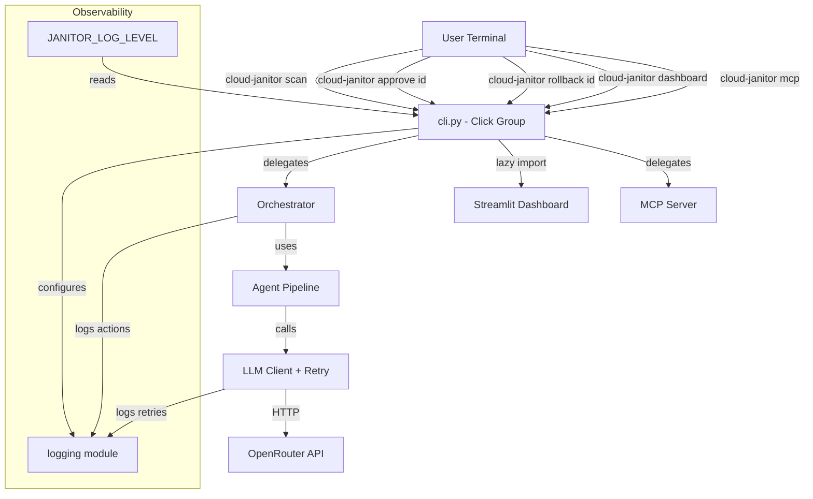

# Design Document: Production Readiness

## Overview

This design transforms Cloud Janitor from a development-time project into a pip-installable, distributable Python package. The refactor touches six areas:

1. **Packaging** — src-layout under `src/cloud_janitor/`, hatchling build backend, proper dependency separation
2. **CLI** — Click-based command-line interface exposing scan/approve/rollback/dashboard/mcp subcommands
3. **Resilience** — Manual retry loop with exponential backoff for LLM calls
4. **Observability** — Structured logging via Python's `logging` module with configurable level
5. **CI/CD** — GitHub Actions pipeline for lint, type-check, test matrix, build, and publish
6. **Developer Experience** — py.typed marker, importable version, stub provider warnings

The design preserves all existing behavior (17 agents, MCP server, property tests, Streamlit dashboard) while reorganizing the file tree into a standards-compliant Python package.

## Architecture

### High-Level Package Layout (After Refactor)

```text
Cloud-Janitor/
├── src/
│   └── cloud_janitor/
│       ├── __init__.py          # __version__ via importlib.metadata
│       ├── py.typed             # PEP 561 marker
│       ├── cli.py               # Click CLI entry point
│       ├── app.py               # Streamlit dashboard (moved from root app.py)
│       ├── logging_config.py    # Logging setup helper
│       ├── agents/              # All agent classes (moved from root agents/)
│       │   ├── __init__.py
│       │   └── ... (existing agent modules)
│       ├── core/                # Shared infrastructure (moved from root core/)
│       │   ├── __init__.py
│       │   └── llm_client.py   # With retry logic added
│       ├── mcp_server/          # MCP protocol server (moved from root mcp_server/)
│       │   ├── __init__.py
│       │   ├── backends/
│       │   │   ├── __init__.py
│       │   │   ├── aws_provider.py
│       │   │   ├── gcp_provider.py   # Warning on instantiation
│       │   │   ├── azure_provider.py # Warning on instantiation
│       │   │   └── fixture_provider.py
│       │   └── aws_janitor_mcp.py
│       └── orchestrator/        # Orchestrator module (moved from root orchestrator.py)
│           ├── __init__.py      # re-exports Orchestrator, AuditResult, etc.
│           └── orchestrator.py
├── tests/                       # Stays at project root
├── fixtures/                    # Stays at project root
├── hooks/                       # Stays at project root
├── output/                      # Stays at project root (runtime artifact)
├── pyproject.toml
├── README.md
└── .github/
    └── workflows/
        └── ci.yml
```

### Component Interaction Diagram



## Components and Interfaces

### 1. CLI Module (`src/cloud_janitor/cli.py`)

The CLI is built with Click and exposes a top-level group with subcommands.

```python
import click
import sys
import logging

from cloud_janitor import __version__
from cloud_janitor.logging_config import configure_logging


@click.group()
@click.version_option(version=__version__, prog_name="cloud-janitor")
def main() -> None:
    """Cloud Janitor — AI-native infrastructure remediation tool."""
    configure_logging()


@main.command()
@click.option("--finops", is_flag=True, help="Run only FinOps auditor")
@click.option("--secops", is_flag=True, help="Run only SecOps guard")
def scan(finops: bool, secops: bool) -> None:
    """Execute the audit pipeline and print a findings summary."""
    from cloud_janitor.orchestrator import Orchestrator

    logger = logging.getLogger(__name__)
    orch = Orchestrator()

    try:
        if finops:
            # CLI calls individual agent directly — Orchestrator has no finops-only method
            findings = orch._finops.scan()
            click.echo(f"Scan complete: {len(findings)} finding(s) produced.")
            return
        elif secops:
            # CLI calls individual agent directly — Orchestrator has no secops-only method
            findings = orch._secops.scan()
            click.echo(f"Scan complete: {len(findings)} finding(s) produced.")
            return
        else:
            result = orch.execute_audit()
    except Exception as exc:
        logger.error("Agent failed: %s", exc)
        click.echo(f"Error: Agent failed — {exc}", err=True)
        sys.exit(1)

    if not result.success:
        click.echo(f"Error: {result.error}", err=True)
        sys.exit(1)

    click.echo(f"Scan complete: {len(result.findings)} finding(s) produced.")


@main.command()
@click.argument("resource_id")
def approve(resource_id: str) -> None:
    """Approve a remediation plan for a specific resource."""
    from cloud_janitor.orchestrator import Orchestrator

    orch = Orchestrator()
    result = orch.approve(command=f"APPROVE {resource_id}")

    if result.success:
        click.echo(f"Approved: {resource_id}")
    else:
        click.echo(f"Error: {result.error}", err=True)
        sys.exit(1)


@main.command()
@click.argument("resource_id")
def rollback(resource_id: str) -> None:
    """Rollback a previously applied remediation."""
    from cloud_janitor.orchestrator import Orchestrator

    orch = Orchestrator()
    result = orch.rollback(command=f"ROLLBACK {resource_id}")

    if result.success:
        click.echo(f"Rollback complete: {resource_id}")
    elif result.needs_confirmation:
        click.echo(f"Rollback pending confirmation: {resource_id}")
    else:
        click.echo(f"Error: {result.error}", err=True)
        sys.exit(1)


@main.command()
def dashboard() -> None:
    """Launch the Streamlit dashboard."""
    try:
        import streamlit  # noqa: F401
    except ImportError:
        click.echo(
            "Error: Dashboard requires the [dashboard] extra.\n"
            "Install with: pip install cloud-janitor[dashboard]",
            err=True,
        )
        sys.exit(1)

    import subprocess
    from pathlib import Path

    # Resolve app.py relative to this file's installed location.
    # After src-layout move: src/cloud_janitor/cli.py → app.py is at
    # src/cloud_janitor/app.py (sibling file in the package root).
    app_path = str(Path(__file__).parent / "app.py")
    proc = subprocess.Popen(
        ["streamlit", "run", app_path, "--server.headless", "true"],
    )
    click.echo(f"Dashboard running at http://localhost:8501")
    proc.wait()


@main.command()
def mcp() -> None:
    """Start the MCP server on stdio transport."""
    from cloud_janitor.mcp_server.aws_janitor_mcp import mcp as mcp_server

    mcp_server.run(transport="stdio")
```

### 2. Logging Configuration (`src/cloud_janitor/logging_config.py`)

```python
import logging
import os
import sys

_VALID_LEVELS = {"DEBUG", "INFO", "WARNING", "ERROR"}
_DEFAULT_LEVEL = "INFO"
_FORMAT = "%(asctime)s %(levelname)s %(name)s %(message)s"


def configure_logging() -> None:
    """Configure root logger from JANITOR_LOG_LEVEL env var.

    - Valid levels: DEBUG, INFO, WARNING, ERROR (case-insensitive)
    - Default: INFO
    - Output: stderr
    - Format: ISO 8601 timestamps
    """
    raw_level = os.environ.get("JANITOR_LOG_LEVEL", _DEFAULT_LEVEL).upper()

    if raw_level not in _VALID_LEVELS:
        # Fall back to INFO, warn after logger is configured
        level = logging.INFO
        warn_invalid = True
    else:
        level = getattr(logging, raw_level)
        warn_invalid = False

    handler = logging.StreamHandler(sys.stderr)
    handler.setFormatter(logging.Formatter(_FORMAT, datefmt="%Y-%m-%dT%H:%M:%S"))

    logging.basicConfig(
        level=level,
        handlers=[handler],
        force=True,
    )

    if warn_invalid:
        logging.getLogger(__name__).warning(
            "Invalid JANITOR_LOG_LEVEL=%r, falling back to INFO. "
            "Valid values: DEBUG, INFO, WARNING, ERROR",
            os.environ.get("JANITOR_LOG_LEVEL"),
        )
```

### 3. LLM Client with Retry (`src/cloud_janitor/core/llm_client.py`)

```python
"""Shared LLM client module for Cloud Janitor.

Routes all LLM calls through OpenRouter's OpenAI-compatible API.
Includes retry logic with exponential backoff for transient failures.
"""

import logging
import os
import time

from dotenv import load_dotenv
import openai

load_dotenv()

logger = logging.getLogger(__name__)

DEFAULT_MODEL: str = os.environ.get("JANITOR_LLM_MODEL", "anthropic/claude-haiku-4-5")

_MAX_RETRIES = 3  # 4 total attempts including original
_BASE_DELAY = 1.0  # seconds
_MULTIPLIER = 2
_TIMEOUT = 30  # seconds
_MAX_RETRY_AFTER = 60  # seconds — above this, don't wait

_RETRIABLE_STATUS_CODES = {429, 500, 502, 503, 504}


class LLMRetryExhausted(Exception):
    """All retry attempts exhausted for an LLM API call."""

    def __init__(self, status_or_error: str, attempts: int, elapsed: float):
        self.status_or_error = status_or_error
        self.attempts = attempts
        self.elapsed = elapsed
        super().__init__(
            f"LLM call failed after {attempts} attempts "
            f"({elapsed:.1f}s elapsed): {status_or_error}"
        )


class LLMRateLimitExceeded(Exception):
    """Retry-After exceeds maximum allowable delay."""

    def __init__(self, retry_after: float):
        self.retry_after = retry_after
        super().__init__(
            f"Rate-limit Retry-After ({retry_after}s) exceeds "
            f"maximum allowable delay ({_MAX_RETRY_AFTER}s)"
        )


def get_client() -> openai.OpenAI:
    """Return an OpenAI client configured for OpenRouter.

    Raises:
        EnvironmentError: If OPENROUTER_API_KEY is not set.
    """
    api_key = os.environ.get("OPENROUTER_API_KEY")
    if not api_key:
        raise EnvironmentError("OPENROUTER_API_KEY is not set")
    return openai.OpenAI(
        base_url="https://openrouter.ai/api/v1",
        api_key=api_key,
        timeout=_TIMEOUT,
    )


def call_llm(client: openai.OpenAI, **kwargs) -> openai.types.chat.ChatCompletion:
    """Make an LLM API call with retry logic.

    Retries on HTTP 429, 500, 502, 503, 504 and network timeouts.
    Uses exponential backoff: 1s, 2s, 4s (base * multiplier^attempt).
    Respects Retry-After header for 429 responses (up to 60s).

    Args:
        client: Configured OpenAI client.
        **kwargs: Arguments passed to client.chat.completions.create().

    Returns:
        ChatCompletion response.

    Raises:
        LLMRetryExhausted: All retry attempts failed.
        LLMRateLimitExceeded: Retry-After header exceeds 60s.
    """
    start_time = time.monotonic()
    last_error: str = "unknown"

    for attempt in range(_MAX_RETRIES + 1):  # 0, 1, 2, 3
        try:
            return client.chat.completions.create(**kwargs)

        except openai.RateLimitError as exc:
            last_error = f"HTTP 429"
            retry_after = _extract_retry_after(exc)

            if retry_after is not None and retry_after > _MAX_RETRY_AFTER:
                raise LLMRateLimitExceeded(retry_after) from exc

            if attempt >= _MAX_RETRIES:
                break

            delay = retry_after if retry_after else _BASE_DELAY * (_MULTIPLIER ** attempt)
            logger.warning(
                "LLM call rate-limited (retry %d of %d), waiting %.1fs",
                attempt + 1, _MAX_RETRIES, delay,
            )
            time.sleep(delay)

        except openai.APIStatusError as exc:
            if exc.status_code not in _RETRIABLE_STATUS_CODES:
                raise

            last_error = f"HTTP {exc.status_code}"
            if attempt >= _MAX_RETRIES:
                break

            delay = _BASE_DELAY * (_MULTIPLIER ** attempt)
            logger.warning(
                "LLM call failed HTTP %d (retry %d of %d), waiting %.1fs",
                exc.status_code, attempt + 1, _MAX_RETRIES, delay,
            )
            time.sleep(delay)

        except openai.APITimeoutError as exc:
            last_error = "timeout"
            if attempt >= _MAX_RETRIES:
                break

            delay = _BASE_DELAY * (_MULTIPLIER ** attempt)
            logger.warning(
                "LLM call timed out (retry %d of %d), waiting %.1fs",
                attempt + 1, _MAX_RETRIES, delay,
            )
            time.sleep(delay)

    elapsed = time.monotonic() - start_time
    raise LLMRetryExhausted(last_error, _MAX_RETRIES + 1, elapsed)


def _extract_retry_after(exc: openai.RateLimitError) -> float | None:
    """Extract Retry-After value from a rate-limit response."""
    if hasattr(exc, "response") and exc.response is not None:
        header = exc.response.headers.get("Retry-After")
        if header:
            try:
                return float(header)
            except (ValueError, TypeError):
                pass
    return None
```

### 4. Package `__init__.py` (`src/cloud_janitor/__init__.py`)

```python
"""Cloud Janitor — AI-native infrastructure remediation tool."""

from importlib.metadata import PackageNotFoundError, version

try:
    __version__: str = version("cloud-janitor")
except PackageNotFoundError:
    __version__ = "0.0.0-dev"
```

### 5. Stub Provider Warning Pattern

Applied to both `GCPProvider` and `AzureProvider`:

```python
"""GCP provider stub for the Cloud Janitor MCP server."""

import logging
from typing import Optional

from cloud_janitor.mcp_server.backends import CloudProvider

logger = logging.getLogger(__name__)


class GCPProvider(CloudProvider):
    """Stub provider for Google Cloud Platform. Not yet implemented."""

    def __init__(self) -> None:
        logger.warning(
            "GCP support is not yet implemented. "
            "This provider is a placeholder for future integration."
        )

    def get_cost_data(self, resource_type: Optional[str] = None, min_idle_days: int = 7) -> dict:
        raise NotImplementedError("GCPProvider.get_cost_data() is not yet implemented")

    def get_security_data(self, check_type: Optional[str] = None) -> dict:
        raise NotImplementedError("GCPProvider.get_security_data() is not yet implemented")

    def check_dependencies(self, resource_id: str) -> dict:
        raise NotImplementedError("GCPProvider.check_dependencies() is not yet implemented")
```

### 6. pyproject.toml (Target State)

```toml
[build-system]
requires = ["hatchling"]
build-backend = "hatchling.build"

[project]
name = "cloud-janitor"
version = "0.1.0"
description = "Multi-agent cloud infrastructure auditor and remediation system using MCP protocol"
readme = "README.md"
requires-python = ">=3.12"
dependencies = [
    "apscheduler>=3.10.0",
    "boto3>=1.34.0",
    "click>=8.1.0",
    "filelock>=3.13.0",
    "mcp>=1.28.1",
    "openai>=2.44.0",
    "packaging>=24.0",
    "python-dotenv>=1.0.0",
    "pyyaml>=6.0.3",
    "terraform-local>=0.26.0",
]

[project.optional-dependencies]
dashboard = ["streamlit>=1.45.0"]

[project.scripts]
cloud-janitor = "cloud_janitor.cli:main"

[dependency-groups]
dev = [
    "hypothesis>=6.155.7",
    "moto[ec2,elasticache,cloudwatch]>=5.0.0",
    "mypy>=1.10.0",
    "pytest>=9.1.1",
    "ruff>=0.4.0",
]

[tool.hatch.build.targets.wheel]
packages = ["src/cloud_janitor"]

[tool.pytest.ini_options]
testpaths = ["tests"]
python_files = ["test_*.py"]

[tool.ruff]
src = ["src"]
line-length = 100

[tool.mypy]
packages = ["cloud_janitor"]
mypy_path = "src"
strict = false
warn_return_any = true
warn_unused_configs = true
```

### 7. GitHub Actions CI Pipeline (`.github/workflows/ci.yml`)

```yaml
name: CI

on:
  push:
    branches: ["**"]
    tags: ["v*"]
  pull_request:
    branches: [main]

jobs:
  lint:
    runs-on: ubuntu-latest
    steps:
      - uses: actions/checkout@v4
      - uses: actions/setup-python@v5
        with:
          python-version: "3.12"
      - run: pip install ruff
      - run: ruff check .

  type-check:
    runs-on: ubuntu-latest
    steps:
      - uses: actions/checkout@v4
      - uses: actions/setup-python@v5
        with:
          python-version: "3.12"
      - run: pip install -e ".[dashboard]"
      - run: pip install mypy
      - run: mypy src/

  test:
    runs-on: ubuntu-latest
    strategy:
      matrix:
        python-version: ["3.12", "3.13"]
    steps:
      - uses: actions/checkout@v4
      - uses: actions/setup-python@v5
        with:
          python-version: ${{ matrix.python-version }}
      - run: pip install -e ".[dashboard]"
      - run: pip install hypothesis moto[ec2,elasticache,cloudwatch] mypy pytest ruff
      - run: pytest

  build:
    runs-on: ubuntu-latest
    needs: [lint, type-check, test]
    steps:
      - uses: actions/checkout@v4
      - uses: actions/setup-python@v5
        with:
          python-version: "3.12"
      - run: pip install build twine
      - run: python -m build
      - run: twine check dist/*
      - run: pip install dist/*.whl
      - run: python -c "import cloud_janitor"
      - run: cloud-janitor --help

  publish:
    if: startsWith(github.ref, 'refs/tags/v')
    runs-on: ubuntu-latest
    needs: [build]
    permissions:
      id-token: write
    steps:
      - uses: actions/checkout@v4
      - uses: actions/setup-python@v5
        with:
          python-version: "3.12"
      - run: pip install build
      - run: python -m build
      - uses: pypa/gh-action-pypi-publish@release/v1
```

## Data Models

### Existing Data Models (Preserved)

These existing dataclasses remain unchanged but move into `src/cloud_janitor/orchestrator/`:

```python
@dataclass
class AuditResult:
    success: bool
    findings: list[dict] = field(default_factory=list)
    plans: list[RemediationPlan] = field(default_factory=list)
    blocked_plans: list[RemediationPlan] = field(default_factory=list)
    hook_error: str | None = None
    error: str | None = None
    anomalies: list[dict] = field(default_factory=list)
    drift_report: dict | None = None


@dataclass
class ApprovalResult:
    success: bool
    resource_id: str = ""
    error: str | None = None
    locked: bool = False
    expected_format: str | None = None
    attempts_remaining: int | None = None


@dataclass
class RollbackResult:
    success: bool
    resource_id: str = ""
    error: str | None = None
    needs_confirmation: bool = False
```

### New Data Models

#### LLM Retry Exceptions

```python
class LLMRetryExhausted(Exception):
    """Raised when all retry attempts are exhausted."""
    status_or_error: str   # e.g. "HTTP 429", "timeout"
    attempts: int          # total attempts made (always 4)
    elapsed: float         # total wall-clock seconds

class LLMRateLimitExceeded(Exception):
    """Raised when Retry-After exceeds max allowable delay (60s)."""
    retry_after: float     # the excessive Retry-After value
```

#### Logging Configuration Constants

| Constant | Value | Description |
|----------|-------|-------------|
| `_VALID_LEVELS` | `{"DEBUG", "INFO", "WARNING", "ERROR"}` | Accepted log levels |
| `_DEFAULT_LEVEL` | `"INFO"` | Fallback when env var missing/invalid |
| `_FORMAT` | `"%(asctime)s %(levelname)s %(name)s %(message)s"` | Log record format |

#### Retry Configuration Constants

| Constant | Value | Description |
|----------|-------|-------------|
| `_MAX_RETRIES` | `3` | Maximum retry attempts (4 total calls) |
| `_BASE_DELAY` | `1.0` | Base backoff delay in seconds |
| `_MULTIPLIER` | `2` | Exponential multiplier |
| `_TIMEOUT` | `30` | HTTP timeout in seconds |
| `_MAX_RETRY_AFTER` | `60` | Max acceptable Retry-After value |
| `_RETRIABLE_STATUS_CODES` | `{429, 500, 502, 503, 504}` | HTTP codes that trigger retry |

## Correctness Properties

*A property is a characteristic or behavior that should hold true across all valid executions of a system — essentially, a formal statement about what the system should do. Properties serve as the bridge between human-readable specifications and machine-verifiable correctness guarantees.*

### Property 1: Log Level Configuration Mapping

*For any* string value of `JANITOR_LOG_LEVEL`, calling `configure_logging()` SHALL configure the root logger level to that level if the value (case-insensitive) is in `{"DEBUG", "INFO", "WARNING", "ERROR"}`, or to INFO otherwise. Additionally, if the value is not in the valid set, a WARNING-level log record SHALL be emitted indicating the invalid value.

**Validates: Requirements 7.2, 7.6**

### Property 2: Retry on Retriable Errors

*For any* retriable error type (HTTP 429, 500, 502, 503, 504, or network timeout) and *for any* number of consecutive failures `n` where `1 <= n <= 3`, the `call_llm` function SHALL make exactly `n + 1` total attempts before either succeeding (if the `n+1`th attempt succeeds) or raising `LLMRetryExhausted` (if `n == 3`). Each retry attempt SHALL produce a WARNING-level log record containing the attempt number, wait duration, and error reason.

**Validates: Requirements 8.1, 8.2, 8.3, 8.5**

### Property 3: Retry Exhaustion Exception Content

*For any* retriable error type that persists for all 4 attempts, the raised `LLMRetryExhausted` exception SHALL contain: (a) the final HTTP status code or error type string, (b) the total number of attempts made (always 4), and (c) the total elapsed time as a positive float.

**Validates: Requirements 8.4**

### Property 4: Backoff Delay Calculation

*For any* retry attempt number `n` in `{0, 1, 2}` and *for any* optional Retry-After header value `r`:

- If the error is HTTP 429 AND `r` is present AND `0 < r <= 60`, the delay SHALL equal `r`
- If the error is HTTP 429 AND `r` is present AND `r > 60`, the client SHALL raise `LLMRateLimitExceeded` immediately (no retry)
- Otherwise, the delay SHALL equal `1 * 2^n` seconds (i.e., 1s, 2s, 4s for attempts 0, 1, 2)

**Validates: Requirements 8.6, 8.7**

### Property 5: Stub Provider NotImplementedError Content

*For any* stub provider (GCP or Azure) and *for any* abstract method (`get_cost_data`, `get_security_data`, `check_dependencies`), calling that method SHALL raise `NotImplementedError` with a message that contains both the provider class name and the method name.

**Validates: Requirements 11.3**

## Error Handling

### CLI Error Handling

| Scenario | Behavior |
|----------|----------|
| Unknown subcommand | Click prints help, exits code 2 (Click default) |
| Agent exception during scan | Catch exception, print "Error: Agent failed — {exc}" to stderr, exit 1 |
| Approve with non-existent ID | Print Orchestrator error to stderr, exit 1 |
| Rollback with non-existent ID | Print Orchestrator error to stderr, exit 1 |
| `streamlit` not installed + `dashboard` command | Print install instructions to stderr, exit 1 |
| `OPENROUTER_API_KEY` missing | EnvironmentError propagates, CLI prints error, exit 1 |

### LLM Client Error Handling

| Scenario | Behavior |
|----------|----------|
| HTTP 429 with Retry-After ≤ 60s | Wait Retry-After seconds, retry |
| HTTP 429 with Retry-After > 60s | Raise `LLMRateLimitExceeded` immediately |
| HTTP 429/5xx without Retry-After | Wait `1 * 2^attempt` seconds, retry |
| Network timeout (30s) | Retry with exponential backoff |
| All 4 attempts exhausted | Raise `LLMRetryExhausted` with diagnostics |
| Non-retriable HTTP error (400, 401, 403) | Raise immediately (no retry) |

### Logging Error Handling

| Scenario | Behavior |
|----------|----------|
| `JANITOR_LOG_LEVEL` missing | Default to INFO silently |
| `JANITOR_LOG_LEVEL` invalid value | Fall back to INFO, emit WARNING |

### Provider Error Handling

| Scenario | Behavior |
|----------|----------|
| GCP/Azure provider instantiated | Emit WARNING, allow instantiation to complete |
| Stub method called | Raise `NotImplementedError` with provider + method name |

## Testing Strategy

### Unit Tests (example-based)

- **CLI tests**: Use Click's `CliRunner` to invoke commands with mocked Orchestrator
  - Verify `scan` calls `execute_audit()` and prints finding count
  - Verify `scan --finops` calls `orch._finops.scan()` directly (not a nonexistent method)
  - Verify `scan --secops` calls `orch._secops.scan()` directly (not a nonexistent method)
  - Verify `approve <id>` passes correct command string
  - Verify `rollback <id>` passes correct command string
  - Verify `dashboard` without streamlit prints install instructions + exit 1
  - Verify `--version` prints version string
  - Verify unknown subcommand exits non-zero

- **Version tests**: Verify `__version__` behavior
  - Normal case: returns version string matching pyproject.toml
  - Fallback case: mock `importlib.metadata.version` to raise `PackageNotFoundError`, verify "0.0.0-dev"
  - PEP 440 conformance via `packaging.version.Version()`

- **Provider tests**: Verify stub warning behavior
  - GCPProvider instantiation emits WARNING log
  - AzureProvider instantiation emits WARNING log
  - Both remain instantiable after warning

- **Logging config tests**: Verify default level, format, stderr output

### Property-Based Tests (Hypothesis)

Each property test runs minimum 100 iterations per the project's existing Hypothesis configuration.

- **Property 1**: Log level mapping
  - Generator: Random strings (mix of valid levels in random casing + invalid strings)
  - Assertion: Level matches expected mapping
  - Tag: `Feature: production-readiness, Property 1: Log level configuration mapping`

- **Property 2**: Retry behavior
  - Generator: Random retriable error type × random failure count (1–3) × random success/fail on final
  - Assertion: Correct total attempts, correct log records per retry
  - Tag: `Feature: production-readiness, Property 2: Retry on retriable errors`

- **Property 3**: Exhaustion exception
  - Generator: Random retriable error type (from {429, 500, 502, 503, 504, timeout})
  - Assertion: Exception has status_or_error string, attempts == 4, elapsed > 0
  - Tag: `Feature: production-readiness, Property 3: Retry exhaustion exception content`

- **Property 4**: Delay calculation
  - Generator: Random attempt number (0–2) × random Retry-After value (None, or float 0.1–120)
  - Assertion: Delay follows formula; values > 60 cause immediate raise
  - Tag: `Feature: production-readiness, Property 4: Backoff delay calculation`

- **Property 5**: Stub provider errors
  - Generator: Random choice of (GCPProvider, AzureProvider) × random method name
  - Assertion: NotImplementedError message contains provider name + method name
  - Tag: `Feature: production-readiness, Property 5: Stub provider NotImplementedError content`

### Integration Tests (CI-level)

Run in GitHub Actions workflow:

- `pip install .` succeeds, `import cloud_janitor` works
- `cloud-janitor --help` exits 0
- `pip wheel .` + `twine check` passes
- `ruff check .` passes
- `mypy src/` passes
- `pytest` passes on Python 3.12 and 3.13

### Smoke Tests

- pyproject.toml contains `[build-system]` with hatchling
- `py.typed` exists at correct path and is 0 bytes
- `anthropic` not in `[project.dependencies]`
- `hypothesis` in `[dependency-groups]` dev only
- `click` in `[project.dependencies]`
- No `print()` calls in `llm_client.py`
- No top-level `import streamlit` in `cli.py`
- No `import tenacity` in `llm_client.py`

### Test Library

- **Property testing**: `hypothesis` (already in project dev dependencies)
- **Unit testing**: `pytest` (already in project)
- **CLI testing**: `click.testing.CliRunner` (bundled with Click)
- **Mocking**: `unittest.mock` (stdlib)
