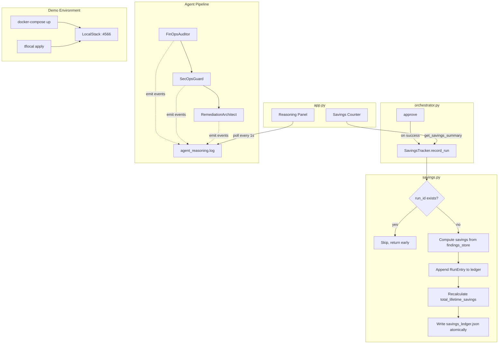

# Design Document: Savings Tracker & LocalStack Integration

## Overview

This design covers four sub-features added to the Cloud Janitor project:

1. **Savings Tracker** (`savings.py`) — a persistent cumulative savings ledger that records cost savings across multiple audit-and-remediation runs, exposes a summary API, and integrates with the orchestrator's `approve()` method.
2. **LocalStack Wiring** — replaces all `terraform` subprocess calls with `tflocal` (from `terraform-local`) and introduces a `docker-compose.yml` with a LocalStack service for demo-mode execution.
3. **SPEC_COMPLIANCE.md Generator** (`generate_spec_compliance.py`) — reads `.kiro/specs/tasks.md`, verifies file artifacts exist, and outputs a compliance report. A Git post-commit hook auto-runs it.
4. **Streaming Agent Reasoning Logger** — each agent emits structured JSON events to `agent_reasoning.log`, rendered in a Streamlit panel with live polling.

### Design Rationale

- **Recalculate-from-source pattern**: The savings ledger uses `sum(monthly_savings_added for all runs)` instead of incrementally adding to a running total. This means any single corrupted entry self-heals on the next write.
- **Deduplication by non-mutation**: Duplicate `run_id` detection simply returns early without touching the file (mtime unchanged), preventing inflation and making idempotency observable.
- **tflocal over environment variables**: Using `tflocal` (a wrapper CLI from `terraform-local`) is simpler and more reliable than overriding Terraform provider endpoints via environment variables; it handles LocalStack endpoint injection automatically.
- **Fragment-based Streamlit polling**: Using `@st.fragment(run_every=1)` (Streamlit ≥ 1.33) avoids full-page reruns and keeps other dashboard panels stable. The fallback for older Streamlit uses a background thread with session_state flag polling.

## Architecture



## Components and Interfaces

### 1. SavingsTracker (`savings.py`)

**Location**: Project root (`savings.py`)

```python
class SavingsTracker:
    """Manages the savings_ledger.json lifecycle."""

    def __init__(
        self,
        ledger_path: Path | None = None,
        findings_store_path: Path | None = None,
    ): ...

    def record_run(self, resources_remediated: list[str]) -> bool:
        """
        Record a remediation run in the ledger.

        Args:
            resources_remediated: List of resource_id strings that were
                approved and executed.

        Returns:
            True if the run was recorded, False if it was a duplicate.

        Behavior:
            1. Read scan_id and completed_at from findings_store.json
            2. Check if scan_id already exists in ledger runs → skip if duplicate
            3. Compute monthly_savings_added from findings whose resource_id
               is in resources_remediated
            4. Append RunEntry
            5. Recalculate total_lifetime_savings from all runs
            6. Write ledger file
        """
        ...

    def get_savings_summary(self) -> dict:
        """
        Return savings summary.

        Returns:
            {
                "total_lifetime_monthly": float,
                "total_lifetime_annual": float,
                "total_runs": int,
                "last_run_savings": float,
            }
        """
        ...

    def _load_ledger(self) -> dict:
        """Load ledger from disk or return empty structure."""
        ...

    def _write_ledger(self, ledger: dict) -> None:
        """Write ledger to disk."""
        ...

    def _compute_monthly_savings(self, resources_remediated: list[str]) -> float:
        """Sum cost_estimate_monthly for matching findings."""
        ...

    def _recalculate_total(self, runs: list[dict]) -> float:
        """Sum monthly_savings_added across all runs."""
        ...
```

**Integration point in `orchestrator.py`**:

```python
# In Orchestrator.__init__:
from savings import SavingsTracker
self._savings_tracker = SavingsTracker(...)

# In Orchestrator.approve(), AFTER successful approval and execution:
self._savings_tracker.record_run(resources_remediated=[resource_id])
```

The `record_run` call is placed exclusively in `approve()`, after the `_run_post_remediation_hook` call, to ensure it only fires for genuinely approved and executed remediations.

### 2. Reasoning Logger (`agents/reasoning_logger.py`)

**Location**: `agents/reasoning_logger.py`

```python
class ReasoningLogger:
    """Structured JSON event logger for agent reasoning traces."""

    VALID_EVENT_TYPES = {"check", "finding", "skip", "decision", "handoff"}

    def __init__(self, log_path: Path | None = None): ...

    def truncate(self) -> None:
        """Truncate the log file (called at audit start)."""
        ...

    def emit(self, agent: str, event_type: str, resource_id: str, message: str) -> None:
        """
        Append a structured JSON line to agent_reasoning.log.

        Args:
            agent: Agent name (max 64 chars, truncated if longer)
            event_type: One of VALID_EVENT_TYPES
            resource_id: Resource ID or empty string
            message: Plain-text explanation (max 500 chars, truncated if longer)

        On filesystem error: prints to stderr, does NOT raise.
        """
        ...
```

Each agent receives a `ReasoningLogger` instance and calls `emit()` at key decision points during its `scan()` / `plan()` execution.

### 3. LocalStack Terraform Executor

**Changes to `mcp_server/aws_janitor_mcp.py`**:

```python
# Replace:
#   ["terraform", "init", "-backend=false"]
#   ["terraform", "validate"]
# With:
#   ["tflocal", "init", "-backend=false"]
#   ["tflocal", "validate"]
```

**Changes to `.kiro/hooks/pre-remediation.sh`**:

```bash
# Replace all occurrences of:
#   terraform -chdir="$tmp_dir" init ...
#   terraform -chdir="$tmp_dir" validate
# With:
#   tflocal -chdir="$tmp_dir" init ...
#   tflocal -chdir="$tmp_dir" validate
```

### 4. Docker Compose (`docker-compose.yml`)

```yaml
version: "3.8"
services:
  localstack:
    image: localstack/localstack:latest
    ports:
      - "4566:4566"
    environment:
      - SERVICES=ec2,elasticache,s3,ebs
      - DEFAULT_REGION=us-east-1
      - DOCKER_HOST=unix:///var/run/docker.sock
    volumes:
      - "/var/run/docker.sock:/var/run/docker.sock"
```

### 5. Makefile (`Makefile`)

```makefile
.PHONY: demo

demo:
 docker-compose up -d
 @echo "Waiting for LocalStack..."
 @i=0; while [ $$i -lt 30 ]; do \
  if curl -s http://localhost:4566/_localstack/health | grep -q '"ready"'; then \
   echo " ready!"; break; \
  fi; \
  printf "."; \
  sleep 2; \
  i=$$((i + 1)); \
 done; \
 if [ $$i -eq 30 ]; then \
  echo "\nERROR: LocalStack failed to start within 60 seconds"; exit 1; \
 fi
 python -m orchestrator
 tflocal apply -auto-approve
```

### 6. Compliance Generator (`generate_spec_compliance.py`)

A standalone Python script that:

1. Reads `.kiro/specs/tasks.md`
2. Parses checkbox lines (`- [x]`, `- [ ]`, `- [-]`)
3. For each "done" task, verifies existence of mapped artifact
4. Outputs `SPEC_COMPLIANCE.md` as a Markdown table

### 7. Streamlit Reasoning Panel (in `app.py`)

```python
# If Streamlit >= 1.33:
@st.fragment(run_every=1)
def reasoning_log_panel():
    """Poll agent_reasoning.log and render color-coded events."""
    ...

# If Streamlit < 1.33:
# Run audit in background thread, poll from main thread using
# st.empty() + time.sleep(1) checking session_state["audit_running"] flag.
```

## Data Models

### savings_ledger.json Schema

```json
{
  "total_lifetime_savings": 57.6,
  "runs": [
    {
      "run_id": "086a8f10-8e73-44da-91d7-304543f15139",
      "timestamp": "2026-06-27T05:31:48.159990+00:00",
      "resources_remediated": ["cache-prod-legacy-01", "vol-0abc123def456789a"],
      "monthly_savings_added": 57.6,
      "cumulative_at_time": 57.6
    }
  ]
}
```

- `total_lifetime_savings`: Always equals `sum(r["monthly_savings_added"] for r in runs)`. Recalculated on every write.
- `run_id`: Sourced from `findings_store.json` → `scan_id`.
- `timestamp`: Sourced from `findings_store.json` → `completed_at`.
- `cumulative_at_time`: The running total as of this entry (recalculated from source each time).

### agent_reasoning.log Line Schema

```json
{
  "timestamp": "2026-06-27T05:23:37.020107+00:00",
  "agent": "finops_auditor",
  "event_type": "check",
  "resource_id": "cache-prod-legacy-01",
  "message": "Checking ElastiCache cluster idle duration: 42 days exceeds 30-day threshold"
}
```

- One JSON object per line (JSONL format).
- `event_type` ∈ {`check`, `finding`, `skip`, `decision`, `handoff`}.
- `agent` max 64 characters, `message` max 500 characters.
- File is truncated at the start of each new audit run.

### get_savings_summary() Return Schema

```json
{
  "total_lifetime_monthly": 57.6,
  "total_lifetime_annual": 691.2,
  "total_runs": 1,
  "last_run_savings": 57.6
}
```

### SPEC_COMPLIANCE.md Output Format

```markdown
# Spec Compliance Report

Generated: 2026-06-28T12:00:00Z

| # | Task | Status | Artifact Verified |
|---|------|--------|-------------------|
| 1 | Create savings.py module | ✅ Done | savings.py exists |
| 2 | Write design document | ✅ Done | .kiro/specs/design.md exists |
| 3 | Add streaming UI | ❌ Pending | app.py missing expected content |
```
