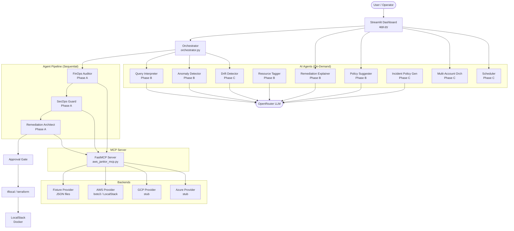

# Cloud Janitor — System Audit Report

**Branch:** `feat/audit-remediation`  
**Generated:** 2026-07-02  
**Project Version:** 0.1.0

---

## Table of Contents

1. [System Overview](#1-system-overview)
2. [Agent Inventory](#2-agent-inventory)
3. [Data Flow](#3-data-flow)
4. [Test Coverage Summary](#4-test-coverage-summary)
5. [Known Limitations](#5-known-limitations)
6. [Environment Setup Summary](#6-environment-setup-summary)

---

## 1. System Overview

### What the System Does

Cloud Janitor is an AI-native AWS infrastructure auditor that detects financial waste (idle resources) and security vulnerabilities (open ports, missing encryption), generates Terraform remediation plans with matching rollback HCL, and requires explicit human approval before any change executes against infrastructure. It combines rule-based scanning agents with LLM-powered analysis (anomaly detection, plain-English explanations, policy suggestions) orchestrated through a multi-agent pipeline with a Streamlit dashboard for real-time visibility.

### Architecture Diagram



### Technology Stack

| Component | Technology | Version |
|-----------|-----------|---------|
| Language | Python | ≥ 3.12 |
| Package Manager | uv | latest |
| Web Framework | Streamlit | ≥ 1.45.0 |
| MCP Framework | FastMCP (mcp) | ≥ 1.28.1 |
| LLM Client | OpenAI SDK → OpenRouter | ≥ 2.44.0 |
| AWS SDK | boto3 | ≥ 1.34.0 |
| IaC | Terraform via terraform-local | ≥ 0.26.0 |
| Scheduling | APScheduler | ≥ 3.10.0 |
| File Locking | filelock | ≥ 3.13.0 |
| Test Framework | pytest + Hypothesis | ≥ 9.1.1 / ≥ 6.155.7 |
| AWS Mocking | moto | ≥ 5.0.0 |
| Container | Docker (LocalStack) | latest |
| Default LLM Model | anthropic/claude-haiku-4-5 | via OpenRouter |

---

## 2. Agent Inventory

### Phase A — Core Pipeline Agents

| Agent | File | Responsibility | Input | Output |
|-------|------|---------------|-------|--------|
| **FinOps Auditor** | `agents/finops_auditor.py` | Detect idle/orphaned resources representing financial waste | MCP `get_cost_data()` response | `findings_store.json` (fresh write) |
| **SecOps Guard** | `agents/secops_guard.py` | Detect security vulnerabilities (open ports, missing encryption) | MCP `get_security_data()` response | `findings_store.json` (append) |
| **Remediation Architect** | `agents/remediation_architect.py` | Generate Terraform HCL for remediation + rollback per finding | `findings_store.json` + MCP `check_dependencies()` | `output/remediation.tf` + `output/rollbacks/<id>.tf` |

### Phase B — AI Feature Agents

| Agent | File | Responsibility | Input | Output |
|-------|------|---------------|-------|--------|
| **Query Interpreter** | `agents/query_interpreter.py` | Map natural language queries to structured scan parameters | Free-text string | `{resource_types, check_types, min_idle_days, intent_summary, confidence}` |
| **Remediation Explainer** | `agents/explainer.py` | Generate plain-English explanation of risk, fix, and rollback | resource_id + finding + HCL | `{risk_explanation, what_terraform_does, what_rollback_restores}` |
| **Policy Suggester** | `agents/policy_suggester.py` | Recommend additional scan policies based on finding patterns | findings list + already_checked | List of 0–5 suggestion dicts |
| **Resource Tagger** | `agents/tagger.py` | Infer env/team/owner/risk from resource names and metadata | resource_id + resource_name + existing_tags | `{env, team, owner, risk_level, confidence}` |
| **Anomaly Detector** | `agents/anomaly_detector.py` | Flag suspicious resources not caught by rule-based checks | resources list + findings list | List of anomaly dicts (max 20) |

### Phase C — Platform Agents

| Agent | File | Responsibility | Input | Output |
|-------|------|---------------|-------|--------|
| **Drift Detector** | `agents/drift_detector.py` | Compare scan snapshots over time, generate drift narrative | Scan findings + history file | `{new_findings, resolved_findings, waste_delta, critical_delta, narrative}` |
| **Incident Policy Generator** | `agents/incident_policy_generator.py` | Generate preventive scan policies from incident descriptions | Incident text | 3–5 policy JSON files in `output/policies/` |
| **Multi-Account Orchestrator** | `agents/multi_account_orchestrator.py` | Run concurrent audits across multiple AWS accounts | `accounts.json` | Aggregated result with per-account findings |
| **Scheduler** | `scheduler.py` | Cron-based automated background scans | JANITOR_SCHEDULE env var | Periodic audit runs logged to `scheduler.log` |

### Supporting Modules (Not Agents)

| Module | File | Purpose |
|--------|------|---------|
| Approval Gate | `agents/approval_gate.py` | Parse/validate approval commands, 3-attempt lockout |
| Audit Logger | `agents/audit_logger.py` | Append-only JSON-lines audit log |
| Reasoning Logger | `agents/reasoning_logger.py` | Structured JSONL agent decision traces |
| Schema Validator | `agents/schema_validator.py` | Validate findings_store.json structure |
| Savings Tracker | `agents/savings_tracker.py` | Track cumulative cost savings from remediations |
| LLM Client | `core/llm_client.py` | Shared OpenRouter client configuration |

---

## 3. Data Flow

### Single Audit Run — End-to-End Trace

```
Step 1: User clicks "Run Audit" in Streamlit UI
         ↓
Step 2: Orchestrator.execute_audit() begins
         → Truncates agent_reasoning.log
         ↓
Step 3: FinOps Auditor scans
         → Calls MCP get_cost_data(min_idle_days=0)
         → Filters for idle_days >= 30
         → Writes output/findings_store.json (FRESH — overwrites)
         ↓
Step 4: SecOps Guard scans
         → Calls MCP get_security_data()
         → Filters for open ports + missing encryption
         → APPENDS to output/findings_store.json
         ↓
Step 5: Orchestrator validates findings_store.json
         → Confirms both "finops" and "secops" entries present
         ↓
Step 6: Remediation Architect plans
         → Reads findings_store.json
         → For each finding: calls MCP check_dependencies()
         → Blocked findings: logged, no HCL generated
         → Unblocked findings: generates remediation + rollback HCL
         → Writes output/remediation.tf (combined)
         → Writes output/rollbacks/<resource_id>.tf (per resource)
         ↓
Step 7: Pre-remediation hook runs
         → Copies HCL to temp dir, runs terraform init + validate
         → Blocks pipeline if validation fails
         ↓
Step 8: Anomaly Detection (post-scan)
         → Calls MCP get_cost_data() + get_security_data()
         → Filters out already-flagged resources
         → Calls LLM for anomaly analysis
         ↓
Step 9: Drift Detection
         → Saves current scan as snapshot in scan_history.json
         → Compares with previous snapshot (if exists)
         → Generates LLM narrative describing drift
         ↓
Step 10: Pipeline returns AuditResult to UI
         → findings, plans, blocked_plans, anomalies, drift_report
         ↓
Step 11: User reviews findings in dashboard
         → Approval Gate panel appears with resource selector
         ↓
Step 12: User types "APPROVE <resource_id>"
         → Gate validates exact match (case-sensitive)
         → On success: runs tflocal apply -auto-approve
         → Post-remediation hook appends to audit.log
         → Savings tracker records the remediation
```

### Files Written During a Single Run

| File | Created By | Purpose | Persistence |
|------|-----------|---------|-------------|
| `output/findings_store.json` | FinOps + SecOps | Shared state between agents | Overwritten each run |
| `output/remediation.tf` | Remediation Architect | Combined Terraform for all unblocked fixes | Overwritten each run |
| `output/rollbacks/<id>.tf` | Remediation Architect | Per-resource rollback HCL | Accumulates |
| `output/logs/agent_reasoning.log` | ReasoningLogger | Structured JSONL decision traces | Truncated at run start |
| `output/logs/audit.log` | AuditLogger + post-hook | Append-only JSON-lines compliance log | Accumulates forever |
| `output/scan_history.json` | DriftDetector | Snapshot history (max 30) | Rotated |
| `output/savings_ledger.json` | SavingsTracker | Cumulative savings from approvals | Accumulates |
| `output/policies/<id>.json` | IncidentPolicyGenerator | On-demand policy files | Written once per incident hash |
| `output/logs/scheduler.log` | JanitorScheduler | Rotating file log (10MB × 3) | Rotated |

---

## 4. Test Coverage Summary

**Total tests collected:** 920 (across 59 test files)

### Test Files by Category

#### Core Pipeline Tests (5 files)

| File | Approx Tests | Requirements Covered |
|------|-------------|---------------------|
| `test_orchestrator.py` | ~35 | Agent sequencing, hooks, approval, rollback, audit trail |
| `test_orchestrator_ai_agents.py` | ~15 | Orchestrator + AI agent integration (Req 1.10, 6.4, 11.10) |
| `test_error_states.py` | ~12 | Dependency blocking, validate failures, lockout |
| `test_approval_gate.py` | ~20 | Command parsing, format rejection, 3-attempt lockout |
| `test_orchestrator-new-tests.py` | 2 | Rollback terraform apply regression tests |

#### Agent Unit Tests (15 files)

| File | Approx Tests | Agent Covered |
|------|-------------|--------------|
| `test_query_interpreter.py` | ~8 | QueryInterpreter (Req 2.1–2.8) |
| `test_explainer.py` | ~8 | RemediationExplainer (Req 3.1–3.6) |
| `test_policy_suggester.py` | ~10 | PolicySuggester (Req 4.1–4.6) |
| `test_tagger_validate.py` | ~10 | ResourceTagger (Req 5.1–5.7) |
| `test_anomaly_detector.py` | ~8 | AnomalyDetector (Req 6.1–6.6) |
| `test_incident_policy_generator.py` | ~12 | IncidentPolicyGenerator (Req 7.1–7.9) |
| `test_drift_detector.py` | ~10 | DriftDetector (Req 8.1–8.10) |
| `test_multi_account_orchestrator.py` | ~10 | MultiAccountOrchestrator (Req 9.1–9.8) |
| `test_savings_tracker.py` | ~8 | SavingsTracker |
| `test_reasoning_logger.py` | ~6 | ReasoningLogger |
| `test_audit_logger.py` | ~6 | AuditLogger |
| `test_schema_validator.py` | ~12 | Schema validation |
| `test_secops_guard.py` | ~8 | SecOpsGuard |
| `test_secops_integration.py` | ~5 | SecOps end-to-end |
| `test_remediation_architect.py` | ~12 | Remediation Architect |

#### Property-Based Tests (16 files)

| File | Properties Tested | Requirements Validated |
|------|------------------|----------------------|
| `test_never_raise_properties.py` | Never-raise guarantee, safe defaults on LLM failure | Req 1.1–1.9 |
| `test_query_interpreter_properties.py` | Output validity (confidence, enums, bounds) | Req 2.1–2.7 |
| `test_explainer_properties.py` | Schema completeness (3 keys, non-empty strings) | Req 3.4, 1.2 |
| `test_policy_suggester_properties.py` | Output bounds (0–5), exclusion filter | Req 4.1–4.4 |
| `test_tagger_properties.py` | Enum constraints, confidence threshold, passthrough | Req 5.1–5.6 |
| `test_anomaly_detector_properties.py` | Disjoint resource IDs, output schema | Req 6.1–6.3 |
| `test_incident_policy_generator_properties.py` | Idempotency, file consistency, schema bounds | Req 7.1–7.7 |
| `test_drift_detector_properties.py` | Max snapshots, waste delta, finding diff | Req 8.3–8.8 |
| `test_multi_account_orchestrator_properties.py` | Fault isolation, account ID injection, sorting | Req 9.2–9.4 |
| `test_scheduler_properties.py` | Status schema, idempotent start | Req 10.4–10.5 |
| `test_savings_tracker_properties.py` | Schema, computation, dedup, summary | Savings reqs |
| `test_reasoning_logger_properties.py` | Valid JSON, sequential append | Logger reqs |
| `test_fixture_provider_properties.py` | Provider output schemas | Req 12.1–12.2 |
| `test_provider_selection_properties.py` | Backend selection, registry | Provider reqs |
| `test_backward_compatibility_properties.py` | Fixture mode backward compat | Req 12.4 |
| `test_compliance_generator_properties.py` | Spec compliance parser | Dev tooling |

#### Infrastructure / Integration Tests (8 files)

| File | Tests | Coverage |
|------|-------|---------|
| `test_fixture.py` | ~6 | Fixture JSON schema validation |
| `test_fixture_mode_integration.py` | ~8 | Full pipeline in fixture mode |
| `test_mcp_tools_phase_bc.py` | ~12 | MCP tool endpoints (Phase B+C) |
| `test_mcp_interpret_query.py` | ~4 | Query interpretation MCP tool |
| `test_aws_provider.py` | ~10 | AWSProvider with moto mocks |
| `test_llm_client.py` | ~6 | LLM client config and error handling |
| `test_gate_integration.py` | ~5 | Approval gate end-to-end |
| `test_gate_persistence.py` | ~6 | Gate state persistence |

#### Specialized Tests (15 files)

| File | Tests | Coverage |
|------|-------|---------|
| `test_error_telemetry.py` + `_props.py` | ~10 | Error reporting |
| `test_gate_lockout_props.py` | ~4 | Gate lockout properties |
| `test_gate_persistence_props.py` | ~4 | Gate persistence properties |
| `test_approval_gate_store.py` | ~6 | Gate store module |
| `test_tf_cmd_validation.py` + `_props.py` | ~8 | TF_CMD allowlist validation |
| `test_property_resource_id.py` | ~4 | Resource ID validation properties |
| `test_resource_id_extraction.py` | ~6 | Resource ID parsing |
| `test_path_config.py` + `test_paths.py` | ~6 | Path configuration |
| `test_reasoning_panel_properties.py` + `_quick.py` | ~8 | UI reasoning panel |
| `test_malformed_line_resilience.py` | ~4 | Malformed log line handling |
| `test_bin_tflocal.py` + `test_tflocal_wrapper.py` | ~6 | tflocal script properties |

### Coverage Gaps

| Area | Gap |
|------|-----|
| `app.py` (Streamlit UI) | No automated tests — UI is tested manually via browser |
| `scheduler.py` background execution | Property tests verify schema/idempotency but not actual cron firing |
| End-to-end with real LocalStack | Integration tests use moto mocks, not live LocalStack |
| `hooks/post-remediation.sh` | Tested indirectly via orchestrator mock; no direct shell test |

---

## 5. Known Limitations

### 5.1 Windows/WSL Bash Dependency

**Problem:** On Windows, `bash` resolves to the WSL wrapper (`C:\Windows\system32\bash.exe`) which fails with "Permission denied" if Ubuntu isn't initialized. The orchestrator's hook execution depends on bash for `pre-remediation.sh` and `post-remediation.sh`.

**Current Workaround:** The `_find_bash()` function in `orchestrator.py` detects Windows and resolves to Git Bash at `C:\Program Files\Git\bin\bash.exe`. Configurable via `BASH_PATH` env var.

**Residual Risk:** If Git Bash is not installed at the hardcoded path, hooks fail with "bash not found" error (non-fatal for post-hook, blocks audit for pre-hook).

### 5.2 LocalStack Auth Token Requirement

**Problem:** Since LocalStack 2026.3.0, the free Hobby tier requires `LOCALSTACK_AUTH_TOKEN` to start. Without it, the container exits with code 55.

**Current Workaround:** Token is read from `.env` via `docker-compose --env-file .env up -d`. The `docker-compose.yml` passes it as `${LOCALSTACK_AUTH_TOKEN}` environment variable.

**Residual Risk:** Users who clone the repo and run `docker-compose up` without `--env-file .env` will get a silent container exit.

### 5.3 Pre-Remediation Hook and Provider Validation

**Problem:** Generated HCL uses illustrative resource types (e.g., `aws_elasticache_snapshot`) that don't exist in the real AWS Terraform provider. Full `terraform validate` fails.

**Current Workaround:** The hook falls back to syntax-only validation via `terraform fmt` when `terraform validate` fails. This confirms HCL is parseable but doesn't catch semantic errors.

### 5.4 Drift Detector Property Tests

**Problem:** `test_drift_detector_properties.py` can hang indefinitely due to filelock contention when Hypothesis generates rapid concurrent save_snapshot calls in the same process.

**Current Workaround:** Run with `pytest --timeout=60` or skip with `-k "not drift_detector_properties"`.

### 5.5 No LLM Timeout or Retry

**Problem:** All 7 LLM-calling agents use the OpenAI SDK without a configured timeout. A stalled OpenRouter connection blocks the calling thread indefinitely.

**Impact:** In fixture mode without `OPENROUTER_API_KEY`, agents fail immediately (EnvironmentError) and return safe defaults. The hang only occurs when the key is set but the network is slow.

### 5.6 Non-Atomic File Writes

**Problem:** `findings_store.json` and `savings_ledger.json` are written with `Path.write_text()` — a crash mid-write leaves a corrupt file. Only `scan_history.json` uses the atomic tmp+rename pattern.

### 5.7 No Build System for Distribution

**Problem:** `pyproject.toml` has no `[build-system]` section. The project cannot be `pip install`ed or published to PyPI. It's a runnable source tree, not a distributable package.

---

## 6. Environment Setup Summary

### Prerequisites

| Requirement | Minimum Version | Purpose |
|-------------|----------------|---------|
| Python | 3.12+ | Runtime |
| uv | latest | Package management and virtual env |
| Docker Desktop | any recent | Runs LocalStack container |
| Terraform | 1.5+ | Required by tflocal for HCL validation |
| Git (with Git Bash on Windows) | 2.x | Hook execution on Windows |
| LocalStack Auth Token | — | Required since LocalStack 2026.3.0 |
| OpenRouter API Key | — | Required for AI features (optional for fixture-only mode) |

### Step-by-Step: Fresh Clone to Running App

```bash
# 1. Clone
git clone https://github.com/darthrevan030/Cloud-Janitor.git
cd Cloud-Janitor
git checkout feat/audit-remediation

# 2. Install dependencies
uv sync

# 3. Configure environment
cp .env.example .env
# Edit .env:
#   - Set OPENROUTER_API_KEY=sk-or-... (get free at https://openrouter.ai/keys)
#   - Set LOCALSTACK_AUTH_TOKEN=ls-... (get free at https://app.localstack.cloud)

# 4. Start LocalStack (requires Docker running)
docker-compose --env-file .env up -d

# 5. Wait for LocalStack to be ready (~15-20 seconds)
# Check: curl http://localhost:4566/_localstack/health | grep ready

# 6. Run the app
uv run streamlit run app.py

# 7. Open browser at http://localhost:8501
# Click "Run Audit" to execute the full pipeline
```

### Running in Fixture Mode (No AWS, No Docker)

```bash
# .env contents for pure fixture mode:
JANITOR_BACKEND=fixture
TF_CMD=tflocal
# OPENROUTER_API_KEY not needed — AI agents return safe defaults

# Run without Docker/LocalStack:
uv run streamlit run app.py

# Note: pre-remediation hook will fail (tflocal needs terraform binary)
# The audit still completes — hook failure is reported but non-fatal in fixture mode
```

### Running in Live AWS Mode

```bash
# .env contents:
JANITOR_BACKEND=aws
TF_CMD=terraform
AWS_ACCESS_KEY_ID=AKIA...
AWS_SECRET_ACCESS_KEY=...
AWS_DEFAULT_REGION=us-east-1
OPENROUTER_API_KEY=sk-or-...

# No Docker needed — queries real AWS APIs directly
uv run streamlit run app.py
```

### Running Tests

```bash
# Full suite (920 tests)
uv run pytest

# Skip potentially hanging test
uv run pytest -k "not drift_detector_properties"

# Single file
uv run pytest tests/test_orchestrator.py -v

# Only property tests
uv run pytest tests/test_*_properties.py
```
